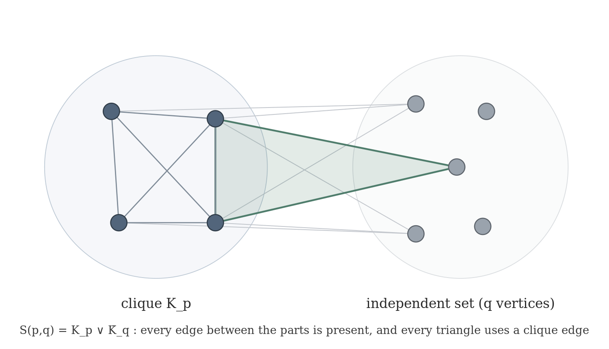
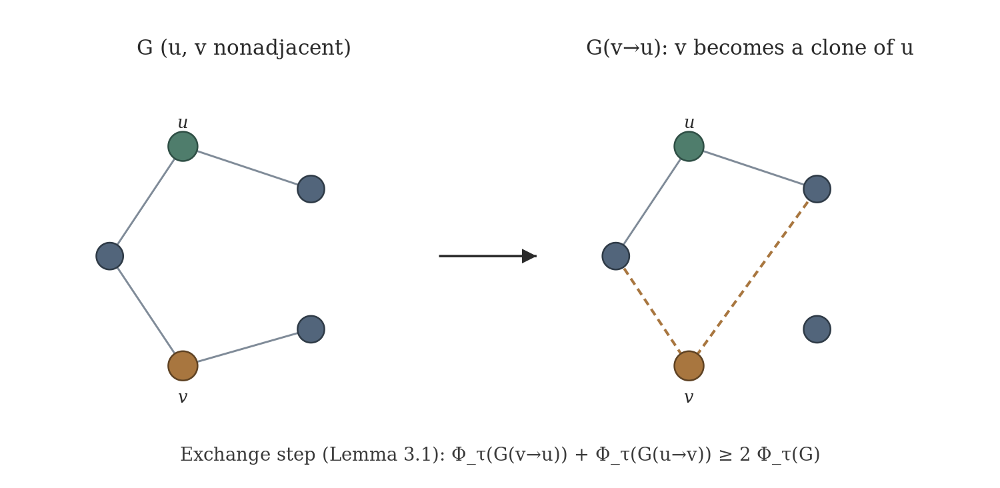
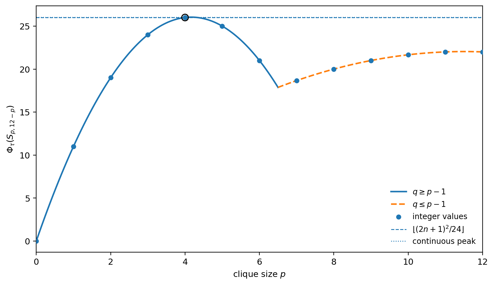

# Complete-Split Extremizers for a Fractional Triangle-Cover Functional on Chordal Graphs

**Juan Pablo Traverso Gianini**  
Independent researcher, Santiago, Chile  
[jtraverso@gmail.com](mailto:jtraverso@gmail.com)  
[ORCID: 0009-0003-6068-4096](https://orcid.org/0009-0003-6068-4096)

**Paper II in the series**  
**Preprint:** version 1.2. This manuscript and its accompanying formal artifact form one self-contained public package.  
**Release date:** August 22, 2026  
**Status:** official author preprint release. The accompanying Paper II Lean v1.2 freeze consolidates the main development, extremizer/copy-defect modules, arithmetic corollaries, and contribution surfaces. The exact archive and manuscript package passed independent clean-room reproduction and external adversarial review. This release is not external human peer review or a specialist priority determination.

**Prior-art and novelty status.** The internal literature audit, supplemented by external adversarial review, identified no earlier result determining the same exact finite extremum for the fractional triangle-cover functional on chordal graphs, with the complete-split extremizers and the symmetrization route proved here. The broader chordal clique-partition problem remains open. This is a corpus-bounded negative search, not proof of priority or a substitute for specialist review.

**MSC 2020:** Primary 05C70; Secondary 05C35, 05C72.

---

## Abstract

For a graph \(G\), let \(\tau_3^*(G)\) be its fractional triangle-cover number, and set

\[
\Phi_\tau(G):=|E(G)|-2\tau_3^*(G).
\]

Equivalently \(\Phi_\tau(G)=|E(G)|-2\nu_3^*(G)\), since \(\nu_3^*=\tau_3^*\); this is the fractional triangle-packing defect of the series. We determine the exact maximum of \(\Phi_\tau\) over chordal graphs of fixed order. For every integer \(n\ge1\),

\[
\boxed{
\max_{\substack{|V(G)|=n\\G\text{ chordal}}}
\Phi_\tau(G)
=
\left\lfloor\frac{(2n+1)^2}{24}\right\rfloor.
}
\]

The proof is finite and cover-first. Its main step is a vertex-copy inequality: for two nonadjacent vertices, the two possible copy directions have average \(\Phi_\tau\)-value at least that of the original graph. A discrete-convexity argument lifts this from single vertices to whole open-neighborhood clone classes. In chordal graphs, copying toward a simplicial clone class preserves chordality. Repeated admissible copies therefore reduce the extremal problem, without decreasing \(\Phi_\tau\), to complete-split graphs

\[
S_{p,q}:=K_p\vee\overline{K_q}.
\]

On \(S_{p,q}\), orbit averaging reduces the fractional cover calculation to a two-variable linear program. Solving its two branches, including the degenerate case \(S_{2,0}=K_2\), and then maximizing over \(p+q=n\), gives the displayed floor exactly.

The uniqueness/tie statement concerns the maximizing clique size within the complete-split family. The paper does not claim that every chordal extremizer is uniquely determined up to isomorphism.

This is the finite fractional extremal component of the broader Erdős Problem #81 program [8]. Within the series, Paper I proves a finite fractional split-graph bound [4], the present paper identifies the complete-split terminal family and the exact fractional value, Paper III proves the linear-error split-graph theorem for clique partitions, and Paper IV develops a general transfer-and-rounding interface. The paper proves only the fractional cover-functional theorem above. It does not prove an integral clique-partition theorem; its cover-first proof does not use strong LP duality or an asymptotic packing theorem.

**Keywords:** chordal graph; fractional triangle cover; symmetrization; clone class; complete-split graph; Erdős problem.

---

## 1. Introduction

A graph is chordal if it has no induced cycle of length at least four. Chordal graphs admit several equivalent structural descriptions, among them perfect elimination orderings and clique trees. These descriptions make the class suitable for extremal arguments in which vertices are simplified while a graph parameter is controlled.

The present paper studies the functional

\[
\Phi_\tau(G):=|E(G)|-2\tau_3^*(G),
\]

where \(\tau_3^*(G)\) is the fractional triangle-cover number. The main result is an exact finite extremal theorem.

#### Theorem 1.1

For every integer \(n\ge1\),

\[
\boxed{
\max_{\substack{|V(G)|=n\\G\text{ chordal}}}
\left(
|E(G)|-2\tau_3^*(G)
\right)
=
\left\lfloor\frac{(2n+1)^2}{24}\right\rfloor.
}
\]

Moreover, equality is attained by a complete-split graph

\[
S_{p,q}=K_p\vee\overline{K_q},
\qquad
p+q=n,
\]

with \(p\) an integer nearest to \((2n+1)/6\). Among complete-split graphs \(S_{p,n-p}\), the maximizing integer \(p\) is unique unless \(n\equiv1\pmod3\), in which case exactly two consecutive values of \(p\) attain the maximum; see the case analysis in the proof of Proposition 7.1 and the formalized declarations `Fsat_argmax_unique` and `Fsat_argmax_tie`. No uniqueness statement for arbitrary chordal extremizers is claimed.

#### Remark (extremization principle)

The reduction extends to any isomorphism-invariant functional \(F\) that satisfies the same two-direction clone-copy exchange inequality as Lemma 3.1 for every nonadjacent pair. Repeating the class-copy and terminal-reduction arguments of Lemmas 4.1--5.3 then shows that the chordal maximum is attained on the complete-split family:
\[
\max_{\substack{|V(G)|=n\\ G\text{ chordal}}}F(G)=\max_{0\le p\le n}F(S_{p,\,n-p}).
\]
Theorem 1.1 is the instance \(F=\Phi_\tau\); the closed form \(\lfloor(2n+1)^2/24\rfloor\) is then an analytic evaluation on that one-parameter family. The principle is stated here for later use; only the triangle-cover instance is formalized. It is an attainment statement and does not classify all chordal equality cases.

#### Corollary 1.2

For chordal graphs of order \(n\),

\[
\max_{\substack{|V(G)|=n\\G\text{ chordal}}}\Phi_\tau(G)=\frac{n^2}{6}+O(n),
\]

so the maximum is \((1+o(1))\,n^2/6\). The leading constant \(1/6\) is the same constant that
appears in the Erdős–Ordman–Zalcstein target for clique partitions of chordal graphs [1]. This
statement concerns the fractional functional \(\Phi_\tau\) only; the passage to an integral
clique-partition bound is not made here.

#### Proof

By Theorem 1.1 the maximum equals \(\left\lfloor(2n+1)^2/24\right\rfloor\). Since
\((2n+1)^2/24=n^2/6+n/6+1/24\), the floor differs from \(n^2/6+n/6\) by less than \(1\); hence the
maximum is \(n^2/6+O(n)\). 

#### Corollary 1.2\(^{\prime}\) (sharpened asymptotic)

Write \(M(n):=\left\lfloor(2n+1)^2/24\right\rfloor\). For \(n\ge1\), this is the extremal value of Theorem 1.1; as an arithmetic statement about the floor, the following inequalities hold for every integer \(n\):

\[
\frac{n^2}{6}+\frac{n}{6}-1
\;<\;
M(n)
\;\le\;
\frac{n^2}{6}+\frac{n}{6}+\frac{1}{24},
\]

equivalently, cleared of denominators over \(\mathbb Z\),

\[
4n^2+4n-23 \;<\; 24\,M(n) \;\le\; 4n^2+4n+1.
\]

After the explicit linear term \(n/6\) is extracted, the remaining error is bounded: one has
\(M(n)=n^2/6+n/6+\theta_n\) with \(\theta_n\in(-1,\,1/24]\). This is immediate from
\(24\,M(n)\le(2n+1)^2<24\,M(n)+24\) and \((2n+1)^2=4n^2+4n+1\). Formalized for \(n:\mathbb Z\), with no lower-bound hypothesis, as
`PaperII.phiTau_max_sandwich` (axiom footprint `propext`, `Classical.choice`, `Quot.sound`).

**Formalization status.** The delivered Paper II Lean v1.2 freeze uses Lean 4 / Mathlib v4.28.0 [5,6]. Its recorded main build completed 8,061 jobs, and the explicit extremizer/copy-defect supplement completed 8,032 jobs. The main declaration is named `PaperII.theorem_1_2`; it corresponds to Theorem 1.1 of this manuscript and includes the accompanying attainment statement. The same freeze includes the complete-split argmax, level sets, copy defects, and `PaperII.AsymptoticCorollaries`. Its theorem-level axiom gate reports no project-level mathematical axiom. The formal development derives the chordal structure used in the proof from the standard predicate `IsChordal`; no clique-tree or chordal-structure axiom is added. Section 8 records the exact freeze perimeter.

The proof has two parts. The first part is structural. It reduces an arbitrary chordal graph to a complete-split graph without decreasing \(\Phi_\tau\). The second part is a calculation on that terminal family.

Here is the structural idea in some detail. If \(u\) and \(v\) are nonadjacent, the graph \(G_{v\to u}\) is obtained by replacing the neighborhood of \(v\) by the neighborhood of \(u\). Thus \(v\) becomes a clone of \(u\). The two opposite copy operations satisfy

\[
\Phi_\tau(G_{v\to u})
+
\Phi_\tau(G_{u\to v})
\ge
2\Phi_\tau(G).
\]

This inequality is the basic exchange step. One optimal cover of \(G\) is transported to both copied graphs. The two changes in cover cost cancel after the two inequalities are added. The edge counts cancel in the same way.

Single-vertex copying is not enough for a terminating reduction. It may split a clone class that already existed. We therefore copy whole open-neighborhood clone classes. The same exchange inequality becomes a discrete-convexity statement for a finite sequence \(H_0,\ldots,H_{a+b}\). Consequently one of the two full-class copy directions does not decrease \(\Phi_\tau\).

There is one point where chordality matters. The nondecreasing direction is chosen by the convexity argument, so it is not known in advance. To keep the graph chordal whichever direction is chosen, both clone classes are taken simplicial. Copying toward a simplicial class is safe because the copied vertices are reinserted with a clique neighborhood.

The terminal characterization is proved separately. From the clique-tree running-intersection property, a chordal graph in which every two nonadjacent simplicial vertices have the same open neighborhood must be complete-split. Thus the symmetrization stops exactly in the desired family.

On \(S_{p,q}\), the calculation is short but the small cases must be kept visible. Orbit averaging gives one cover weight \(x\) on clique edges and one weight \(y\) on cross edges. The possible triangle types yield

\[
3x\ge1
\quad(p\ge3),
\qquad
x+2y\ge1
\quad(p\ge2,\ q\ge1).
\]

A constraint is included only when the corresponding triangle type exists. In particular, \(S_{2,0}=K_2\) has no triangles and its cover number is zero. With this convention in place, the terminal linear program has two branches, and the remaining maximization over \(p+q=n\) is a one-variable integer calculation.

#### Remark (chordality is essential)

The hypothesis cannot be dropped. The four-cycle has no triangle, so \(\tau_3^*(C_4)=0\) and \(\Phi_\tau(C_4)=4\), whereas the chordal maximum at \(n=4\) is \(3\). The supplied audit report records exhaustive enumeration over all graphs on \(n=4,5,6,7\) vertices, with maxima \(4,6,9,12\), against the chordal values \(3,5,7,9\). Thus the gap is not confined to \(n=4\). Chordality enters the proof through Lemma 4.3, which is what keeps the symmetrization of Theorem 5.3 inside the class.

**Relation to Erdős Problem #81.** Erdős, Ordman, and Zalcstein asked for an upper bound of the form \(n^2/6+O(n)\) for clique partitions of chordal graphs [1]. Theorem 1.1 identifies the exact finite extremum of a fractional cover functional that appears naturally in approaches to that problem. It does not convert fractional covers into integral triangle packings or clique partitions; those interfaces are deliberately kept outside this paper.

This is the second paper in the series. Paper I proves the finite fractional split-graph bound \(|E(G)|-2\nu_3^*(G)\le n^2/6+n/2\) [4]. The present paper moves from split graphs to all chordal graphs, but for the cover functional \(\Phi_\tau\), and determines the exact finite maximum. Its role is to identify the complete-split terminal family and the precise fractional value; any integral clique-partition conclusion belongs to a separate installment of the program.

#### Remark (coherence with Paper I's bound)

The exact chordal maximum also satisfies Paper I's split-graph upper bound: for every integer \(n\ge1\),

\[
M(n)=\left\lfloor\frac{(2n+1)^2}{24}\right\rfloor
\;\le\;
\frac{n^2}{6}+\frac{n}{2},
\]

where the right-hand side is the finite estimate \(|E(G)|-2\nu_3^*(G)\le n^2/6+n/2\) from Paper I [4]. This comparison is numerical rather than a consequence of class containment, since the chordal class is larger than the split class. The slack is \(\bigl(n^2/6+n/2\bigr)-M(n)=n/3+O(1)\). The inequality is formalized as
`PaperII.phiTau_max_le_paperI_bound` (axiom footprint `propext`, `Quot.sound`).

Section 2 fixes notation and the chordal facts used later. Sections 3 and 4 prove the copy inequality and its clone-class form. Section 5 gives the terminal characterization and the reduction to complete-split graphs. Sections 6 and 7 solve the terminal program and assemble the theorem. Section 8 records reproducibility, formal-verification scope, and validation status.

---

## 2. Definitions and chordal preliminaries

All graphs are finite and simple. Write \(V(G)\), \(E(G)\), and

\[
e(G):=|E(G)|.
\]

Let \(\mathcal T(G)\) denote the set of triangles of \(G\).

A **fractional triangle cover** is a function

\[
z:E(G)\longrightarrow\mathbb R_{\ge0}
\]

such that

\[
\sum_{e\in E(T)}z_e\ge1
\qquad
(T\in\mathcal T(G)).
\]

Its cost is \(\sum_{e\in E(G)}z_e\), and

\[
\tau_3^*(G)
:=
\min\left\{
\sum_{e\in E(G)}z_e:
z\text{ is a fractional triangle cover}
\right\}.
\]

The minimum is attained because this is a finite feasible linear program bounded below by zero. If \(G\) is triangle-free, then \(\tau_3^*(G)=0\).

Define

\[
\Phi_\tau(G):=e(G)-2\tau_3^*(G).
\]

**Relation to the series (not used in the proof).** By finite linear-programming duality the fractional triangle-cover and fractional triangle-packing optima coincide, \(\nu_3^*(G)=\tau_3^*(G)\). Hence

\[
\Phi_\tau(G)=e(G)-2\tau_3^*(G)=e(G)-2\nu_3^*(G)
\]

is exactly the fractional triangle-packing defect studied in Paper I [4], and the fractional relaxation of the integral functional \(|E|-2\nu_3\) of Paper III. This is standard finite LP duality, recorded only to relate the notation across the series; it is not used anywhere in the proof below, which is cover-first.

**Series notation.** Paper I writes the fractional packing deficit as \(\Phi^*(G)=|E(G)|-2\nu_3^*(G)\). The present paper writes the equal cover-side quantity as \(\Phi_\tau(G)\). Paper III reserves \(\Phi(G)\) for the integral deficit \(|E(G)|-2\nu_3(G)\).

For \(p,q\ge0\), the **complete-split graph**

\[
S_{p,q}:=K_p\vee\overline{K_q}
\]

has a clique side \(K\) of order \(p\), an independent side \(I\) of order \(q\), and all \(pq\) edges between the two sides.



**Figure 1.** The complete-split graph \(S_{p,q}=K_p\vee\overline{K_q}\): the clique \(K_p\) is joined completely to the independent set of order \(q\), and every triangle uses at least one clique edge. Admissible copies reduce the extremal problem to this family.

Two vertices \(u,v\) are **open-neighborhood clones** if

\[
N_G(u)=N_G(v).
\]

Distinct open-neighborhood clones are necessarily nonadjacent. A clone class is a maximal set of pairwise open-neighborhood clones. Let \(m(G)\) be the number of maximal clone classes.

A vertex \(v\) is **simplicial** if \(N_G(v)\) is a clique. A clone class is simplicial if its common open neighborhood is a clique.

For nonadjacent vertices \(u,v\), let \(G_{v\to u}\) be the graph obtained by deleting every edge incident with \(v\) and then joining \(v\) to every vertex of \(N_G(u)\). Thus \(u\) and \(v\) are clones in \(G_{v\to u}\).

We use the following standard facts about chordal graphs [2,3].

1. Every induced subgraph of a chordal graph is chordal.
2. Adding a new vertex whose neighborhood is a clique preserves chordality.
3. Every nonempty chordal graph has a simplicial vertex, and every noncomplete connected chordal graph has two nonadjacent simplicial vertices.
4. Every connected chordal graph has a clique tree: its nodes are the maximal cliques, and the maximal cliques containing any fixed vertex induce a connected subtree.

We also use two elementary facts about trees: a tree with at least two nodes has at least two leaves, and a connected subtree containing every leaf is the whole tree.

---

## 3. The vertex-copy inequality



**Figure 2.** The exchange step (Lemma 3.1). Copying \(v\) toward \(u\) makes \(v\) a clone of \(u\); the two opposite copies satisfy \(\Phi_\tau(G_{v\to u})+\Phi_\tau(G_{u\to v})\ge 2\Phi_\tau(G)\).

#### Lemma 3.1

Let \(G\) be a graph and let \(u,v\in V(G)\) be nonadjacent. Then

\[
\boxed{
\Phi_\tau(G_{v\to u})
+
\Phi_\tau(G_{u\to v})
\ge
2\Phi_\tau(G).
}
\]

#### Proof

Let \(z\) be an optimal fractional triangle cover of \(G\), so

\[
\sum_{e\in E(G)}z_e=\tau_3^*(G).
\]

We first construct a cover \(z'\) of \(G_{v\to u}\). For an edge not incident with \(v\), retain its old weight. For every \(x\in N_G(u)\), set

\[
z'_{vx}:=z_{ux}.
\]

To check feasibility, consider a triangle of \(G_{v\to u}\). If it does not contain \(v\), then it is a triangle of \(G\) and all three weights are unchanged. If it is \(vxy\), then \(x,y\in N_G(u)\) and \(xy\in E(G)\). Hence \(uxy\) is a triangle of \(G\), and

\[
z'_{vx}+z'_{vy}+z'_{xy}
=
z_{ux}+z_{uy}+z_{xy}
\ge1.
\]

Thus \(z'\) is feasible.

Its cost is

\[
\operatorname{cost}(z')
=
\left(
\sum_{e\in E(G)}z_e
-
\sum_{x\in N_G(v)}z_{vx}
\right)
+
\sum_{x\in N_G(u)}z_{ux}.
\tag{3.1}
\]

Interchanging \(u\) and \(v\) gives a feasible cover \(z''\) of \(G_{u\to v}\) with

\[
\operatorname{cost}(z'')
=
\left(
\sum_{e\in E(G)}z_e
-
\sum_{x\in N_G(u)}z_{ux}
\right)
+
\sum_{x\in N_G(v)}z_{vx}.
\tag{3.2}
\]

Adding (3.1) and (3.2), the correction terms cancel exactly:

\[
\operatorname{cost}(z')
+
\operatorname{cost}(z'')
=
2\tau_3^*(G).
\]

Since each optimum is no larger than the cost of the corresponding feasible cover,

\[
\tau_3^*(G_{v\to u})
+
\tau_3^*(G_{u\to v})
\le
2\tau_3^*(G).
\tag{3.3}
\]

The edge counts satisfy a second exact identity. The graph \(G_{v\to u}\) replaces \(d_G(v)\) by \(d_G(u)\) and changes no edge not incident with \(v\). Therefore

\[
e(G_{v\to u})
=
e(G)-d_G(v)+d_G(u).
\]

Similarly,

\[
e(G_{u\to v})
=
e(G)-d_G(u)+d_G(v).
\]

Hence

\[
e(G_{v\to u})+e(G_{u\to v})=2e(G).
\tag{3.4}
\]

Using the definition of \(\Phi_\tau\), subtract twice (3.3) from (3.4):

\[
\begin{aligned}
\Phi_\tau(G_{v\to u})
+
\Phi_\tau(G_{u\to v})
&=
2e(G)
-
2\left(
\tau_3^*(G_{v\to u})
+
\tau_3^*(G_{u\to v})
\right)\\
&\ge
2e(G)-4\tau_3^*(G)\\
&=
2\Phi_\tau(G).
\end{aligned}
\]

This proves the lemma. 

#### Corollary 3.2

At least one of the two graphs \(G_{v\to u}\) and \(G_{u\to v}\) satisfies

\[
\Phi_\tau(G_{\mathrm{copy}})\ge\Phi_\tau(G).
\]

No normalization such as \(z_e\le1\) is needed in the proof.

#### Remark (alternative packing-side proof)

Lemma 3.1 admits a shorter proof on the packing side. Since \(|E(G_{v\to u})|+|E(G_{u\to v})|=2|E(G)|\) — each copy deletes the \(d(v)\) edges at \(v\) and adds the \(d(u)\) edges from \(v\) to \(N_G(u)\), or the reverse, and \(u,v\) are nonadjacent — the statement is equivalent to \(\tau_3^*(G_{v\to u})+\tau_3^*(G_{u\to v})\le2\tau_3^*(G)\); under \(\nu_3^*=\tau_3^*\) that inequality follows from a short edge-load count on the images of two optimal packings. That route is not taken here because it requires strong linear-programming duality, which the present proof deliberately avoids. The cover-first argument keeps the paper independent of duality and of any asymptotic packing theorem, and the same independence is visible in the axiom footprint recorded in Section 8.

#### Definition (copy defect)

For nonadjacent \(u,v\) set
\[
\begin{aligned}
\Delta_{\Phi_\tau}(u,v)
&=\Phi_\tau(G_{v\to u})+\Phi_\tau(G_{u\to v})-2\Phi_\tau(G)\ge0
\quad(\text{Lemma 3.1}),\\
\Gamma_{\Phi_\tau}(u,v)
&=\max\{\Phi_\tau(G_{v\to u}),\Phi_\tau(G_{u\to v})\}-\Phi_\tau(G).
\end{aligned}
\]
Then \(\Gamma_{\Phi_\tau}\ge\Delta_{\Phi_\tau}/2\), formalized as `copyDefect_nonneg` and `copyGamma_ge_half_copyDefect`. The quantity \(\Delta_{\Phi_\tau}\) is the resource that any future stability statement must control; it is recorded here as a quantitative handle, not as a stability theorem.

---

## 4. Copying whole clone classes

Let \(U,V\) be distinct nonadjacent clone classes, with

\[
|U|=a,
\qquad
|V|=b.
\]

Outside \(U\cup V\), keep the graph fixed. For \(0\le k\le a+b\), let \(H_k\) be the graph in which \(k\) vertices of \(U\cup V\) have neighborhood type \(N(U)\), and the remaining \(a+b-k\) vertices have neighborhood type \(N(V)\). All vertices in \(U\cup V\) remain pairwise nonadjacent. Up to isomorphism,

\[
H_a=G,
\qquad
H_0=G_{U\to V},
\qquad
H_{a+b}=G_{V\to U}.
\]

#### Lemma 4.1

For

\[
f(k):=\Phi_\tau(H_k),
\]

we have

\[
f(k-1)+f(k+1)\ge2f(k)
\qquad
(1\le k\le a+b-1).
\]

Consequently,

\[
f(a)\le\max\{f(0),f(a+b)\}.
\]

#### Proof

Let \(k\) satisfy \(1\le k\le a+b-1\). Then \(H_k\) contains at least one vertex \(x\) of \(U\)-type and one vertex \(y\) of \(V\)-type. These two vertices are nonadjacent. In \(H_k\), copying \(x\) toward \(y\) changes one \(U\)-type vertex into a \(V\)-type vertex, so the resulting graph is isomorphic to \(H_{k-1}\). Copying \(y\) toward \(x\) gives a graph isomorphic to \(H_{k+1}\). Lemma 3.1 therefore gives

\[
f(k-1)+f(k+1)\ge2f(k).
\]

Put

\[
\Delta_k:=f(k)-f(k-1).
\]

The displayed inequality is equivalent to

\[
\Delta_{k+1}\ge\Delta_k.
\]

Thus the first differences are nondecreasing. Such a finite sequence cannot have a strict maximum in the interior: before the first differences become nonnegative the sequence is decreasing, and after that point it is nondecreasing. Hence the maximum of \(f(0),\ldots,f(a+b)\) is attained at an endpoint, and in particular

\[
f(a)\le\max\{f(0),f(a+b)\}.
\]

This says exactly that one of the two full-class copy directions does not decrease \(\Phi_\tau\).

#### Lemma 4.2

After copying one whole clone class onto another, no old clone class splits. The source and target classes merge, and therefore the number of maximal clone classes strictly decreases.

#### Proof

Suppose the source class \(W_1\) is copied onto the target class \(W_2\), whose common neighborhood is \(B\). Every vertex of \(W_1\cup W_2\) has neighborhood \(B\) in the new graph, so these two classes merge.

Let \(C\) be an old clone class disjoint from \(W_1\cup W_2\), and let \(c,c'\in C\). Edges not incident with \(W_1\) are unchanged, so \(c\) and \(c'\) still agree on all coordinates outside \(W_1\). For \(w\in W_1\), adjacency to \(w\) in the new graph is equivalent to membership in \(B\). Since \(B=N_G(W_2)\) and \(c,c'\) were clones in \(G\), either both belong to \(B\) or neither does. Thus \(c,c'\) also agree on all coordinates in \(W_1\). Hence \(C\) does not split.

The two distinct classes \(W_1,W_2\) merge and every other old class remains contained in a clone class of the new graph. Thus the old clone classes map onto the new clone classes, with two old classes identified and none split. Hence \(m(G)\) strictly decreases. 

#### Lemma 4.3

If \(G\) is chordal and the target clone class is simplicial, then copying a nonadjacent clone class onto it preserves chordality.

#### Proof

Delete the source class. The remaining graph is an induced subgraph of \(G\), hence chordal. Reinsert the source vertices one at a time, each with the common neighborhood of the target class. That neighborhood is a clique because the target class is simplicial. Adding a vertex with clique neighborhood preserves chordality. 

The direction furnished by Lemma 4.1 is not known in advance. For this reason, the symmetrization will use pairs in which both classes are simplicial.

---

## 5. Terminal chordal graphs and symmetrization

We first characterize the terminal graphs without reference to the copy process.

#### Lemma 5.1

Let \(H\) be a finite chordal graph with the following property:

> every two nonadjacent simplicial vertices of \(H\) have the same open neighborhood.

Then \(H\) is complete-split.

*The accompanying Lean formalization proves this lemma by an equivalent argument that does not use clique trees — via simplicial elimination and the fact that every minimal vertex separator of a chordal graph is a clique — rather than the clique-tree proof given below; see §8. The statement proved is identical.*

#### Proof

If \(|V(H)|\le1\), the conclusion is immediate. Suppose first that \(H\) is disconnected. If one component contains an edge and another component is nonempty, choose a simplicial vertex \(z\) with a neighbor in the first component and a simplicial vertex \(w\) in the other component. Such vertices exist by the standard simplicial-vertex theorem applied inside each component. They are nonadjacent. The hypothesis gives

\[
N_H(z)=N_H(w).
\]

The two neighborhoods lie in different components, so both would have to be empty, contradicting that \(z\) has a neighbor. Therefore a disconnected \(H\) satisfying the hypothesis is edgeless, and hence is \(S_{0,|V(H)|}\).

If \(H\) is complete, it is \(S_{|V(H)|,0}\). We may therefore assume that \(H\) is connected and noncomplete.

Choose a clique tree \(\mathcal Q\) of \(H\). It has at least two nodes and therefore at least two leaves. Every leaf maximal clique \(L\) has a private vertex, meaning a vertex that belongs to no other maximal clique. Indeed, otherwise \(L\) would be contained in the union of the neighboring clique along the unique tree edge out of \(L\), contradicting maximality. A private vertex \(x\) is simplicial, and its open neighborhood is \(L\backslash\{x\}\).

Private vertices belonging to distinct leaf cliques are nonadjacent. Indeed, if private vertices \(x\in L_1\) and \(y\in L_2\), with \(L_1\ne L_2\), were adjacent, then some maximal clique would contain both. Since \(x\) belongs only to \(L_1\), this clique would be \(L_1\), forcing \(y\in L_1\), contrary to the privacy of \(y\) in \(L_2\).

By the hypothesis, all leaf-private vertices have one common open neighborhood; call it \(K\). Therefore each leaf clique has the form

\[
L=K\cup\{x_L\}.
\]

There cannot be two private vertices in one leaf clique. Two such vertices would be adjacent, and each would lie in the common neighborhood \(K\) of a private vertex from another leaf, contradicting the nonadjacency just proved.

We now show that every vertex of \(K\) is universal. Fix \(v\in K\). Since \(v\) lies in every leaf clique, the connected subtree of maximal cliques containing \(v\) contains every leaf of \(\mathcal Q\). A connected subtree containing every leaf is the whole tree. Thus \(v\) belongs to every maximal clique and is adjacent to every other vertex of \(H\). Hence \(K\) is a clique of universal vertices.

It remains to prove that \(H-K\) is independent. Suppose that \(H-K\) contains an edge. A nontrivial component of \(H-K\) is chordal and has a simplicial vertex \(z\) with a neighbor inside that component. Since every vertex of \(K\) is universal,

\[
N_H(z)=K\cup N_{H-K}(z).
\]

Both sets on the right are cliques, and all edges between them are present. Thus \(z\) is simplicial in \(H\), and

\[
N_H(z)\supsetneq K.
\]

Choose a leaf-private vertex \(x\), so \(N_H(x)=K\). Because \(z\notin K\), the vertices \(z\) and \(x\) are nonadjacent. The hypothesis would force \(N_H(z)=N_H(x)=K\), a contradiction.

Therefore \(H-K\) is independent. Since \(K\) is a universal clique,

\[
H=K_{|K|}\vee\overline{K_{|H-K|}},
\]

which is complete-split. 

#### Corollary 5.2

If a chordal graph is not complete-split, then it has two nonadjacent simplicial vertices with different open neighborhoods. Their clone classes are distinct, nonadjacent, and both simplicial.

#### Proof

The first statement is the contrapositive of Lemma 5.1. Let \(x,y\) be the resulting vertices and let \(U,V\) be their clone classes. The classes are simplicial because their common neighborhoods are \(N(x)\) and \(N(y)\), both cliques. They are distinct because these neighborhoods differ.

They are nonadjacent as classes. If some \(u\in U\) and \(v\in V\) were adjacent, then \(v\in N(u)=N(x)\), and by symmetry of adjacency \(x\in N(v)=N(y)\). This would make \(x\) and \(y\) adjacent, contrary to their choice. 

#### Theorem 5.3

For every chordal graph \(G\) on \(n\) vertices, there are integers \(p,q\ge0\), \(p+q=n\), such that

\[
\boxed{
\Phi_\tau(G)\le\Phi_\tau(S_{p,q}).
}
\]

#### Proof

Starting from \(G\), repeat the following operation while the current graph is not complete-split.

By Corollary 5.2, choose two distinct nonadjacent simplicial clone classes with different neighborhoods. By Lemma 4.1, one of the two full-class copy directions does not decrease \(\Phi_\tau\). Both possible targets are simplicial, so Lemma 4.3 preserves chordality whichever direction is selected. By Lemma 4.2, the number of maximal clone classes strictly decreases.

The process terminates because \(m(G)\) is a positive integer. At termination there is no pair supplied by Corollary 5.2, and the graph is therefore complete-split by Lemma 5.1. Copying never changes the vertex set, so the terminal graph is \(S_{p,q}\) with \(p+q=n\). Since \(\Phi_\tau\) never decreases,

\[
\Phi_\tau(G)\le\Phi_\tau(S_{p,q}).
\]

The requirement that both classes be simplicial is used only to make this last argument compatible with the direction chosen by discrete convexity.

---

## 6. The complete-split cover program

Let

\[
S_{p,q}=K_p\vee\overline{K_q},
\qquad
P:=\binom p2.
\]

The automorphism group is

\[
\operatorname{Aut}(S_{p,q})
\cong
\mathfrak S_p\times\mathfrak S_q.
\]

It has two edge orbits: the \(P\) clique edges and the \(pq\) cross edges.

#### Lemma 6.1

There is an optimal fractional triangle cover of \(S_{p,q}\) that is constant on each edge orbit.

#### Proof

Let \(z\) be an optimal cover. For each automorphism \(\sigma\), transport \(z\) by setting

\[
z^\sigma_e:=z_{\sigma^{-1}(e)}.
\]

Automorphisms permute triangles, so every \(z^\sigma\) is feasible. They all have the same cost. Their average

\[
\overline z
=
\frac{1}{|\operatorname{Aut}(S_{p,q})|}
\sum_{\sigma\in\operatorname{Aut}(S_{p,q})}z^\sigma
\]

is feasible by convexity, has the same cost, and is invariant under the automorphism group. It is therefore constant on each edge orbit. 

Write \(x\) for the common weight on clique edges and \(y\) for the common weight on cross edges. There are two possible triangle types.

- Three clique vertices, present only when \(p\ge3\), give
  \[
  3x\ge1.
  \]
- Two clique vertices and one independent vertex, present only when \(p\ge2\) and \(q\ge1\), give
  \[
  x+2y\ge1.
  \]

Thus the symmetrized program is

\[
\min\{Px+pq\,y:x,y\ge0\},
\]

with each constraint included only when its triangle type exists.

#### Proposition 6.2

The degenerate cases are

\[
\tau_3^*(S_{p,q})=0
\qquad
(p\le1),
\]

and

\[
\tau_3^*(S_{2,0})=0.
\]

In all other cases,

\[
\boxed{
\tau_3^*(S_{p,q})
=
\begin{cases}
\dfrac{P+pq}{3},
& p\ge3,\ 0\le q\le p-1,\\[3mm]
P,
& p\ge2,\ q\ge p-1.
\end{cases}
}
\]

#### Proof

If \(p\le1\), the graph has no triangle. The same is true for \(S_{2,0}=K_2\). Hence the cover number is zero in these cases.

Let \(p\ge3\) and \(q=0\). Only the constraint \(3x\ge1\) exists, so

\[
\tau_3^*(S_{p,0})
=
\min\{Px:3x\ge1,\ x\ge0\}
=
\frac P3.
\]

This is the first branch with \(q=0\).

Now let \(p\ge3\) and \(q\ge1\). Both constraints exist. Feasibility forces \(x\ge1/3\). If \(x>1\), lowering \(x\) to \(1\) and keeping \(y=0\) cannot increase the objective, so it is enough to consider \(1/3\le x\le1\). For such an \(x\), the least feasible value of \(y\) is

\[
y=\frac{1-x}{2}.
\]

Using a larger \(y\) only increases the objective. Hence the objective reduces to

\[
\begin{aligned}
Px+pq\,y
&=
Px+pq\frac{1-x}{2}\\
&=
\frac{pq}{2}
+
x\left(P-\frac{pq}{2}\right),
\end{aligned}
\]

and

\[
P-\frac{pq}{2}
=
\frac p2(p-1-q).
\]

If \(q\le p-1\), this coefficient is nonnegative. The minimum occurs at \(x=1/3\), and then \(y=1/3\). Its value is

\[
\frac{P+pq}{3}.
\]

If \(q\ge p-1\), the coefficient is nonpositive. The minimum occurs at \(x=1\), \(y=0\), with value \(P\).

Finally, suppose \(p=2\) and \(q\ge1\). There is no all-clique triangle, so \(3x\ge1\) is absent. Since \(P=1\), the program is

\[
\min\{x+2q\,y:x,y\ge0,\ x+2y\ge1\}.
\]

For \(q\ge1\), the minimum is attained at \(x=1\), \(y=0\), and equals \(1=P\).

At \(p\ge3\) and \(q=p-1\), the two formulas agree because

\[
\frac{P+p(p-1)}{3}=P.
\]


#### Corollary 6.3

For \(p+q=n\), the value of \(\Phi_\tau(S_{p,q})\) is as follows.

In the branch \(q\ge p-1\),

\[
\Phi_\tau(S_{p,q})
=
pq-P
=
\frac{p(2n+1-3p)}2.
\tag{6.1}
\]

In the branch \(q\le p-1\), with \(p\ge3\),

\[
\Phi_\tau(S_{p,q})
=
\frac{P+pq}{3}
=
\frac{p(2n-p-1)}6.
\tag{6.2}
\]

The degenerate cases are obtained directly from \(\tau_3^*=0\).

#### Proof

In the first branch, Proposition 6.2 gives \(\tau_3^*=P\). Therefore

\[
\begin{aligned}
\Phi_\tau(S_{p,q})
&=
P+pq-2P\\
&=
pq-P\\
&=
p(n-p)-\frac{p(p-1)}2\\
&=
\frac{p(2n+1-3p)}2.
\end{aligned}
\]

In the second branch,

\[
\begin{aligned}
\Phi_\tau(S_{p,q})
&=
P+pq-\frac23(P+pq)\\
&=
\frac{P+pq}{3}\\
&=
\frac{p(p-1)+2p(n-p)}6\\
&=
\frac{p(2n-p-1)}6.
\end{aligned}
\]

**Table 1. The complete-split cover functional.** With \(P=\binom p2\), \(n=p+q\); the two non-degenerate branches agree at \(q=p-1\).

| Regime | \(\tau_3^*(S_{p,q})\) | \(\Phi_\tau(S_{p,q})=e-2\tau_3^*\) |
|---|---|---|
| \(p\le1\), or \(S_{2,0}\) (triangle-free) | \(0\) | \(P+pq\) |
| \(p\ge3,\ q\le p-1\) | \((P+pq)/3\) | \(p(2n-p-1)/6\) |
| \(p\ge2,\ q\ge p-1\) | \(P\) | \(p(2n+1-3p)/2\) |


---

## 7. Exact integer maximization

#### Proposition 7.1

For integers \(p,q\ge0\) with \(p+q=n\),

\[
\Phi_\tau(S_{p,q})
\le
\left\lfloor\frac{(2n+1)^2}{24}\right\rfloor.
\]

Equality is attained in the branch \(q\ge p-1\) by an integer \(p\) nearest to \((2n+1)/6\).

#### Proof

First consider the branch \(q\ge p-1\). By (6.1),

\[
F_n(p)
:=
\Phi_\tau(S_{p,q})
=
\frac{p(2n+1-3p)}2.
\]

Completing the square,

\[
F_n(p)
=
\frac{(2n+1)^2}{24}
-
\frac32
\left(
p-\frac{2n+1}{6}
\right)^2.
\tag{7.1}
\]

Since \(F_n(p)\) is an integer for integer \(p\),

\[
F_n(p)
\le
\left\lfloor\frac{(2n+1)^2}{24}\right\rfloor.
\]

It remains to show that the floor is attained. Write

\[
2n+1=6k+r,
\qquad
r\in\{1,3,5\}.
\]

If \(r=1\), take \(p=k\). The squared distance in (7.1) is \(1/36\), and

\[
F_n(k)
=
\frac{(2n+1)^2-1}{24}.
\]

If \(r=3\), take \(p=k\) or \(p=k+1\). The squared distance is \(1/4\), and

\[
F_n(p)
=
\frac{(2n+1)^2-9}{24}.
\]

If \(r=5\), take \(p=k+1\). Again the squared distance is \(1/36\), and

\[
F_n(k+1)
=
\frac{(2n+1)^2-1}{24}.
\]

An odd square is congruent to \(1\pmod{24}\) unless it is divisible by \(3\), in which case it is congruent to \(9\pmod{24}\). Thus each displayed value is exactly

\[
\left\lfloor\frac{(2n+1)^2}{24}\right\rfloor.
\]

The chosen \(p\) is nearest to \((2n+1)/6\) and satisfies

\[
p\le\frac{n+1}{2},
\]

which is equivalent to \(q\ge p-1\). Hence it belongs to the branch under consideration.

Now consider the branch \(q\le p-1\). Then

\[
p\ge\frac{n+1}{2},
\]

and (6.2) gives

\[
\Phi_\tau(S_{p,q})
=
\frac{p(2n-p-1)}6.
\]

The numerator is a concave quadratic in \(p\), with its real vertex at \(p=n-\tfrac12\). On the integer interval

\[
\left\lceil\frac{n+1}{2}\right\rceil
\le p\le n,
\]

the vertex lies between the two largest integers \(n-1\) and \(n\). The maximum on this interval is therefore attained at one of these two points, and both give \(n(n-1)\). Therefore

\[
\Phi_\tau(S_{p,q})
\le
\frac{n(n-1)}6.
\]

For \(n\ge3\),

\[
\begin{aligned}
\frac{(2n+1)^2}{24}
-
\frac{n(n-1)}6
&=
\frac{(2n+1)^2-4n(n-1)}{24}\\
&=
\frac{8n+1}{24}\\
&>1.
\end{aligned}
\]

Consequently,

\[
\frac{n(n-1)}6
\le
\left\lfloor\frac{(2n+1)^2}{24}\right\rfloor.
\]

The cases \(n\le2\), including \(S_{2,0}\), follow by inspection. Thus the nonsaturated branch never exceeds the value attained in the saturated branch. 

#### Proof of Theorem 1.1

Let \(G\) be a chordal graph on \(n\) vertices. Theorem 5.3 gives \(p,q\ge0\), with \(p+q=n\), such that

\[
\Phi_\tau(G)\le\Phi_\tau(S_{p,q}).
\]

Proposition 7.1 then gives

\[
\Phi_\tau(G)
\le
\left\lfloor\frac{(2n+1)^2}{24}\right\rfloor.
\]

This proves the upper bound.

For equality, choose an integer \(p\) nearest to \((2n+1)/6\), and put \(q=n-p\). As in Proposition 7.1, this choice satisfies \(q\ge p-1\), so it lies in the saturated branch. Proposition 7.1 gives

\[
\Phi_\tau(S_{p,q})
=
\left\lfloor\frac{(2n+1)^2}{24}\right\rfloor.
\]

The graph \(S_{p,q}\) is chordal, so it is an admissible graph in the maximum. Therefore

\[
\max_{\substack{|V(G)|=n\\G\text{ chordal}}}
\Phi_\tau(G)
=
\left\lfloor\frac{(2n+1)^2}{24}\right\rfloor.
\]


#### Corollary 7.2 (level sets of the cover functional)

Write \(M=2n+1\). For \(p\) in the saturated branch \(q\ge p-1\) and every \(\delta\ge0\),
\[
\Phi_\tau(S_{p,q})\ \ge\ \frac{M^2}{24}-\delta\qquad\Longleftrightarrow\qquad \Big|p-\frac{M}{6}\Big|\ \le\ \sqrt{\frac{2\delta}{3}},
\]
with \(\delta\) measured from the continuous maximum \(M^2/24\). This is an exact equivalence, obtained from identity (7.1) by monotonicity of the square, and is formalized as `level_set_iff`. In particular \(\Phi_\tau\) is not flat in any direction of \(p\), and its level sets are intervals of radius \(\sqrt{2\delta/3}\); within the complete-split family this settles the second half of the stability question raised in Paper III, §12.4.

#### Corollary 7.3 (residue-class formula)

Since \(2n+1\) is odd, an elementary residue computation gives
\((2n+1)^2\equiv1\pmod{24}\), except when \(3\mid(2n+1)\) — equivalently \(n\equiv1\pmod3\) — in which
case \((2n+1)^2\equiv9\pmod{24}\). Consequently the floor in Theorem 1.1 can be evaluated explicitly:

\[
M(n)=\left\lfloor\frac{(2n+1)^2}{24}\right\rfloor
=
\begin{cases}
\dfrac{(2n+1)^2-9}{24}, & 3\mid(2n+1)\ \ (n\equiv1\bmod3),\\[3mm]
\dfrac{(2n+1)^2-1}{24}, & \text{otherwise.}
\end{cases}
\]

Thus the extremal value is one of these two integers according to the residue of \(n\) modulo \(3\). This makes explicit the odd-square-modulo-\(24\) fact used in the case analysis of Proposition 7.1. The same residue class \(n\equiv1\pmod3\) is exactly the two-value tie case recorded by `Fsat_argmax_tie`. The residue fact is formalized as
`PaperII.odd_sq_emod_24` and the closed form as `PaperII.phiTau_max_closed` (axiom footprint
`propext`, `Classical.choice`, `Quot.sound`).

---

### Numerical illustration and small cases

**Table 2. Small cases of the extremal value.** Optimal \(p\) is an integer nearest to \((2n+1)/6\); the extremizer is \(S_{p,\,n-p}\).

| \(n\) | \(\lfloor(2n+1)^2/24\rfloor\) | optimal \(p\) | extremizer |
|---|---|---|---|
| 3 | 2 | 1 | \(S_{1,2}\) |
| 6 | 7 | 2 | \(S_{2,4}\) |
| 9 | 15 | 3 | \(S_{3,6}\) |
| 12 | 26 | 4 | \(S_{4,8}\) |

Figure 3 plots \(\Phi_\tau(S_{p,q})\) against the clique size \(p\) (with \(q=n-p\)) for the
representative order \(n=12\). The saturated branch \(q\ge p-1\) is the parabola
\(p(2n+1-3p)/2\) of eq. (6.1); completing the square places its real vertex at \(p=(2n+1)/6\)
with height \((2n+1)^2/24\). Since \(\Phi_\tau(S_{p,q})\) is an integer on this branch, the maximum
over integer \(p\) equals the floor \(\lfloor (2n+1)^2/24\rfloor\), attained at the integer nearest
to \((2n+1)/6\). The non-saturated branch \(q\le p-1\) is the lower curve \(p(2n-p-1)/6\) of
eq. (6.2); it never reaches the floor, so the global maximum lies in the saturated branch. This is
exactly the content of Proposition 7.1.

{ width=78% }

**Figure 3.** The two branches of \(\Phi_\tau(S_{p,q})\) for \(n=12\), together with the floor \(\lfloor(2n+1)^2/24\rfloor=26\) and the continuous peak \((2n+1)^2/24\approx26.04\). The integer maximizer \(p=4\) attains the floor.

Table 3 records the maximum value and an optimal complete-split for small \(n\), with a few larger
orders to indicate the growth \(p\sim(2n+1)/6\).

**Table 3. Extended exact values.** The table gives the exact maximum and one optimal complete-split graph for selected orders.

| \(n\) | \(\left\lfloor (2n+1)^2/24\right\rfloor\) | optimal \((p,q)\) | branch |
|---:|---:|:---:|:---|
| 1 | 0 | \((1,0)\) | saturated |
| 2 | 1 | \((1,1)\) | saturated |
| 3 | 2 | \((1,2)\) | saturated |
| 4 | 3 | \((2,2)\) | saturated |
| 5 | 5 | \((2,3)\) | saturated |
| 6 | 7 | \((2,4)\) | saturated |
| 7 | 9 | \((3,4)\) | saturated |
| 8 | 12 | \((3,5)\) | saturated |
| 9 | 15 | \((3,6)\) | saturated |
| 10 | 18 | \((4,6)\) | saturated |
| 11 | 22 | \((4,7)\) | saturated |
| 12 | 26 | \((4,8)\) | saturated |
| 13 | 30 | \((5,8)\) | saturated |
| 50 | 425 | \((17,33)\) | saturated |
| 100 | 1683 | \((34,66)\) | saturated |
| 1000 | 166833 | \((334,666)\) | saturated |

When \(2n+1\equiv3\pmod6\) (for example, \(n=4,7\)), two consecutive values of \(p\) are optimal; Table 3 lists one of them. The supplied audit report records exact-rational reproduction of all displayed entries; see Section 8.

---

## 8. Reproducibility, formal verification, and scope

The proof in the paper is analytic. Computational experiments were used during development to search for counterexamples and to catch transcription errors, but no computation is used as a premise in the proof.

The accompanying calculation ledger records the proof at a lower level of granularity. It lists the definitions, the copied-cover construction in Lemma 3.1, the two cancellation identities, the discrete-convexity lift to clone classes, the clone-progress argument, the simpliciality requirement in the chordal reduction, the terminal complete-split characterization, the two-variable program on \(S_{p,q}\), the degenerate case \(S_{2,0}\), the formulas for \(\Phi_\tau(S_{p,q})\), and the final integer maximization. The theorem, the exact bound, and the assembly have received internal adversarial audit. This records the author's validation process and is not a claim of external peer review.

### Formal verification in Lean

The consolidated snapshot at `PAPER_II/05_formalization/lean_v1.2_freeze` uses Lean 4 / Mathlib v4.28.0 [5,6]. The recorded main build completed 8,061 jobs with zero errors; an explicit supplement covering `PaperII.Extremizer` and `PaperII.CopyDefect` completed 8,032 jobs with zero errors. The corresponding main declaration is

\[
\texttt{PaperII.theorem\_1\_2}
\]

in repository [7]. The formal theorem includes both sides of the result: the upper bound over all chordal graphs on \(n\) vertices and the existence of a complete-split graph attaining the value.

The formalization uses the standard chordal predicate `IsChordal`. In the development, this predicate says that every cycle of length at least four has a chord. The deficit functional is formalized as

\[
\texttt{phiTau G = (|E(G)| : ℝ) - 2 · tau3star G},
\]

where `tau3star` is the fractional triangle-cover number of the finite cover LP. The complete-split family is formalized as `completeSplit p q`, and the extremal value is the integer \(\lfloor(2n+1)^2/24\rfloor\).

No chordal-structure axiom is added. The formalization derives from `IsChordal` the hereditary property for induced subgraphs, preservation under adding a vertex with clique neighborhood, and the existence of simplicial vertices. The written proof of Lemma 5.1 uses clique trees as standard textbook infrastructure; the Lean proof uses a clique-tree-free terminal-characterization argument. Thus the formal proof does not assume a clique-tree or running-intersection axiom.

The checked development covers the copied-cover inequality, clone-class discrete convexity, clone-class progress, chordality-preserving copying, the terminal complete-split characterization, orbit averaging on \(S_{p,q}\), the terminal linear program, and the exact integer maximization. The freeze log records 49 linter warnings, principally unused section variables and unused simp arguments; these do not affect kernel elaboration. The recorded axiom report is

```text
#print axioms PaperII.theorem_1_2
[propext, Classical.choice, Quot.sound]
```

These are Lean's standard classical axioms. The report contains no `sorryAx` and no project-specific axiom. The frozen source archive is `PAPER_II_lean_v1.2_freeze.zip`, with SHA-256 `ee2d05cc40d943ca92f8f7bf3e5dd83c2692518ddea5e2ca4f7686ccb1ac3895`. The main and supplement logs are stored as `gate_logs/BUILD_LOG.txt` and `gate_logs/BUILD_SUPPLEMENT_EXTREMIZER_COPYDEFECT.txt` within `lean_v1.2_freeze`. The chordal-graph contribution modules shipped in the same archive are candidates for upstreaming to Mathlib and are not additional proof assumptions of this paper. The frozen archive passed independent clean-room reproduction; the external audit recorded a successful 8,063-job build and the expected 16 axiom surfaces.

**Table 4. Frozen formalization perimeter (Lean v1.2).** The delivered freeze contains the main theorem and the manuscript declarations listed below; independent clean-room reproduction returned PASS.

| Node | Statement | Axiom footprint |
|---|---|---|
| `PaperII.theorem_1_2` | \(\max_{\text{chordal},\,|V|=n}\Phi_\tau=\lfloor(2n+1)^2/24\rfloor\), attained by a complete-split graph | `propext`, `Classical.choice`, `Quot.sound` |
| `Fsat_argmax_unique`, `Fsat_argmax_tie` | uniqueness of the maximizing integer \(p\) within the complete-split family, and the two-value tie when \(n\equiv1\pmod3\) | `propext`, `Classical.choice`, `Quot.sound` |
| `level_set_iff` (Cor. 7.2) | exact level-set equivalence from the continuous maximum | `propext`, `Classical.choice`, `Quot.sound` |
| `copyDefect_nonneg`, `copyGamma_ge_half_copyDefect` | copy defect \(\Delta_{\Phi_\tau}\ge0\) and \(\Gamma_{\Phi_\tau}\ge\Delta_{\Phi_\tau}/2\) | `propext`, `Classical.choice`, `Quot.sound` |

**Table 5. Arithmetic surface included in the Lean v1.2 freeze.** These declarations are consequences of the frozen extremal value and are included in the delivered archive.

| Node | Statement | Axiom footprint |
|---|---|---|
| `phiTau_max_sandwich` (Cor. 1.2\(^{\prime}\)) | for every \(n\in\mathbb Z\), \(4n^2+4n-23<24\lfloor(2n+1)^2/24\rfloor\le4n^2+4n+1\) | `propext`, `Classical.choice`, `Quot.sound` |
| `odd_sq_emod_24`, `phiTau_max_closed` (Cor. 7.3) | \((2n+1)^2\equiv1\) or \(9\pmod{24}\), and the resulting residue-class formula for the extremum | `propext`, `Classical.choice`, `Quot.sound` |
| `phiTau_max_le_paperI_bound` | \(\lfloor(2n+1)^2/24\rfloor\le n^2/6+n/2\) for \(n\ge1\) (comparison with Paper I) | `propext`, `Quot.sound` |

The four declarations in Table 5 are collected in `PaperII/AsymptoticCorollaries.lean`, which builds against the same toolchain (Lean 4 / Mathlib v4.28.0) and carries only Lean's standard classical axioms, with no `sorryAx` and no project-specific axiom. The per-declaration `#print axioms` reports are archived in `PaperII/AxiomCheckCorollaries.lean`. The module adds no hypothesis to and does not modify the frozen main development; each declaration is derived from the closed value by `ring`, a finite residue split, and `omega`.

### Independent computational verification

In addition to the analytic proof and the Lean development, supplementary scripts recomputed the main claims from first principles. These scripts evaluated \(\tau_3^*\) by exact linear programming, checked the dual fractional packing LP separately as a consistency test, performed the integer optimization in exact rational arithmetic, and used exhaustive enumeration where feasible. The supplied audit report records no discrepancy.

The reported checks include:

- the vertex-copy inequality and its two cancellation identities over all non-isomorphic graphs on up to \(7\) vertices and all nonadjacent pairs;
- discrete convexity, clone-class progress without splitting, and chordality preservation, including a \(C_4\) test showing why the simpliciality hypothesis is necessary;
- the terminal characterization over all chordal graphs on up to \(7\) vertices;
- the complete-split formulas of Proposition 6.2 and Corollary 6.3 against the full LP in the tested range;
- the identity \(\max_{p+q=n}\Phi_\tau(S_{p,q})=\lfloor(2n+1)^2/24\rfloor\) for \(1\le n\le2000\);
- the global maximum over chordal graphs, exhaustively for \(n\le7\), with additional random tests for \(8\le n\le12\).

The audit scripts, reports, and SHA-256 manifests accompany the preprint. They corroborate the proof and help make the release reproducible; they are not a substitute for the proof.

### Scope

The result proved here is the exact finite extremum of the fractional functional \(\Phi_\tau\). It is not a clique-partition theorem and does not use integral triangle packing. Within the Erdős Problem #81 program, the role of this paper is to identify the complete-split terminal family and the exact fractional value.

---

## Acknowledgements

The author is deeply grateful to his wife María Paz and to his children Lucas, Juan Cristóbal, Francisca, Raimundo, and Benjamín for their love, patience, and support.

---

## Use of AI-assisted tools

AI-assisted tools were used during exploratory, computational, adversarial, organizational, formalization-support, and editorial stages, including systems from Anthropic, Google, and OpenAI. They supported the testing of candidate arguments, exact regression checks, proof organization, audit preparation, and drafting. The author reviewed the mathematical content, selected the final arguments, and remains solely responsible for the claims, citations, code, and presentation. No AI system is listed as an author.

---

## References

[1] P. Erdős, E. T. Ordman, and Y. Zalcstein, “Clique partitions of chordal graphs,” *Combinatorics, Probability and Computing* **2** (1993), no. 4, 409–415.

[2] M. C. Golumbic, *Algorithmic Graph Theory and Perfect Graphs*, second edition, Annals of Discrete Mathematics 57, Elsevier, Amsterdam, 2004.

[3] J. R. S. Blair and B. Peyton, “An introduction to chordal graphs and clique trees,” in *Graph Theory and Sparse Matrix Computation*, IMA Volumes in Mathematics and its Applications 56, Springer, New York, 1993, pp. 1–29.

[4] J. P. Traverso Gianini, “Affine profile reduction for fractional triangle packings in split graphs” (Paper I in the series), preprint, July 2026.

[5] L. de Moura and S. Ullrich, “The Lean 4 Theorem Prover and Programming Language,” in *Automated Deduction – CADE 28*, Lecture Notes in Computer Science **12699**, Springer, 2021, pp. 625–635, https://doi.org/10.1007/978-3-030-79876-5_37.

[6] The mathlib Community, “The Lean Mathematical Library,” in *Proceedings of the 9th ACM SIGPLAN International Conference on Certified Programs and Proofs (CPP 2020)*, ACM, 2020, pp. 367–381, https://doi.org/10.1145/3372885.3373824.

[7] J. P. Traverso Gianini, *Erdős #81 Chordal Clique Partitions: Public Preprints and Formalization Artifacts*, public project repository, 2026, https://github.com/jtraverso/erdos-81-chordal-clique-partitions, accessed July 7, 2026.

[8] T. F. Bloom, “Erdős Problem #81,” *Erdős Problems*, https://www.erdosproblems.com/81, accessed July 6, 2026.
