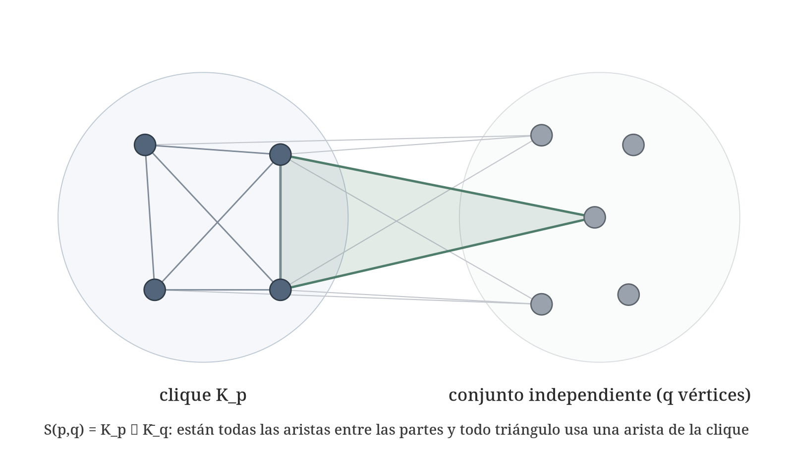
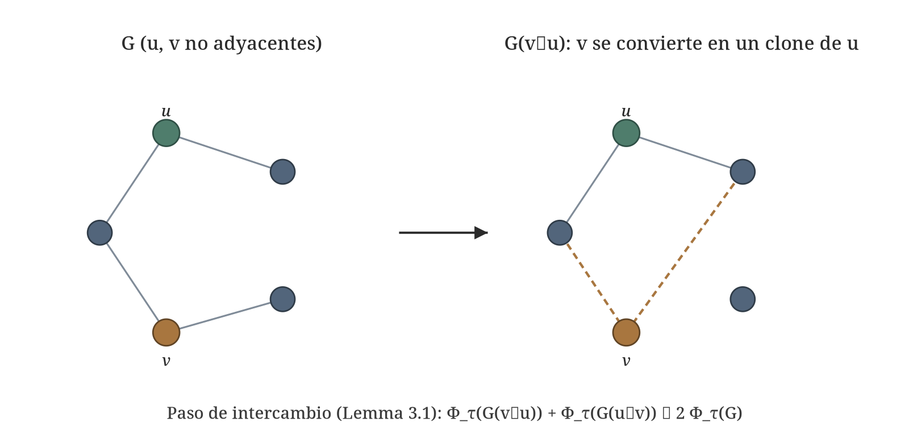
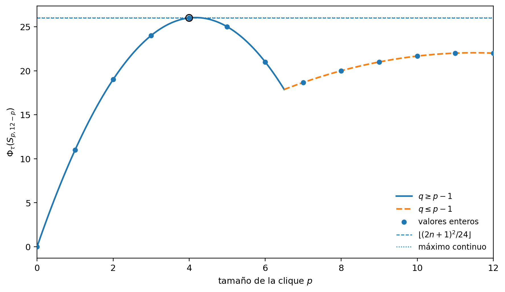

# Extremizadores complete-split para un funcional fraccional de cobertura de triángulos en grafos cordales

**Juan Pablo Traverso Gianini**  
Investigador independiente, Santiago, Chile  
[jtraverso@gmail.com](mailto:jtraverso@gmail.com)  
[ORCID: 0009-0003-6068-4096](https://orcid.org/0009-0003-6068-4096)

**Paper II de la serie**  
**Preprint:** versión 1.2. Este manuscrito y su artefacto formal adjunto forman un único paquete público autocontenido.  
**Fecha de publicación:** 22 de agosto de 2026  
**Estado:** preprint oficial del autor. El freeze adjunto Paper II Lean v1.2 consolida el desarrollo principal, los módulos de extremizadores y defectos de copia, los corolarios aritméticos y las superficies de contribución. El archivo exacto y el paquete del manuscrito superaron una reproducción independiente en clean room y una auditoría adversarial externa. Esta publicación no constituye revisión externa humana por pares ni una determinación especializada de prioridad.

**Estado del arte previo y la novedad.** La auditoría interna de literatura, complementada por la revisión adversarial externa, no identificó un resultado anterior que determine el mismo extremo finito exacto para el funcional fraccional de cobertura de triángulos sobre grafos cordales, con los extremizadores complete-split y la vía de simetrización demostrados aquí. El problema más amplio de particiones en cliques de grafos cordales sigue abierto. Esta es una búsqueda negativa acotada por su corpus, no una demostración de prioridad ni un sustituto de una revisión especializada.

**MSC 2020:** Primario 05C70; secundarios 05C35, 05C72.

---

## Resumen

Para un grafo \(G\), sea \(\tau_3^*(G)\) su número fraccional de cobertura de triángulos, y definamos

\[
\Phi_\tau(G):=|E(G)|-2\tau_3^*(G).
\]

Equivalentemente, \(\Phi_\tau(G)=|E(G)|-2\nu_3^*(G)\), pues \(\nu_3^*=\tau_3^*\); este es el déficit fraccional de empaquetamiento de triángulos de la serie. Determinamos el máximo exacto de \(\Phi_\tau\) sobre grafos cordales de orden fijo. Para todo entero \(n\ge1\),

\[
\boxed{
\max_{\substack{|V(G)|=n\\G\text{ cordal}}}
\Phi_\tau(G)
=
\left\lfloor\frac{(2n+1)^2}{24}\right\rfloor.
}
\]

La demostración es finita y está formulada desde el lado de coberturas. Su paso principal es una desigualdad de copia de vértices: para dos vértices no adyacentes, el promedio de los valores \(\Phi_\tau\) de las dos direcciones posibles de copia es al menos el valor del grafo original. Un argumento de convexidad discreta eleva esto desde vértices individuales a clases completas de clones por vecindario abierto. En grafos cordales, copiar hacia una clase simplicial de clones preserva la cordalidad. Copias admisibles repetidas reducen, por tanto, el problema extremo, sin disminuir \(\Phi_\tau\), a grafos complete-split

\[
S_{p,q}:=K_p\vee\overline{K_q}.
\]

Sobre \(S_{p,q}\), el promedio sobre órbitas reduce el cálculo de cobertura fraccional a un programa lineal de dos variables. Resolver sus dos ramas, incluido el caso degenerado \(S_{2,0}=K_2\), y luego maximizar sobre \(p+q=n\), entrega exactamente el piso exhibido.

El enunciado de unicidad/empate se refiere al tamaño maximizante de la clique dentro de la familia complete-split. El artículo no afirma que todo extremizador cordal esté determinado de manera única salvo isomorfismo.

Este es el componente extremo fraccional finito del programa más amplio de Erdős Problem #81 [8]. Dentro de la serie, Paper I prueba una cota fraccional finita para grafos split [4], el presente artículo identifica la familia terminal complete-split y el valor fraccional exacto, Paper III prueba el teorema de error lineal para particiones en cliques de grafos split y Paper IV desarrolla una interfaz general de transferencia y redondeo. El artículo prueba únicamente el teorema del funcional fraccional de cobertura anterior. No prueba un teorema integral de partición en cliques; su demostración desde el lado de coberturas no usa dualidad fuerte de PL ni un teorema asintótico de empaquetamiento.

**Palabras clave:** grafo cordal; cobertura fraccional de triángulos; simetrización; clase de clones; grafo complete-split; problema de Erdős.

---

## 1. Introducción

Un grafo es cordal si no tiene ciclos inducidos de longitud al menos cuatro. Los grafos cordales admiten varias descripciones estructurales equivalentes, entre ellas los órdenes de eliminación perfecta y los árboles de cliques. Estas descripciones hacen que la clase sea apropiada para argumentos extremos en los que se simplifican vértices mientras se controla un parámetro del grafo.

El presente artículo estudia el funcional

\[
\Phi_\tau(G):=|E(G)|-2\tau_3^*(G),
\]

donde \(\tau_3^*(G)\) es el número fraccional de cobertura de triángulos. El resultado principal es un teorema extremo finito exacto.

#### Teorema 1.1

Para todo entero \(n\ge1\),

\[
\boxed{
\max_{\substack{|V(G)|=n\\G\text{ cordal}}}
\left(
|E(G)|-2\tau_3^*(G)
\right)
=
\left\lfloor\frac{(2n+1)^2}{24}\right\rfloor.
}
\]

Además, la igualdad se alcanza en un grafo complete-split

\[
S_{p,q}=K_p\vee\overline{K_q},
\qquad
p+q=n,
\]

donde \(p\) es un entero más próximo a \((2n+1)/6\). Entre los grafos complete-split \(S_{p,n-p}\), el entero maximizante \(p\) es único salvo cuando \(n\equiv1\pmod3\); en ese caso, exactamente dos valores consecutivos de \(p\) alcanzan el máximo. Véanse el análisis por casos en la demostración de la Proposición 7.1 y las declaraciones formalizadas `Fsat_argmax_unique` y `Fsat_argmax_tie`. No se afirma unicidad alguna para extremizadores cordales arbitrarios.

#### Observación (principio de extremización)

La reducción se extiende a cualquier funcional \(F\), invariante por isomorfismos, que satisfaga para todo par no adyacente la misma desigualdad de intercambio por copia de clones en ambas direcciones que el Lema 3.1. Al repetir los argumentos de copia de clases y reducción terminal de los Lemas 4.1--5.3 se obtiene entonces que el máximo cordal se alcanza en la familia complete-split:
\[
\max_{\substack{|V(G)|=n\\ G\text{ cordal}}}F(G)=\max_{0\le p\le n}F(S_{p,\,n-p}).
\]
El Teorema 1.1 es el caso \(F=\Phi_\tau\); la forma cerrada \(\lfloor(2n+1)^2/24\rfloor\) se obtiene después mediante una evaluación analítica sobre esa familia uniparamétrica. El principio se enuncia aquí para su uso posterior; solo se formaliza el caso de cobertura de triángulos. Es un enunciado de existencia de un maximizante y no una clasificación de todos los casos de igualdad cordales.

#### Corolario 1.2

Para grafos cordales de orden \(n\),

\[
\max_{\substack{|V(G)|=n\\G\text{ cordal}}}\Phi_\tau(G)=\frac{n^2}{6}+O(n),
\]

de modo que el máximo es \((1+o(1))\,n^2/6\). La constante principal \(1/6\) es la misma que aparece en el objetivo de Erdős–Ordman–Zalcstein para particiones en cliques de grafos cordales [1]. Este enunciado concierne únicamente al funcional fraccional \(\Phi_\tau\); aquí no se realiza el paso hacia una cota integral de partición en cliques.

#### Demostración

Por Teorema 1.1, el máximo es \(\left\lfloor(2n+1)^2/24\right\rfloor\). Como \((2n+1)^2/24=n^2/6+n/6+1/24\), el piso difiere de \(n^2/6+n/6\) en menos de \(1\); por tanto, el máximo es \(n^2/6+O(n)\).

#### Corolario 1.2\(^{\prime}\) (asintótica afinada)

Escribamos \(M(n):=\left\lfloor(2n+1)^2/24\right\rfloor\). Para \(n\ge1\), este es el valor extremal del Teorema 1.1; como enunciado aritmético acerca del piso, las desigualdades siguientes valen para todo entero \(n\):

\[
\frac{n^2}{6}+\frac{n}{6}-1
\;<\;
M(n)
\;\le\;
\frac{n^2}{6}+\frac{n}{6}+\frac{1}{24},
\]

o, de manera equivalente, eliminando denominadores sobre \(\mathbb Z\),

\[
4n^2+4n-23 \;<\; 24\,M(n) \;\le\; 4n^2+4n+1.
\]

Una vez extraído el término lineal explícito \(n/6\), el error restante queda acotado: se tiene \(M(n)=n^2/6+n/6+\theta_n\), con \(\theta_n\in(-1,\,1/24]\). Esto se sigue de inmediato de \(24\,M(n)\le(2n+1)^2<24\,M(n)+24\) y \((2n+1)^2=4n^2+4n+1\). Está formalizado para \(n:\mathbb Z\), sin hipótesis de cota inferior, como `PaperII.phiTau_max_sandwich` (huella axiomática `propext`, `Classical.choice`, `Quot.sound`).

**Estado de la formalización.** El freeze Paper II Lean v1.2 entregado usa Lean 4 / Mathlib v4.28.0 [5,6]. Su build principal registrado completó 8.061 jobs, y el suplemento explícito de extremizadores y defectos de copia completó 8.032 jobs. La declaración principal se llama `PaperII.theorem_1_2`; corresponde al Teorema 1.1 de este manuscrito e incluye el enunciado de existencia del maximizante que lo acompaña. El mismo freeze incluye el argmax complete-split, los conjuntos de nivel, los defectos de copia y `PaperII.AsymptoticCorollaries`. Su gate de axiomas a nivel de teorema no registra axiomas matemáticos propios del proyecto. El desarrollo formal deriva la estructura cordal usada en la demostración a partir del predicado estándar `IsChordal`; no se añade ningún axioma sobre árboles de cliques ni sobre estructura cordal. La Sección 8 registra el perímetro exacto del freeze.

La demostración tiene dos partes. La primera es estructural. Reduce un grafo cordal arbitrario a uno complete-split sin disminuir \(\Phi_\tau\). La segunda es un cálculo sobre esa familia terminal.

La idea estructural es la siguiente. Si \(u\) y \(v\) no son adyacentes, el grafo \(G_{v\to u}\) se obtiene reemplazando el vecindario de \(v\) por el vecindario de \(u\). Así, \(v\) se convierte en un clone de \(u\). Las dos operaciones de copia en sentidos opuestos satisfacen

\[
\Phi_\tau(G_{v\to u})
+
\Phi_\tau(G_{u\to v})
\ge
2\Phi_\tau(G).
\]

Esta desigualdad es el paso básico de intercambio. Una cobertura óptima de \(G\) se transporta a ambos grafos copiados. Los dos cambios en el costo de cobertura se cancelan al sumar las desigualdades. Los conteos de aristas se cancelan del mismo modo.

Copiar vértices individuales no basta para una reducción que termine. Puede dividir una clase de clones ya existente. Por ello copiamos clases completas de clones por vecindario abierto. La misma desigualdad de intercambio se convierte en un enunciado de convexidad discreta para una sucesión finita \(H_0,\ldots,H_{a+b}\). En consecuencia, una de las dos direcciones de copia de la clase completa no disminuye \(\Phi_\tau\).

Hay un punto en que importa la cordalidad. La dirección no decreciente se elige mediante el argumento de convexidad y, por tanto, no se conoce de antemano. Para mantener el grafo cordal cualquiera sea la dirección elegida, ambas clases de clones se toman simpliciales. Copiar hacia una clase simplicial es seguro porque los vértices copiados se reinsertan con un vecindario que es clique.

La caracterización terminal se prueba por separado. A partir de la propiedad de intersección consecutiva del árbol de cliques, un grafo cordal en el que cada par de vértices simpliciales no adyacentes tiene el mismo vecindario abierto debe ser complete-split. Por tanto, la simetrización se detiene exactamente en la familia deseada.

Sobre \(S_{p,q}\), el cálculo es breve, pero los casos pequeños deben permanecer visibles. El promedio sobre órbitas da un peso de cobertura \(x\) sobre las aristas de la clique y un peso \(y\) sobre las aristas cruzadas. Los tipos posibles de triángulo producen

\[
3x\ge1
\quad(p\ge3),
\qquad
x+2y\ge1
\quad(p\ge2,\ q\ge1).
\]

Una restricción se incluye solo cuando existe el tipo de triángulo correspondiente. En particular, \(S_{2,0}=K_2\) no tiene triángulos y su número de cobertura es cero. Con esta convención, el programa lineal terminal tiene dos ramas, y la maximización restante sobre \(p+q=n\) es un cálculo entero de una variable.

#### Observación (la cordalidad es esencial)

La hipótesis no puede omitirse. El ciclo de longitud cuatro no contiene triángulos, por lo que \(\tau_3^*(C_4)=0\) y \(\Phi_\tau(C_4)=4\), mientras que el máximo cordal para \(n=4\) es \(3\). El informe de auditoría suministrado registra una enumeración exhaustiva de todos los grafos con \(n=4,5,6,7\) vértices, cuyos máximos son \(4,6,9,12\), frente a los valores cordales \(3,5,7,9\). Así, la brecha no se limita a \(n=4\). La cordalidad entra en la demostración a través del Lema 4.3, que es el que mantiene la simetrización del Teorema 5.3 dentro de la clase.

**Relación con Erdős Problem #81.** Erdős, Ordman y Zalcstein preguntaron por una cota de la forma \(n^2/6+O(n)\) para particiones en cliques de grafos cordales [1]. Teorema 1.1 identifica el extremo finito exacto de un funcional fraccional de cobertura que aparece naturalmente en enfoques a ese problema. No convierte coberturas fraccionales en empaquetamientos integrales de triángulos ni en particiones en cliques; esas interfaces se mantienen deliberadamente fuera de este artículo.

Este es el segundo artículo de la serie. Paper I prueba la cota fraccional finita para grafos split \(|E(G)|-2\nu_3^*(G)\le n^2/6+n/2\) [4]. El presente artículo pasa de los grafos split a todos los grafos cordales, pero para el funcional de cobertura \(\Phi_\tau\), y determina el máximo finito exacto. Su función es identificar la familia terminal complete-split y el valor fraccional preciso; toda conclusión integral sobre particiones en cliques corresponde a otra entrega del programa.

#### Observación (coherencia con la cota de Paper I)

El máximo cordal exacto también satisface la cota superior de Paper I para grafos split: para todo entero \(n\ge1\),

\[
M(n)=\left\lfloor\frac{(2n+1)^2}{24}\right\rfloor
\;\le\;
\frac{n^2}{6}+\frac{n}{2},
\]

donde el lado derecho es la estimación finita \(|E(G)|-2\nu_3^*(G)\le n^2/6+n/2\) de Paper I [4]. Esta comparación es numérica y no una consecuencia de la inclusión de clases, pues la clase cordal es mayor que la clase split. La holgura es \(\bigl(n^2/6+n/2\bigr)-M(n)=n/3+O(1)\). La desigualdad está formalizada como `PaperII.phiTau_max_le_paperI_bound` (huella axiomática `propext`, `Quot.sound`).

Sección 2 fija la notación y los hechos cordales usados más adelante. Secciones 3 y 4 prueban la desigualdad de copia y su forma para clases de clones. Sección 5 entrega la caracterización terminal y la reducción a grafos complete-split. Secciones 6 y 7 resuelven el programa terminal y ensamblan el teorema. Sección 8 registra la reproducibilidad, el alcance de la verificación formal y el estado de validación.

---

## 2. Definiciones y preliminares cordales

Todos los grafos son finitos y simples. Escribimos \(V(G)\), \(E(G)\), y

\[
e(G):=|E(G)|.
\]

Sea \(\mathcal T(G)\) el conjunto de triángulos de \(G\).

Una **cobertura fraccional de triángulos** es una función

\[
z:E(G)\longrightarrow\mathbb R_{\ge0}
\]

tal que

\[
\sum_{e\in E(T)}z_e\ge1
\qquad
(T\in\mathcal T(G)).
\]

Su costo es \(\sum_{e\in E(G)}z_e\), y

\[
\tau_3^*(G)
:=
\min\left\{
\sum_{e\in E(G)}z_e:
z\text{ es una cobertura fraccional de triángulos}
\right\}.
\]

El mínimo se alcanza porque este es un programa lineal finito, factible y acotado inferiormente por cero. Si \(G\) no tiene triángulos, entonces \(\tau_3^*(G)=0\).

Definimos

\[
\Phi_\tau(G):=e(G)-2\tau_3^*(G).
\]

**Relación con la serie (no usada en la demostración).** Por dualidad finita de programación lineal, los óptimos fraccionales de cobertura y empaquetamiento de triángulos coinciden, \(\nu_3^*(G)=\tau_3^*(G)\). Por tanto,

\[
\Phi_\tau(G)=e(G)-2\tau_3^*(G)=e(G)-2\nu_3^*(G)
\]

es exactamente el déficit fraccional de empaquetamiento de triángulos estudiado en Paper I [4], y la relajación fraccional del funcional integral \(|E|-2\nu_3\) de Paper III. Esta es dualidad finita estándar de PL, registrada únicamente para relacionar la notación a través de la serie; no se usa en ninguna parte de la demostración siguiente, que está formulada desde el lado de coberturas.

**Notación de la serie.** Paper I escribe el déficit de empaquetamiento fraccional como \(\Phi^*(G)=|E(G)|-2\nu_3^*(G)\). El presente artículo denota la cantidad igual, vista desde la cobertura, por \(\Phi_\tau(G)\). Paper III reserva \(\Phi(G)\) para el déficit integral \(|E(G)|-2\nu_3(G)\).

Para \(p,q\ge0\), el **grafo complete-split**

\[
S_{p,q}:=K_p\vee\overline{K_q}
\]

tiene un lado clique \(K\) de orden \(p\), un lado independiente \(I\) de orden \(q\) y las \(pq\) aristas entre ambos lados.



**Figura 1.** El grafo complete-split \(S_{p,q}=K_p\vee\overline{K_q}\): la clique \(K_p\) está unida completamente al conjunto independiente de orden \(q\), y todo triángulo usa al menos una arista de la clique. Las copias admisibles reducen el problema extremo a esta familia.

Dos vértices \(u,v\) son **clones por vecindario abierto** si

\[
N_G(u)=N_G(v).
\]

Clones distintos por vecindario abierto son necesariamente no adyacentes. Una clase de clones es un conjunto maximal de clones por vecindario abierto dos a dos. Sea \(m(G)\) el número de clases maximales de clones.

Un vértice \(v\) es **simplicial** si \(N_G(v)\) es una clique. Una clase de clones es simplicial si su vecindario abierto común es una clique.

Para vértices no adyacentes \(u,v\), sea \(G_{v\to u}\) el grafo obtenido eliminando toda arista incidente en \(v\) y luego uniendo \(v\) a cada vértice de \(N_G(u)\). Así, \(u\) y \(v\) son clones en \(G_{v\to u}\).

Usamos los siguientes hechos estándar sobre grafos cordales [2,3].

1. Todo subgrafo inducido de un grafo cordal es cordal.
2. Añadir un nuevo vértice cuyo vecindario es una clique preserva la cordalidad.
3. Todo grafo cordal no vacío tiene un vértice simplicial, y todo grafo cordal conexo no completo tiene dos vértices simpliciales no adyacentes.
4. Todo grafo cordal conexo tiene un árbol de cliques: sus nodos son las cliques maximales, y las cliques maximales que contienen un vértice fijo inducen un subárbol conexo.

También usamos dos hechos elementales sobre árboles: un árbol con al menos dos nodos tiene al menos dos hojas, y un subárbol conexo que contiene todas las hojas es el árbol completo.

---

## 3. La desigualdad de copia de vértices



**Figura 2.** El paso de intercambio (Lema 3.1). Copiar \(v\) hacia \(u\) convierte a \(v\) en un clone de \(u\); las dos copias en sentidos opuestos satisfacen \(\Phi_\tau(G_{v\to u})+\Phi_\tau(G_{u\to v})\ge 2\Phi_\tau(G)\).

#### Lema 3.1

Sea \(G\) un grafo y sean \(u,v\in V(G)\) no adyacentes. Entonces

\[
\boxed{
\Phi_\tau(G_{v\to u})
+
\Phi_\tau(G_{u\to v})
\ge
2\Phi_\tau(G).
}
\]

#### Demostración

Sea \(z\) una cobertura fraccional óptima de triángulos de \(G\), de modo que

\[
\sum_{e\in E(G)}z_e=\tau_3^*(G).
\]

Construimos primero una cobertura \(z'\) de \(G_{v\to u}\). Para una arista no incidente en \(v\), conservamos su peso anterior. Para todo \(x\in N_G(u)\), definimos

\[
z'_{vx}:=z_{ux}.
\]

Para verificar la factibilidad, consideremos un triángulo de \(G_{v\to u}\). Si no contiene a \(v\), entonces es un triángulo de \(G\) y los tres pesos no cambian. Si es \(vxy\), entonces \(x,y\in N_G(u)\) y \(xy\in E(G)\). Por tanto, \(uxy\) es un triángulo de \(G\), y

\[
z'_{vx}+z'_{vy}+z'_{xy}
=
z_{ux}+z_{uy}+z_{xy}
\ge1.
\]

Así, \(z'\) es factible.

Su costo es

\[
\operatorname{cost}(z')
=
\left(
\sum_{e\in E(G)}z_e
-
\sum_{x\in N_G(v)}z_{vx}
\right)
+
\sum_{x\in N_G(u)}z_{ux}.
\tag{3.1}
\]

Intercambiar \(u\) y \(v\) da una cobertura factible \(z''\) de \(G_{u\to v}\) con

\[
\operatorname{cost}(z'')
=
\left(
\sum_{e\in E(G)}z_e
-
\sum_{x\in N_G(u)}z_{ux}
\right)
+
\sum_{x\in N_G(v)}z_{vx}.
\tag{3.2}
\]

Al sumar (3.1) y (3.2), los términos de corrección se cancelan exactamente:

\[
\operatorname{cost}(z')
+
\operatorname{cost}(z'')
=
2\tau_3^*(G).
\]

Como cada óptimo no es mayor que el costo de la cobertura factible correspondiente,

\[
\tau_3^*(G_{v\to u})
+
\tau_3^*(G_{u\to v})
\le
2\tau_3^*(G).
\tag{3.3}
\]

Los conteos de aristas satisfacen una segunda identidad exacta. El grafo \(G_{v\to u}\) reemplaza \(d_G(v)\) por \(d_G(u)\) y no cambia ninguna arista no incidente en \(v\). Por tanto,

\[
e(G_{v\to u})
=
e(G)-d_G(v)+d_G(u).
\]

De manera análoga,

\[
e(G_{u\to v})
=
e(G)-d_G(u)+d_G(v).
\]

Así,

\[
e(G_{v\to u})+e(G_{u\to v})=2e(G).
\tag{3.4}
\]

Usando la definición de \(\Phi_\tau\), restamos dos veces (3.3) de (3.4):

\[
\begin{aligned}
\Phi_\tau(G_{v\to u})
+
\Phi_\tau(G_{u\to v})
&=
2e(G)
-
2\left(
\tau_3^*(G_{v\to u})
+
\tau_3^*(G_{u\to v})
\right)\\
&\ge
2e(G)-4\tau_3^*(G)\\
&=
2\Phi_\tau(G).
\end{aligned}
\]

Esto prueba el lema.

#### Corolario 3.2

Al menos uno de los dos grafos \(G_{v\to u}\) y \(G_{u\to v}\) satisface

\[
\Phi_\tau(G_{\mathrm{copy}})\ge\Phi_\tau(G).
\]

No se necesita en la demostración ninguna normalización como \(z_e\le1\).

#### Observación (demostración alternativa desde el lado del empaquetamiento)

El Lema 3.1 admite una demostración más breve desde el lado del empaquetamiento. Como \(|E(G_{v\to u})|+|E(G_{u\to v})|=2|E(G)|\) —cada copia elimina las \(d(v)\) aristas incidentes con \(v\) y añade las \(d(u)\) aristas desde \(v\) hasta \(N_G(u)\), o a la inversa, y \(u,v\) no son adyacentes—, el enunciado equivale a \(\tau_3^*(G_{v\to u})+\tau_3^*(G_{u\to v})\le2\tau_3^*(G)\). Bajo \(\nu_3^*=\tau_3^*\), esta desigualdad se obtiene mediante un breve conteo de cargas de aristas sobre las imágenes de dos empaquetamientos óptimos. Aquí no se sigue esa vía porque requiere dualidad fuerte de programación lineal, que la presente demostración evita deliberadamente. El argumento que parte de coberturas mantiene el artículo independiente de la dualidad y de cualquier teorema asintótico de empaquetamiento; la misma independencia se refleja en la huella axiomática registrada en la Sección 8.

#### Definición (defecto de copia)

Para \(u,v\) no adyacentes, definamos
\[
\begin{aligned}
\Delta_{\Phi_\tau}(u,v)
&=\Phi_\tau(G_{v\to u})+\Phi_\tau(G_{u\to v})-2\Phi_\tau(G)\ge0
\quad(\text{Lema 3.1}),\\
\Gamma_{\Phi_\tau}(u,v)
&=\max\{\Phi_\tau(G_{v\to u}),\Phi_\tau(G_{u\to v})\}-\Phi_\tau(G).
\end{aligned}
\]
Entonces \(\Gamma_{\Phi_\tau}\ge\Delta_{\Phi_\tau}/2\), formalizado como `copyDefect_nonneg` y `copyGamma_ge_half_copyDefect`. La cantidad \(\Delta_{\Phi_\tau}\) es el recurso que deberá controlar cualquier enunciado futuro de estabilidad; aquí se registra como una herramienta cuantitativa, no como un teorema de estabilidad.

---

## 4. Copia de clases completas de clones

Sean \(U,V\) dos clases distintas y no adyacentes de clones, con

\[
|U|=a,
\qquad
|V|=b.
\]

Fuera de \(U\cup V\), mantenemos fijo el grafo. Para \(0\le k\le a+b\), sea \(H_k\) el grafo en el que \(k\) vértices de \(U\cup V\) tienen tipo de vecindario \(N(U)\), y los \(a+b-k\) vértices restantes tienen tipo de vecindario \(N(V)\). Todos los vértices de \(U\cup V\) siguen siendo dos a dos no adyacentes. Salvo isomorfismo,

\[
H_a=G,
\qquad
H_0=G_{U\to V},
\qquad
H_{a+b}=G_{V\to U}.
\]

#### Lema 4.1

Para

\[
f(k):=\Phi_\tau(H_k),
\]

tenemos

\[
f(k-1)+f(k+1)\ge2f(k)
\qquad
(1\le k\le a+b-1).
\]

Por tanto,

\[
f(a)\le\max\{f(0),f(a+b)\}.
\]

#### Demostración

Sea \(k\) tal que \(1\le k\le a+b-1\). Entonces \(H_k\) contiene al menos un vértice \(x\) de tipo \(U\) y un vértice \(y\) de tipo \(V\). Estos dos vértices no son adyacentes. En \(H_k\), copiar \(x\) hacia \(y\) transforma un vértice de tipo \(U\) en uno de tipo \(V\), de modo que el grafo resultante es isomorfo a \(H_{k-1}\). Copiar \(y\) hacia \(x\) da un grafo isomorfo a \(H_{k+1}\). Lema 3.1 da, por tanto,

\[
f(k-1)+f(k+1)\ge2f(k).
\]

Definamos

\[
\Delta_k:=f(k)-f(k-1).
\]

La desigualdad exhibida es equivalente a

\[
\Delta_{k+1}\ge\Delta_k.
\]

Así, las primeras diferencias son no decrecientes. Una sucesión finita de este tipo no puede tener un máximo estricto en el interior: antes de que las primeras diferencias se vuelvan no negativas, la sucesión decrece, y después de ese punto es no decreciente. Por tanto, el máximo de \(f(0),\ldots,f(a+b)\) se alcanza en un extremo y, en particular,

\[
f(a)\le\max\{f(0),f(a+b)\}.
\]

Esto dice exactamente que una de las dos direcciones de copia de la clase completa no disminuye \(\Phi_\tau\).

#### Lema 4.2

Después de copiar una clase completa de clones sobre otra, ninguna clase antigua de clones se divide. Las clases fuente y objetivo se fusionan, y por tanto el número de clases maximales de clones disminuye estrictamente.

#### Demostración

Supongamos que la clase fuente \(W_1\) se copia sobre la clase objetivo \(W_2\), cuyo vecindario común es \(B\). Todo vértice de \(W_1\cup W_2\) tiene vecindario \(B\) en el nuevo grafo, por lo que estas dos clases se fusionan.

Sea \(C\) una clase antigua de clones disjunta de \(W_1\cup W_2\), y sean \(c,c'\in C\). Las aristas no incidentes en \(W_1\) no cambian, de modo que \(c\) y \(c'\) siguen coincidiendo en todas las coordenadas fuera de \(W_1\). Para \(w\in W_1\), la adyacencia con \(w\) en el nuevo grafo equivale a pertenecer a \(B\). Como \(B=N_G(W_2)\) y \(c,c'\) eran clones en \(G\), o ambos pertenecen a \(B\) o ninguno pertenece. Así, \(c,c'\) también coinciden en todas las coordenadas de \(W_1\). Por tanto, \(C\) no se divide.

Las dos clases distintas \(W_1,W_2\) se fusionan y cada otra clase antigua queda contenida en una clase de clones del nuevo grafo. Por tanto, las clases antiguas se proyectan sobre las nuevas, con dos clases antiguas identificadas y ninguna dividida. De aquí que \(m(G)\) disminuya estrictamente.

#### Lema 4.3

Si \(G\) es cordal y la clase objetivo de clones es simplicial, copiar sobre ella una clase no adyacente de clones preserva la cordalidad.

#### Demostración

Eliminamos la clase fuente. El grafo restante es un subgrafo inducido de \(G\), y por tanto es cordal. Reinsertamos los vértices fuente uno a uno, cada uno con el vecindario común de la clase objetivo. Ese vecindario es una clique porque la clase objetivo es simplicial. Añadir un vértice con vecindario clique preserva la cordalidad.

La dirección entregada por Lema 4.1 no se conoce de antemano. Por esta razón, la simetrización usará pares en los que ambas clases sean simpliciales.

---

## 5. Grafos cordales terminales y simetrización

Primero caracterizamos los grafos terminales sin referencia al proceso de copia.

#### Lema 5.1

Sea \(H\) un grafo cordal finito con la siguiente propiedad:

> cada par de vértices simpliciales no adyacentes de \(H\) tiene el mismo vecindario abierto.

Entonces \(H\) es complete-split.

*La formalización Lean acompañante prueba este lema mediante un argumento equivalente que no usa árboles de cliques — por eliminación simplicial y el hecho de que todo separador minimal de vértices de un grafo cordal es una clique — en lugar de la demostración mediante árboles de cliques dada abajo; véase §8. El enunciado probado es idéntico.*

#### Demostración

Si \(|V(H)|\le1\), la conclusión es inmediata. Supongamos primero que \(H\) es disconexo. Si una componente contiene una arista y otra componente es no vacía, elegimos un vértice simplicial \(z\) con un vecino en la primera componente y un vértice simplicial \(w\) en la otra componente. Tales vértices existen por el teorema estándar de vértices simpliciales aplicado dentro de cada componente. No son adyacentes. La hipótesis da

\[
N_H(z)=N_H(w).
\]

Los dos vecindarios están en componentes distintas, por lo que ambos tendrían que ser vacíos, contradiciendo que \(z\) tiene un vecino. Por tanto, un \(H\) disconexo que satisface la hipótesis no tiene aristas y es, por tanto, \(S_{0,|V(H)|}\).

Si \(H\) es completo, es \(S_{|V(H)|,0}\). Podemos entonces suponer que \(H\) es conexo y no completo.

Elegimos un árbol de cliques \(\mathcal Q\) de \(H\). Tiene al menos dos nodos y, por tanto, al menos dos hojas. Toda clique maximal hoja \(L\) tiene un vértice privado, es decir, un vértice que no pertenece a ninguna otra clique maximal. En efecto, de otro modo \(L\) estaría contenida en la unión con la clique vecina a lo largo de la única arista del árbol que sale de \(L\), contradiciendo la maximalidad. Un vértice privado \(x\) es simplicial, y su vecindario abierto es \(L\backslash\{x\}\).

Los vértices privados que pertenecen a cliques hoja distintas no son adyacentes. En efecto, si vértices privados \(x\in L_1\) e \(y\in L_2\), con \(L_1\ne L_2\), fueran adyacentes, alguna clique maximal contendría a ambos. Como \(x\) pertenece solo a \(L_1\), esa clique sería \(L_1\), lo que forzaría \(y\in L_1\), en contra de la privacidad de \(y\) en \(L_2\).

Por la hipótesis, todos los vértices privados de hojas tienen un vecindario abierto común; llamémoslo \(K\). Por tanto, toda clique hoja tiene la forma

\[
L=K\cup\{x_L\}.
\]

No puede haber dos vértices privados en una misma clique hoja. Dos de ellos serían adyacentes, y cada uno pertenecería al vecindario común \(K\) de un vértice privado de otra hoja, contradiciendo la no adyacencia recién probada.

Mostramos ahora que todo vértice de \(K\) es universal. Fijemos \(v\in K\). Como \(v\) pertenece a toda clique hoja, el subárbol conexo de cliques maximales que contienen a \(v\) contiene todas las hojas de \(\mathcal Q\). Un subárbol conexo que contiene todas las hojas es el árbol completo. Así, \(v\) pertenece a toda clique maximal y es adyacente a todo otro vértice de \(H\). Por tanto, \(K\) es una clique de vértices universales.

Resta probar que \(H-K\) es independiente. Supongamos que \(H-K\) contiene una arista. Una componente no trivial de \(H-K\) es cordal y tiene un vértice simplicial \(z\) con un vecino dentro de esa componente. Como todo vértice de \(K\) es universal,

\[
N_H(z)=K\cup N_{H-K}(z).
\]

Los dos conjuntos de la derecha son cliques, y están presentes todas las aristas entre ellos. Por tanto, \(z\) es simplicial en \(H\), y

\[
N_H(z)\supsetneq K.
\]

Elegimos un vértice privado de hoja \(x\), de modo que \(N_H(x)=K\). Como \(z\notin K\), los vértices \(z\) y \(x\) no son adyacentes. La hipótesis forzaría \(N_H(z)=N_H(x)=K\), una contradicción.

Por tanto, \(H-K\) es independiente. Como \(K\) es una clique universal,

\[
H=K_{|K|}\vee\overline{K_{|H-K|}},
\]

que es complete-split.

#### Corolario 5.2

Si un grafo cordal no es complete-split, entonces tiene dos vértices simpliciales no adyacentes con vecindarios abiertos distintos. Sus clases de clones son distintas, no adyacentes y ambas simpliciales.

#### Demostración

El primer enunciado es la contrapositiva de Lema 5.1. Sean \(x,y\) los vértices resultantes y sean \(U,V\) sus clases de clones. Las clases son simpliciales porque sus vecindarios comunes son \(N(x)\) y \(N(y)\), ambos cliques. Son distintas porque estos vecindarios difieren.

Son no adyacentes como clases. Si algunos \(u\in U\) y \(v\in V\) fueran adyacentes, entonces \(v\in N(u)=N(x)\), y por simetría de la adyacencia \(x\in N(v)=N(y)\). Esto haría adyacentes a \(x\) e \(y\), en contra de su elección.

#### Teorema 5.3

Para todo grafo cordal \(G\) de \(n\) vértices, existen enteros \(p,q\ge0\), \(p+q=n\), tales que

\[
\boxed{
\Phi_\tau(G)\le\Phi_\tau(S_{p,q}).
}
\]

#### Demostración

Partiendo de \(G\), repetimos la siguiente operación mientras el grafo actual no sea complete-split.

Por Corolario 5.2, elegimos dos clases simpliciales distintas y no adyacentes de clones con vecindarios diferentes. Por Lema 4.1, una de las dos direcciones de copia de la clase completa no disminuye \(\Phi_\tau\). Ambos objetivos posibles son simpliciales, de modo que Lema 4.3 preserva la cordalidad cualquiera sea la dirección seleccionada. Por Lema 4.2, el número de clases maximales de clones disminuye estrictamente.

El proceso termina porque \(m(G)\) es un entero positivo. Al terminar, no existe el par entregado por Corolario 5.2, y por tanto el grafo es complete-split por Lema 5.1. La copia nunca cambia el conjunto de vértices, de modo que el grafo terminal es \(S_{p,q}\), con \(p+q=n\). Como \(\Phi_\tau\) nunca disminuye,

\[
\Phi_\tau(G)\le\Phi_\tau(S_{p,q}).
\]

El requisito de que ambas clases sean simpliciales se usa únicamente para hacer compatible este último argumento con la dirección elegida por convexidad discreta.

---

## 6. El programa de cobertura complete-split

Sea

\[
S_{p,q}=K_p\vee\overline{K_q},
\qquad
P:=\binom p2.
\]

El grupo de automorfismos es

\[
\operatorname{Aut}(S_{p,q})
\cong
\mathfrak S_p\times\mathfrak S_q.
\]

Tiene dos órbitas de aristas: las \(P\) aristas de la clique y las \(pq\) aristas cruzadas.

#### Lema 6.1

Existe una cobertura fraccional óptima de triángulos de \(S_{p,q}\) que es constante en cada órbita de aristas.

#### Demostración

Sea \(z\) una cobertura óptima. Para cada automorfismo \(\sigma\), transportamos \(z\) definiendo

\[
z^\sigma_e:=z_{\sigma^{-1}(e)}.
\]

Los automorfismos permutan los triángulos, de modo que cada \(z^\sigma\) es factible. Todas tienen el mismo costo. Su promedio

\[
\overline z
=
\frac{1}{|\operatorname{Aut}(S_{p,q})|}
\sum_{\sigma\in\operatorname{Aut}(S_{p,q})}z^\sigma
\]

es factible por convexidad, tiene el mismo costo y es invariante bajo el grupo de automorfismos. Por tanto, es constante en cada órbita de aristas.

Escribamos \(x\) para el peso común sobre las aristas de la clique e \(y\) para el peso común sobre las aristas cruzadas. Hay dos tipos posibles de triángulo.

- Tres vértices de la clique, presentes solo cuando \(p\ge3\), dan
  \[
  3x\ge1.
  \]
- Dos vértices de la clique y un vértice independiente, presentes solo cuando \(p\ge2\) y \(q\ge1\), dan
  \[
  x+2y\ge1.
  \]

Así, el programa simetrizado es

\[
\min\{Px+pq\,y:x,y\ge0\},
\]

incluyendo cada restricción solo cuando exista su tipo de triángulo.

#### Proposición 6.2

Los casos degenerados son

\[
\tau_3^*(S_{p,q})=0
\qquad
(p\le1),
\]

y

\[
\tau_3^*(S_{2,0})=0.
\]

En todos los demás casos,

\[
\boxed{
\tau_3^*(S_{p,q})
=
\begin{cases}
\dfrac{P+pq}{3},
& p\ge3,\ 0\le q\le p-1,\\[3mm]
P,
& p\ge2,\ q\ge p-1.
\end{cases}
}
\]

#### Demostración

Si \(p\le1\), el grafo no tiene triángulos. Lo mismo vale para \(S_{2,0}=K_2\). Por tanto, el número de cobertura es cero en estos casos.

Sea \(p\ge3\) y \(q=0\). Solo existe la restricción \(3x\ge1\), de modo que

\[
\tau_3^*(S_{p,0})
=
\min\{Px:3x\ge1,\ x\ge0\}
=
\frac P3.
\]

Esta es la primera rama con \(q=0\).

Ahora sean \(p\ge3\) y \(q\ge1\). Existen ambas restricciones. La factibilidad obliga a \(x\ge1/3\). Si \(x>1\), disminuir \(x\) hasta \(1\) y mantener \(y=0\) no puede aumentar el objetivo, de modo que basta considerar \(1/3\le x\le1\). Para un \(x\) de este tipo, el menor valor factible de \(y\) es

\[
y=\frac{1-x}{2}.
\]

Usar un \(y\) mayor solo aumenta el objetivo. Por tanto, el objetivo se reduce a

\[
\begin{aligned}
Px+pq\,y
&=
Px+pq\frac{1-x}{2}\\
&=
\frac{pq}{2}
+
x\left(P-\frac{pq}{2}\right),
\end{aligned}
\]

y

\[
P-\frac{pq}{2}
=
\frac p2(p-1-q).
\]

Si \(q\le p-1\), este coeficiente es no negativo. El mínimo se alcanza en \(x=1/3\), y entonces \(y=1/3\). Su valor es

\[
\frac{P+pq}{3}.
\]

Si \(q\ge p-1\), el coeficiente es no positivo. El mínimo se alcanza en \(x=1\), \(y=0\), con valor \(P\).

Finalmente, supongamos \(p=2\) y \(q\ge1\). No hay triángulos enteramente en la clique, por lo que la restricción \(3x\ge1\) está ausente. Como \(P=1\), el programa es

\[
\min\{x+2q\,y:x,y\ge0,\ x+2y\ge1\}.
\]

Para \(q\ge1\), el mínimo se alcanza en \(x=1\), \(y=0\), y es igual a \(1=P\).

Cuando \(p\ge3\) y \(q=p-1\), las dos fórmulas coinciden porque

\[
\frac{P+p(p-1)}{3}=P.
\]

#### Corolario 6.3

Para \(p+q=n\), el valor de \(\Phi_\tau(S_{p,q})\) es el siguiente.

En la rama \(q\ge p-1\),

\[
\Phi_\tau(S_{p,q})
=
pq-P
=
\frac{p(2n+1-3p)}2.
\tag{6.1}
\]

En la rama \(q\le p-1\), con \(p\ge3\),

\[
\Phi_\tau(S_{p,q})
=
\frac{P+pq}{3}
=
\frac{p(2n-p-1)}6.
\tag{6.2}
\]

Los casos degenerados se obtienen directamente de \(\tau_3^*=0\).

#### Demostración

En la primera rama, Proposición 6.2 da \(\tau_3^*=P\). Por tanto,

\[
\begin{aligned}
\Phi_\tau(S_{p,q})
&=
P+pq-2P\\
&=
pq-P\\
&=
p(n-p)-\frac{p(p-1)}2\\
&=
\frac{p(2n+1-3p)}2.
\end{aligned}
\]

En la segunda rama,

\[
\begin{aligned}
\Phi_\tau(S_{p,q})
&=
P+pq-\frac23(P+pq)\\
&=
\frac{P+pq}{3}\\
&=
\frac{p(p-1)+2p(n-p)}6\\
&=
\frac{p(2n-p-1)}6.
\end{aligned}
\]

**Tabla 1. El funcional de cobertura complete-split.** Con \(P=\binom p2\), \(n=p+q\); las dos ramas no degeneradas coinciden en \(q=p-1\).

| Régimen | \(\tau_3^*(S_{p,q})\) | \(\Phi_\tau(S_{p,q})=e-2\tau_3^*\) |
|---|---|---|
| \(p\le1\), o \(S_{2,0}\) (sin triángulos) | \(0\) | \(P+pq\) |
| \(p\ge3,\ q\le p-1\) | \((P+pq)/3\) | \(p(2n-p-1)/6\) |
| \(p\ge2,\ q\ge p-1\) | \(P\) | \(p(2n+1-3p)/2\) |

---

## 7. Maximización entera exacta

#### Proposición 7.1

Para enteros \(p,q\ge0\) con \(p+q=n\),

\[
\Phi_\tau(S_{p,q})
\le
\left\lfloor\frac{(2n+1)^2}{24}\right\rfloor.
\]

La igualdad se alcanza en la rama \(q\ge p-1\) mediante un entero \(p\) más cercano a \((2n+1)/6\).

#### Demostración

Consideremos primero la rama \(q\ge p-1\). Por (6.1),

\[
F_n(p)
:=
\Phi_\tau(S_{p,q})
=
\frac{p(2n+1-3p)}2.
\]

Completando cuadrados,

\[
F_n(p)
=
\frac{(2n+1)^2}{24}
-
\frac32
\left(
p-\frac{2n+1}{6}
\right)^2.
\tag{7.1}
\]

Como \(F_n(p)\) es entero para \(p\) entero,

\[
F_n(p)
\le
\left\lfloor\frac{(2n+1)^2}{24}\right\rfloor.
\]

Resta mostrar que se alcanza el piso. Escribamos

\[
2n+1=6k+r,
\qquad
r\in\{1,3,5\}.
\]

Si \(r=1\), tomamos \(p=k\). La distancia al cuadrado en (7.1) es \(1/36\), y

\[
F_n(k)
=
\frac{(2n+1)^2-1}{24}.
\]

Si \(r=3\), tomamos \(p=k\) o \(p=k+1\). La distancia al cuadrado es \(1/4\), y

\[
F_n(p)
=
\frac{(2n+1)^2-9}{24}.
\]

Si \(r=5\), tomamos \(p=k+1\). Nuevamente la distancia al cuadrado es \(1/36\), y

\[
F_n(k+1)
=
\frac{(2n+1)^2-1}{24}.
\]

Un cuadrado impar es congruente con \(1\pmod{24}\), salvo cuando es divisible por \(3\), caso en el que es congruente con \(9\pmod{24}\). Así, cada valor exhibido es exactamente

\[
\left\lfloor\frac{(2n+1)^2}{24}\right\rfloor.
\]

El \(p\) elegido es el entero más cercano a \((2n+1)/6\) y satisface

\[
p\le\frac{n+1}{2},
\]

lo que equivale a \(q\ge p-1\). Por tanto, pertenece a la rama considerada.

Consideremos ahora la rama \(q\le p-1\). Entonces

\[
p\ge\frac{n+1}{2},
\]

y (6.2) da

\[
\Phi_\tau(S_{p,q})
=
\frac{p(2n-p-1)}6.
\]

El numerador es una cuadrática cóncava en \(p\), con vértice real en \(p=n-\tfrac12\). En el intervalo entero

\[
\left\lceil\frac{n+1}{2}\right\rceil
\le p\le n,
\]

el vértice está entre los dos mayores enteros \(n-1\) y \(n\). Por tanto, el máximo en este intervalo se alcanza en uno de estos dos puntos, y ambos dan \(n(n-1)\). En consecuencia,

\[
\Phi_\tau(S_{p,q})
\le
\frac{n(n-1)}6.
\]

Para \(n\ge3\),

\[
\begin{aligned}
\frac{(2n+1)^2}{24}
-
\frac{n(n-1)}6
&=
\frac{(2n+1)^2-4n(n-1)}{24}\\
&=
\frac{8n+1}{24}\\
&>1.
\end{aligned}
\]

Por tanto,

\[
\frac{n(n-1)}6
\le
\left\lfloor\frac{(2n+1)^2}{24}\right\rfloor.
\]

Los casos \(n\le2\), incluido \(S_{2,0}\), se siguen por inspección. Así, la rama no saturada nunca supera el valor alcanzado en la rama saturada.

#### Demostración de Teorema 1.1

Sea \(G\) un grafo cordal de \(n\) vértices. Teorema 5.3 entrega \(p,q\ge0\), con \(p+q=n\), tales que

\[
\Phi_\tau(G)\le\Phi_\tau(S_{p,q}).
\]

Proposición 7.1 da entonces

\[
\Phi_\tau(G)
\le
\left\lfloor\frac{(2n+1)^2}{24}\right\rfloor.
\]

Esto prueba la cota superior.

Para la igualdad, elegimos un entero \(p\) más cercano a \((2n+1)/6\) y definimos \(q=n-p\). Como en Proposición 7.1, esta elección satisface \(q\ge p-1\), de modo que pertenece a la rama saturada. Proposición 7.1 da

\[
\Phi_\tau(S_{p,q})
=
\left\lfloor\frac{(2n+1)^2}{24}\right\rfloor.
\]

El grafo \(S_{p,q}\) es cordal, por lo que es admisible en el máximo. En consecuencia,

\[
\max_{\substack{|V(G)|=n\\G\text{ cordal}}}
\Phi_\tau(G)
=
\left\lfloor\frac{(2n+1)^2}{24}\right\rfloor.
\]


#### Corolario 7.2 (conjuntos de nivel del funcional de cobertura)

Escribamos \(M=2n+1\). Para \(p\) en la rama saturada \(q\ge p-1\) y todo \(\delta\ge0\),
\[
\Phi_\tau(S_{p,q})\ \ge\ \frac{M^2}{24}-\delta\qquad\Longleftrightarrow\qquad \Big|p-\frac{M}{6}\Big|\ \le\ \sqrt{\frac{2\delta}{3}},
\]
donde \(\delta\) se mide desde el máximo continuo \(M^2/24\). Es una equivalencia exacta, obtenida de la identidad (7.1) por monotonía del cuadrado, y está formalizada como `level_set_iff`. En particular, \(\Phi_\tau\) no es plana en ninguna dirección de \(p\), y sus conjuntos de nivel son intervalos de radio \(\sqrt{2\delta/3}\); dentro de la familia complete-split, esto resuelve la segunda mitad de la pregunta de estabilidad planteada en Paper III, §12.4.

#### Corolario 7.3 (fórmula por clases de residuos)

Como \(2n+1\) es impar, un cálculo elemental de residuos da \((2n+1)^2\equiv1\pmod{24}\), salvo cuando \(3\mid(2n+1)\) —equivalentemente, \(n\equiv1\pmod3\)—, caso en el que \((2n+1)^2\equiv9\pmod{24}\). Por consiguiente, el piso del Teorema 1.1 puede evaluarse explícitamente:

\[
M(n)=\left\lfloor\frac{(2n+1)^2}{24}\right\rfloor
=
\begin{cases}
\dfrac{(2n+1)^2-9}{24}, & 3\mid(2n+1)\ \ (n\equiv1\bmod3),\\[3mm]
\dfrac{(2n+1)^2-1}{24}, & \text{en otro caso.}
\end{cases}
\]

Así, el valor extremal es uno de estos dos enteros según la clase de \(n\) módulo \(3\). Esto hace explícito el hecho sobre cuadrados impares módulo \(24\) usado en el análisis por casos de la Proposición 7.1. La misma clase residual \(n\equiv1\pmod3\) es precisamente el caso de empate entre dos valores registrado por `Fsat_argmax_tie`. El hecho residual está formalizado como `PaperII.odd_sq_emod_24` y la forma cerrada como `PaperII.phiTau_max_closed` (huella axiomática `propext`, `Classical.choice`, `Quot.sound`).

---

### Ilustración numérica y casos pequeños

**Tabla 2. Casos pequeños del valor extremal.** El valor óptimo de \(p\) es un entero más próximo a \((2n+1)/6\); el extremizador es \(S_{p,\,n-p}\).

| \(n\) | \(\lfloor(2n+1)^2/24\rfloor\) | \(p\) óptimo | extremizador |
|---|---|---|---|
| 3 | 2 | 1 | \(S_{1,2}\) |
| 6 | 7 | 2 | \(S_{2,4}\) |
| 9 | 15 | 3 | \(S_{3,6}\) |
| 12 | 26 | 4 | \(S_{4,8}\) |

Figura 3 grafica \(\Phi_\tau(S_{p,q})\) en función del tamaño \(p\) de la clique (con \(q=n-p\)) para el orden representativo \(n=12\). La rama saturada \(q\ge p-1\) es la parábola \(p(2n+1-3p)/2\) de (6.1); completar cuadrados sitúa su vértice real en \(p=(2n+1)/6\), con altura \((2n+1)^2/24\). Como \(\Phi_\tau(S_{p,q})\) es entero en esta rama, el máximo sobre \(p\) entero es igual al piso \(\lfloor (2n+1)^2/24\rfloor\), alcanzado en el entero más cercano a \((2n+1)/6\). La rama no saturada \(q\le p-1\) es la curva inferior \(p(2n-p-1)/6\) de (6.2); nunca alcanza el piso, de modo que el máximo global está en la rama saturada. Este es exactamente el contenido de Proposición 7.1.

{ width=78% }

**Figura 3.** Las dos ramas de \(\Phi_\tau(S_{p,q})\) para \(n=12\), junto con el piso \(\lfloor(2n+1)^2/24\rfloor=26\) y el máximo continuo \((2n+1)^2/24\approx26.04\). El maximizador entero \(p=4\) alcanza el piso.

Tabla 3 registra el valor máximo y un complete-split óptimo para valores pequeños de \(n\), junto con algunos órdenes mayores para mostrar el crecimiento \(p\sim(2n+1)/6\).

**Tabla 3. Valores exactos ampliados.** La tabla entrega el máximo exacto y un grafo complete-split óptimo para órdenes seleccionados.

| \(n\) | \(\left\lfloor (2n+1)^2/24\right\rfloor\) | \((p,q)\) óptimo | rama |
|---:|---:|:---:|:---|
| 1 | 0 | \((1,0)\) | saturada |
| 2 | 1 | \((1,1)\) | saturada |
| 3 | 2 | \((1,2)\) | saturada |
| 4 | 3 | \((2,2)\) | saturada |
| 5 | 5 | \((2,3)\) | saturada |
| 6 | 7 | \((2,4)\) | saturada |
| 7 | 9 | \((3,4)\) | saturada |
| 8 | 12 | \((3,5)\) | saturada |
| 9 | 15 | \((3,6)\) | saturada |
| 10 | 18 | \((4,6)\) | saturada |
| 11 | 22 | \((4,7)\) | saturada |
| 12 | 26 | \((4,8)\) | saturada |
| 13 | 30 | \((5,8)\) | saturada |
| 50 | 425 | \((17,33)\) | saturada |
| 100 | 1683 | \((34,66)\) | saturada |
| 1000 | 166833 | \((334,666)\) | saturada |

Cuando \(2n+1\equiv3\pmod6\) (por ejemplo, \(n=4,7\)), dos valores consecutivos de \(p\) son óptimos; la Tabla 3 muestra uno de ellos. El informe de auditoría suministrado registra la reproducción con aritmética racional exacta de todas las entradas mostradas; véase la Sección 8.

---

## 8. Reproducibilidad, verificación formal y alcance

La demostración del artículo es analítica. Durante el desarrollo se usaron experimentos computacionales para buscar contraejemplos y detectar errores de transcripción, pero ningún cálculo se usa como premisa de la demostración.

El ledger de cálculos acompañante registra la demostración con un nivel de granularidad menor. Enumera las definiciones, la construcción de cobertura copiada de Lema 3.1, las dos identidades de cancelación, la elevación por convexidad discreta a clases de clones, el argumento de progreso de clones, el requisito de simplicialidad en la reducción cordal, la caracterización terminal complete-split, el programa de dos variables sobre \(S_{p,q}\), el caso degenerado \(S_{2,0}\), las fórmulas para \(\Phi_\tau(S_{p,q})\) y la maximización entera final. El teorema, la cota exacta y el ensamblaje han recibido una auditoría adversarial interna. Esto registra el proceso de validación del autor y no es una afirmación de revisión externa por pares.

### Verificación formal en Lean

El snapshot consolidado en `PAPER_II/05_formalization/lean_v1.2_freeze` usa Lean 4 / Mathlib v4.28.0 [5,6]. El build principal registrado completó 8.061 jobs sin errores; un suplemento explícito que cubre `PaperII.Extremizer` y `PaperII.CopyDefect` completó 8.032 jobs sin errores. La declaración principal correspondiente es

\[
\texttt{PaperII.theorem\_1\_2}
\]

en el repositorio [7]. El teorema formal incluye ambos lados del resultado: la cota superior sobre todos los grafos cordales de \(n\) vértices y la existencia de un grafo complete-split que alcanza el valor.

La formalización usa el predicado cordal estándar `IsChordal`. En el desarrollo, este predicado dice que todo ciclo de longitud al menos cuatro tiene una cuerda. El funcional de déficit se formaliza como

\[
\texttt{phiTau G = (|E(G)| : ℝ) - 2 · tau3star G},
\]

donde `tau3star` es el número fraccional de cobertura de triángulos del PL finito de coberturas. La familia complete-split se formaliza como `completeSplit p q`, y el valor extremo es el entero \(\lfloor(2n+1)^2/24\rfloor\).

No se añade ningún axioma estructural cordal. La formalización deriva de `IsChordal` la propiedad hereditaria para subgrafos inducidos, la preservación al añadir un vértice con vecindario clique y la existencia de vértices simpliciales. La demostración escrita de Lema 5.1 usa árboles de cliques como infraestructura estándar de libro de texto; la demostración Lean usa un argumento de caracterización terminal sin árboles de cliques. Por tanto, la demostración formal no supone un axioma de árbol de cliques ni de intersección consecutiva.

El desarrollo comprobado cubre la desigualdad de cobertura copiada, la convexidad discreta de clases de clones, el progreso de las clases de clones, la copia que preserva la cordalidad, la caracterización terminal complete-split, el promedio por órbitas sobre \(S_{p,q}\), el programa lineal terminal y la maximización entera exacta. El log del freeze registra 49 advertencias del linter, principalmente variables de sección y argumentos `simp` no utilizados; ninguna afecta la elaboración por el kernel. El informe de axiomas registrado es

```text
#print axioms PaperII.theorem_1_2
[propext, Classical.choice, Quot.sound]
```

Estos son los axiomas clásicos estándar de Lean. El informe no contiene `sorryAx` ni axiomas propios del proyecto. El archivo de fuentes congelado es `PAPER_II_lean_v1.2_freeze.zip`, con SHA-256 `ee2d05cc40d943ca92f8f7bf3e5dd83c2692518ddea5e2ca4f7686ccb1ac3895`. Los logs principal y suplementario se almacenan como `gate_logs/BUILD_LOG.txt` y `gate_logs/BUILD_SUPPLEMENT_EXTREMIZER_COPYDEFECT.txt` dentro de `lean_v1.2_freeze`. Los módulos de contribución sobre grafos cordales entregados en el mismo archivo son candidatos para su incorporación upstream a Mathlib y no constituyen supuestos adicionales de la demostración de este artículo. El archivo congelado superó una reproducción independiente en clean room; la auditoría externa registró un build exitoso de 8.063 jobs y las 16 superficies de axiomas esperadas.

**Tabla 4. Perímetro de la formalización congelada (Lean v1.2).** El freeze entregado contiene el teorema principal y las declaraciones del manuscrito que se enumeran a continuación; la reproducción independiente en clean room obtuvo PASS.

| Nodo | Enunciado | Huella axiomática |
|---|---|---|
| `PaperII.theorem_1_2` | \(\max_{\text{cordal},\,|V|=n}\Phi_\tau=\lfloor(2n+1)^2/24\rfloor\), alcanzado por un grafo complete-split | `propext`, `Classical.choice`, `Quot.sound` |
| `Fsat_argmax_unique`, `Fsat_argmax_tie` | unicidad del entero maximizante \(p\) dentro de la familia complete-split y empate entre dos valores cuando \(n\equiv1\pmod3\) | `propext`, `Classical.choice`, `Quot.sound` |
| `level_set_iff` (Cor. 7.2) | equivalencia exacta para los conjuntos de nivel desde el máximo continuo | `propext`, `Classical.choice`, `Quot.sound` |
| `copyDefect_nonneg`, `copyGamma_ge_half_copyDefect` | defecto de copia \(\Delta_{\Phi_\tau}\ge0\) y \(\Gamma_{\Phi_\tau}\ge\Delta_{\Phi_\tau}/2\) | `propext`, `Classical.choice`, `Quot.sound` |

**Tabla 5. Superficie aritmética incluida en el freeze Lean v1.2.** Estas declaraciones son consecuencias del valor extremal congelado y están incluidas en el archivo entregado.

| Nodo | Enunciado | Huella axiomática |
|---|---|---|
| `phiTau_max_sandwich` (Cor. 1.2\(^{\prime}\)) | para todo \(n\in\mathbb Z\), \(4n^2+4n-23<24\lfloor(2n+1)^2/24\rfloor\le4n^2+4n+1\) | `propext`, `Classical.choice`, `Quot.sound` |
| `odd_sq_emod_24`, `phiTau_max_closed` (Cor. 7.3) | \((2n+1)^2\equiv1\) o \(9\pmod{24}\), y la fórmula resultante por clases de residuos para el extremo | `propext`, `Classical.choice`, `Quot.sound` |
| `phiTau_max_le_paperI_bound` | \(\lfloor(2n+1)^2/24\rfloor\le n^2/6+n/2\) para \(n\ge1\) (comparación con Paper I) | `propext`, `Quot.sound` |

Las cuatro declaraciones de la Tabla 5 se reúnen en `PaperII/AsymptoticCorollaries.lean`, que compila con el mismo toolchain (Lean 4 / Mathlib v4.28.0) y usa únicamente los axiomas clásicos estándar de Lean, sin `sorryAx` ni axiomas propios del proyecto. Los informes `#print axioms` de cada declaración están archivados en `PaperII/AxiomCheckCorollaries.lean`. El módulo no añade hipótesis ni modifica el desarrollo principal congelado; cada declaración se deriva del valor cerrado mediante `ring`, una partición finita por residuos y `omega`.

### Verificación computacional independiente

Además de la demostración analítica y del desarrollo Lean, scripts suplementarios recalcularon las afirmaciones principales desde primeros principios. Estos scripts evaluaron \(\tau_3^*\) mediante programación lineal exacta, comprobaron por separado el PL dual de empaquetamiento fraccional como prueba de consistencia, realizaron la optimización entera con aritmética racional exacta y usaron enumeración exhaustiva cuando fue posible. El informe de auditoría suministrado no registra discrepancias.

Las comprobaciones reportadas incluyen:

- la desigualdad de copia de vértices y sus dos identidades de cancelación sobre todos los grafos no isomorfos de hasta \(7\) vértices y todos los pares no adyacentes;
- convexidad discreta, progreso de clases de clones sin divisiones y preservación de la cordalidad, incluida una prueba sobre \(C_4\) que muestra por qué es necesaria la hipótesis de simplicialidad;
- la caracterización terminal sobre todos los grafos cordales de hasta \(7\) vértices;
- las fórmulas complete-split de Proposición 6.2 y Corolario 6.3 comparadas con el PL completo en el rango ensayado;
- la identidad \(\max_{p+q=n}\Phi_\tau(S_{p,q})=\lfloor(2n+1)^2/24\rfloor\) para \(1\le n\le2000\);
- el máximo global sobre grafos cordales, exhaustivamente para \(n\le7\), con pruebas aleatorias adicionales para \(8\le n\le12\).

Los scripts de auditoría, los informes y los manifests SHA-256 acompañan al preprint. Corroboran la demostración y ayudan a hacer reproducible el release; no sustituyen la demostración.

### Alcance

El resultado probado aquí es el extremo finito exacto del funcional fraccional \(\Phi_\tau\). No es un teorema de partición en cliques y no usa empaquetamiento integral de triángulos. Dentro del programa Erdős Problem #81, el papel de este artículo es identificar la familia terminal complete-split y el valor fraccional exacto.

---

## Agradecimientos

El autor está profundamente agradecido a su esposa María Paz y a sus hijos Lucas, Juan Cristóbal, Francisca, Raimundo y Benjamín por su amor, paciencia y apoyo.

---

## Uso de herramientas asistidas por IA

Se usaron herramientas asistidas por IA durante las etapas exploratorias, computacionales, adversariales, organizativas, de apoyo a la formalización y editoriales, incluidos sistemas de Anthropic, Google y OpenAI. Apoyaron la prueba de argumentos candidatos, las comprobaciones exactas de regresión, la organización de la demostración, la preparación de auditorías y la redacción. El autor revisó el contenido matemático, seleccionó los argumentos finales y conserva la responsabilidad exclusiva por las afirmaciones, las citas, el código y la presentación. Ningún sistema de IA figura como autor.

---

## Referencias

[1] P. Erdős, E. T. Ordman, and Y. Zalcstein, “Clique partitions of chordal graphs,” *Combinatorics, Probability and Computing* **2** (1993), no. 4, 409–415.

[2] M. C. Golumbic, *Algorithmic Graph Theory and Perfect Graphs*, second edition, Annals of Discrete Mathematics 57, Elsevier, Amsterdam, 2004.

[3] J. R. S. Blair and B. Peyton, “An introduction to chordal graphs and clique trees,” in *Graph Theory and Sparse Matrix Computation*, IMA Volumes in Mathematics and its Applications 56, Springer, New York, 1993, pp. 1–29.

[4] J. P. Traverso Gianini, “Reducción afín de perfiles para empaquetamientos fraccionales de triángulos en grafos split” (Paper I de la serie), preprint, julio de 2026.

[5] L. de Moura and S. Ullrich, “The Lean 4 Theorem Prover and Programming Language,” in *Automated Deduction – CADE 28*, Lecture Notes in Computer Science **12699**, Springer, 2021, pp. 625–635, https://doi.org/10.1007/978-3-030-79876-5_37.

[6] The mathlib Community, “The Lean Mathematical Library,” in *Proceedings of the 9th ACM SIGPLAN International Conference on Certified Programs and Proofs (CPP 2020)*, ACM, 2020, pp. 367–381, https://doi.org/10.1145/3372885.3373824.

[7] J. P. Traverso Gianini, *Erdős #81 Chordal Clique Partitions: Public Preprints and Formalization Artifacts*, public project repository, 2026, https://github.com/jtraverso/erdos-81-chordal-clique-partitions, accessed July 7, 2026.

[8] T. F. Bloom, “Erdős Problem #81,” *Erdős Problems*, https://www.erdosproblems.com/81, accessed July 6, 2026.
