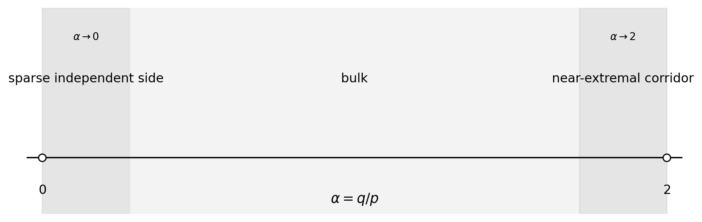

# Linear-Error Clique Partitions of Split Graphs via Structured Triangle Packing

**Juan Pablo Traverso Gianini**  
Independent researcher, Santiago, Chile  
[jtraverso@gmail.com](mailto:jtraverso@gmail.com)  
[ORCID: 0009-0003-6068-4096](https://orcid.org/0009-0003-6068-4096)

**Paper III in the series**  
**Preprint draft:** version 1.4. This manuscript and its accompanying formal artifact form one self-contained review package and the candidate for the first formal public release of Paper III.

**Draft package date:** August 22, 2026  
**Status:** `INTERNAL_AUDIT_PASS_EXTERNAL_REVIEW_PENDING`; unpublished. The accompanying Lean 4 / Mathlib development and the remaining release gates are summarized in Sections 11.6 and 13. The public aggregate root, canonical triangle-packing gates, theorem-level axiom record, escape-hatch assessment, immutable formal freeze, recorded build evidence, and author-side internal audit are complete. The recorded build began from a source-only state but was resumed after an application restart; this limitation is disclosed in Section 13. Independent uninterrupted reproduction, external adversarial audit, external peer review, and final prior-art/novelty review remain required before release.

**Internal prior-art and novelty assessment.** The internal literature audit found no earlier proof improving the Chen--Erdős--Ordman split-graph coefficient (3/16) to the sharp coefficient (1/6) with linear error. On that internal record, the paper determines the sharp quadratic coefficient for the split-graph case, establishing the \(n^2/6+O(n)\) scale; the full chordal problem remains open. This is an internal editorial assessment, not a substitute for independent prior-art review, which remains a release gate.

**MSC 2020:** Primary 05C70; Secondary 05C35, 05C72, 05C15.

---

## Abstract

Let \(G=(K\cup I,E)\) be a split graph on \(n\) vertices, with \(K\) a clique and \(I\) an independent set. We prove that there is an absolute constant \(C\) such that

\[
|E(G)|-2\nu_3(G)
\le
\frac{n^2}{6}+Cn,
\]

where \(\nu_3(G)\) is the maximum number of pairwise edge-disjoint triangles in \(G\). Consequently,

\[
\operatorname{cp}(G)
\le
\frac{n^2}{6}+Cn
\]

for every split graph \(G\), where \(\operatorname{cp}(G)\) is the minimum number of cliques whose edge sets partition \(E(G)\). Chen, Erdős, and Ordman proved the earlier bound \(3n^2/16+O(n)\) for split graphs [5]. The present result improves its quadratic coefficient to the sharp value \(1/6\), matching the complete-split lower-bound family and establishing the \(n^2/6+O(n)\) scale for split graphs. The general chordal problem remains open [3,8]. The exact family has value \(n^2/6+n/6\), so a linear term is necessary; we do not determine the least uniform linear coefficient.

The proof separates three regimes according to \(\alpha=|I|/|K|\). In the bulk regime, an exact four-orbit linear program for a common-neighborhood profile yields a uniform quadratic fractional margin; the Haxell--Rödl theorem then absorbs the subquadratic integrality loss. When \(\alpha\to0\), large edge-disjoint matchings anchored at the independent vertices leave an almost complete, triangle-divisible clique residual, which is decomposed exactly by dense graph decomposition results. When \(\alpha\to2\), averaged factorization closes the short corridor, while a double-factor polarization inequality and a shifted-center gain-completion argument close the remaining mesoscopic corridor.

The proof does not establish the stronger universal estimate \(\nu_3^*(G)-\nu_3(G)=O(n)\). Away from the extremal corridor, a potentially superlinear integrality gap is absorbed by quadratic fractional slack.

All corridor-specific mechanisms are proved in the paper; in particular, the list edge coloring ingredient is established from first principles in Appendix D. An accompanying Lean 4 development contains an unconditional final theorem surface and a selected collection of reusable components. Its formalization perimeter and the remaining freeze, axiom-log, and reproduction gates are recorded in Sections 11.6, 11.7, and 13.

**Keywords:** clique partition; split graph; triangle packing; fractional packing; factorization; polarization; list edge coloring; graph decomposition.

---

# 1. Introduction

## 1.1 Clique partitions of split graphs

A **clique partition** of a graph \(G\) is a family of complete subgraphs whose edge sets partition \(E(G)\). Cliques of order two are allowed. The minimum size of such a family is denoted by \(\operatorname{cp}(G)\).

The chordal clique-partition problem of Erdős, Ordman, and Zalcstein asks whether every chordal graph satisfies \(\operatorname{cp}(G)\le n^2/6+O(n)\) [8]. Their complete-split (indeed threshold) construction shows that the coefficient \(1/6\) is unavoidable. Split graphs form a natural subclass of chordal graphs: a graph is split if its vertex set can be partitioned into a clique and an independent set. Chen, Erdős, and Ordman proved that every split graph satisfies \(\operatorname{cp}(G)\le 3n^2/16+O(n)\) [5]. Corollary 1.2 improves the quadratic coefficient from \(3/16\) to the sharp value \(1/6\), matching the lower bound at quadratic order and establishing the conjectured linear-error scale for split graphs. The corresponding statement for general chordal graphs remains open [3,8].

This is the third paper in the series on the Erdős–Ordman–Zalcstein clique-partition problem (Erdős Problem #81 [3]). Paper I proves the finite fractional split-graph bound \(|E(G)|-2\nu_3^*(G)\le n^2/6+n/2\) [15]. Paper II identifies the complete-split terminal family and determines the exact finite maximum of the fractional cover functional over chordal graphs [16]. Papers I and II are fractional and now have frozen Lean snapshots with successful builds and no project-level mathematical axioms; independent archive reproduction remains pending. Paper IV of the series develops a general transfer-and-rounding interface for integral applications; it is logically independent of the present proof. The present paper is the first integral installment: it strengthens the split-graph estimate to the linear-error scale \(n^2/6+O(n)\).

**Series notation.** Paper I writes the fractional deficit as \(\Phi^*(G)=|E(G)|-2\nu_3^*(G)\), Paper II writes the equal cover-side quantity as \(\Phi_\tau(G)\), and the present paper uses the unstarred \(\Phi(G)=|E(G)|-2\nu_3(G)\) for the integral deficit.

Paper II of the series determines the fractional extremal problem exactly. For every \(n\),

\[
\max_{\substack{|V(G)|=n\\G\text{ chordal}}}
\bigl(|E(G)|-2\nu_3^*(G)\bigr)
=
\max_{\substack{|V(G)|=n\\G\text{ split}}}
\bigl(|E(G)|-2\nu_3^*(G)\bigr)
=
\left\lfloor\frac{(2n+1)^2}{24}\right\rfloor.
\]

It follows from the dense-graph fractional-to-integral packing theorems of Haxell--Rödl and Yuster [11,17] that every chordal graph satisfies

\[
\operatorname{cp}(G)
\le
\left(\frac16+o(1)\right)n^2.
\]

The present paper proves the second-order refinement \(n^2/6+O(n)\) for arbitrary split graphs.

## 1.2 Triangle packings and the linear-error target

Let \(\nu_3(G)\) be the maximum number of pairwise edge-disjoint triangles in \(G\). Every such packing gives a clique partition: keep every packed triangle and use one \(K_2\) for each uncovered edge. Hence

\[
\operatorname{cp}(G)
\le
|E(G)|-2\nu_3(G).
\tag{1.1}
\]

The central theorem of this paper is an integral estimate at the correct second-order scale.

### Theorem 1.1 — Linear-error split-graph theorem

There exists an absolute constant \(C\) such that every split graph \(G\) on \(n\) vertices satisfies

\[
\boxed{
|E(G)|-2\nu_3(G)
\le
\frac{n^2}{6}+Cn.
}
\tag{1.2}
\]

Combining (1.1) and Theorem 1.1 gives the clique-partition statement.

### Corollary 1.2 — Linear-error clique partition bound

There exists an absolute constant \(C\) such that every split graph \(G\) on \(n\) vertices satisfies

\[
\boxed{
\operatorname{cp}(G)
\le
\frac{n^2}{6}+Cn.
}
\tag{1.3}
\]

Section 10.2 evaluates the Erdős--Ordman--Zalcstein complete-split family \(K_p\vee\overline K_{2p}\) exactly. It separates the sharp quadratic coefficient \(1/6\) from the still-undetermined least uniform linear coefficient.


**Figure 1.** The complete-split graph \(K_p\vee\overline K_{2p}\). Every edge between the two parts is present, and the independent side has no internal edges. Since every triangle contains a clique edge, an edge-disjoint triangle packing uses at most \(\binom p2\) triangles; see Section 10.2. The figure is illustrative and is not used as a premise of the proof.

## 1.3 Why the mesoscopic corridor appears

The localization argument is bookkeeping inside the contradiction proof, not an additional extremal proposition. Suppose that no absolute linear-error bound holds, and for each positive integer \(k\) choose a minimum-order split graph \(G_k\) satisfying

\[
|E(G_k)|-2\nu_3(G_k)>\frac{|V(G_k)|^2}{6}+k|V(G_k)|.
\]

After passing to a subsequence, writing \(|K_k|=p_k\), \(|I_k|=q_k\), every such hypothetical sequence must satisfy

\[
\frac{q_k}{p_k}\longrightarrow 2.
\]

Moreover, if \(q_k=2p_k-s_k\), then the bulk and short-corridor estimates force

\[
\sqrt{p_k}\ll s_k=o(p_k).
\]

Thus the proof is forced into the mesoscopic near-extremal corridor. The high/low-dispersion dichotomy in Section 9 then excludes that corridor. Section 10.3 returns to this localization only to explain the architecture of the completed proof.

## 1.4 What the theorem does not prove

Let \(\nu_3^*(G)\) denote the fractional triangle-packing number. The present proof does **not** establish

\[
\nu_3^*(G)-\nu_3(G)=O(n)
\tag{1.4}
\]

uniformly over split graphs.

Indeed, write

\[
\Gamma(G)=\nu_3^*(G)-\nu_3(G)
\]

and

\[
S(G)=\frac{n^2}{6}-\bigl(|E(G)|-2\nu_3^*(G)\bigr).
\]

Then

\[
|E(G)|-2\nu_3(G)
=
\frac{n^2}{6}-S(G)+2\Gamma(G).
\tag{1.5}
\]

Theorem 1.1 only requires

\[
2\Gamma(G)\le S(G)+O(n).
\]

In the bulk regime, \(S(G)\) is quadratic and absorbs the general \(o(n^2)\) integrality loss. Thus the universal linear integrality-gap problem remains open.

## 1.5 Proof architecture

Write

\[
|K|=p,
\qquad
|I|=q,
\qquad
\alpha=\frac qp.
\]

The ratio \(\alpha=q/p\) determines which source of slack is available. We first dispose of \(q\ge2p-1\) by direct averaged factorization, and may then assume \(0\le\alpha<2\). A hypothetical sequence of counterexamples has a subsequence in one of three regimes.

1. **Bulk:** \(\alpha\) stays away from both \(0\) and \(2\). An exact common-profile LP and a fractional cloning argument produce quadratic fractional slack. Haxell--Rödl converts the fractional packing into an integral one with only \(o(n^2)\) loss.

2. **Sparse independent side:** \(\alpha\to0\). Each independent vertex anchors a large matching inside its neighborhood. The residual clique is almost complete. After deleting \(O(p)\) edges to correct divisibility, it admits an exact triangle decomposition.

3. **Near-extremal corridor:** \(\alpha\to2\). Write \(q=2p-s\). Averaged factorization closes \(s=O(\sqrt p)\). For \(\sqrt p\ll s=o(p)\), high dispersion is paid by a double-factor polarization term, while low dispersion implies closeness to a common center and is handled by shifted-center gain completion.

**Table 1. The three proof regimes.** The bulk and sparse regimes retain their literature provenance, while the near-extremal corridor is elementary and effective.

| Regime | Condition on \(\alpha=q/p\) | Source of slack | Mathematical input | Sections |
|---|---|---|---|---|
| Sparse independent side | \(\alpha\to 0\) | dense clique residual admits an exact triangle decomposition | Dross + Barber--Kühn--Lo--Osthus | §8 |
| Bulk | \(\alpha\) bounded away from \(0\) and \(2\) | quadratic fractional margin (common-profile LP + fractional cloning) | Haxell--Rödl/Yuster | §3--4, §9.1 |
| Near-extremal corridor | \(\alpha\to 2\), \(q=2p-s\) | averaged factorization, double-factor polarization, shifted-center gain completion | none beyond standard foundations | §5--7, §9.2--9.3, §10.5 |

The division is not cosmetic. In the bulk there is enough quadratic fractional slack to absorb a general \(o(n^2)\) rounding loss. At the two ends that slack vanishes, so the proof replaces generic rounding by constructions adapted to the geometry of the split presentation.



**Figure 2.** The three parameter regimes used in the proof. The principal corridor thresholds are shown; the complete hypotheses are stated in Sections 4, 8, and 9. The endpoint regimes are asymptotic rather than hard subintervals of \([0,2]\).

## 1.6 Supplementary computational audits

The accompanying closure package contains exact-arithmetic and finite-instance regression tests for selected identities and quantitative inequalities used in the proof.

Every audited statement is proved analytically in the manuscript. No computation, script, finite enumeration, or solver output is a logical premise of Theorem 1.1. The supplementary material is provided solely for independent checking, regression testing, and reproducibility.

## 1.7 Organization

Section 2 fixes notation and the asymptotic theorems used in the proof. Section 3 solves the common-profile LP. Section 4 proves the fractional cloning bound and the global fractional margin. Section 5 develops averaged and double-factor rounding. Section 6 proves polarization. Section 7 proves shifted-center gain completion. Section 8 handles the sparse-independent regime. Section 9 assembles the three regimes. Section 10 records corollaries, Section 11 discusses the proof and its limitations, and Section 12 describes future uses and open directions. Appendices A–D contain the algebraic details, divisibility correction, computational audits, and the self-contained proof of the list edge coloring theorem. Appendix E presents a curated selection of paper-level corollaries and reusable interfaces extracted from the formalization.

---

# 2. Preliminaries

## 2.1 Split notation

Throughout,

\[
G=(K\sqcup I,E)
\]

is a split graph, where \(K\) is a clique of size \(p\) and \(I=\{v_1,\ldots,v_q\}\) is independent.

For \(v_i\in I\), write

\[
N_i=N(v_i)\cap K,
\qquad
d_i=|N_i|,
\qquad
S_i=K\setminus N_i,
\qquad
m_i=|S_i|.
\]

Set

\[
M=\sum_i m_i,
\qquad
S_2=\sum_i m_i^2.
\]

When \(q\) is close to \(2p\), write

\[
q=2p-s.
\tag{2.1}
\]

## 2.2 Triangle packings

A fractional triangle packing is a nonnegative weight assignment to the triangles of \(G\) such that the total weight through every edge is at most one. Its maximum value is \(\nu_3^*(G)\).

The dual is a fractional triangle cover: a nonnegative weight assignment to edges such that every triangle receives total edge weight at least one. LP duality gives equality between the two optimum values.

Throughout we write

\[
\Phi(G):=|E(G)|-2\nu_3(G)
\]

for the integral triangle-packing defect; by (1.1), \(\operatorname{cp}(G)\le\Phi(G)\).

## 2.3 Complete graph factorizations

Adopt the boundary conventions

\[
\chi'(K_0)=\chi'(K_1)=0.
\]

For \(t\ge2\), the edge-chromatic number of a complete graph is

\[
\chi'(K_t)
=
\begin{cases}
t-1,&t\text{ even},\\
t,&t\text{ odd}.
\end{cases}
\tag{2.2}
\]

Thus \(E(K_t)\) decomposes into \(\chi'(K_t)\) matchings. The conventions for \(t\le1\) make the same language valid for empty edge sets.

## 2.4 Asymptotic theorems used in the proof

The written proof uses two asymptotic theorems from the literature. Their formal counterparts and verification status are recorded in Section 11.6. The list-edge-coloring case required here is proved self-contained in Appendix D. Thus Sections 5--7 and Proposition 10.5 use no asymptotic input, though they use standard facts such as the edge coloring of complete graphs.

### Theorem 2.1 — Haxell--Rödl/Yuster [11,17]

For every fixed graph \(H\),

\[
\nu_H^*(G)-\nu_H(G)=o(|V(G)|^2)
\]

uniformly over graphs \(G\). We apply this with \(H=K_3\).

### Theorem 2.2 — List edge coloring (proved in Appendix D)

Let \(B\) be a bipartite graph with maximum degree \(\Delta(B)\). If every edge \(e\) is assigned a list \(L(e)\) with

\[
|L(e)|\ge\Delta(B),
\]

then \(B\) has a proper edge coloring choosing the color of each edge from its list.

This is the maximum-degree case of Galvin's theorem [10]. A self-contained proof (König coloring, stable pairings, and the kernel lemma) is given in Appendix D, so this is not an external dependency of the paper. The local refinement \(|L(xy)|\ge\max\{d(x),d(y)\}\) of Borodin, Kostochka, and Woodall [4] is not needed: hypothesis (7.2) already bounds every list by the maximum degree of the gain graph.

### Theorem 2.3 — Dense triangle decomposition

For every \(\varepsilon>0\), every sufficiently large triangle-divisible graph \(H\) with

\[
\delta(H)\ge(0.9+\varepsilon)|V(H)|
\]

admits a triangle decomposition. This follows from Dross's fractional triangle decomposition theorem [7] (minimum degree \(0.9v\) suffices fractionally) combined with the iterative-absorption theorem of Barber, Kühn, Lo, and Osthus [2], which converts the fractional threshold into an exact decomposition threshold for triangle-divisible graphs, up to \(\varepsilon\) and for sufficiently large order.

#### Remark 2.3\(^{\prime}\) — Necessity of a density hypothesis

Triangle-divisibility alone does not imply triangle-decomposability. The 6-cycle has all degrees even and an edge count divisible by \(3\), but it has no triangle decomposition. A second obstruction is obtained from \(K_7\) by deleting two vertex-disjoint triangles: the resulting graph is triangle-divisible and has \(15\) edges, but it is not triangle-decomposable. Thus a decomposition theorem for triangle-divisible graphs requires an additional hypothesis such as the density condition in Theorem 2.3. These examples motivate that hypothesis; they are not premises of Theorem 2.3 or Theorem 1.1.

**Lean certificates.** `PaperIII.ax2_divisibility_degree_insufficient`, `PaperIII.ax2_density_necessary_K7_minus_two_triangles`, re-exported through `PaperIII.Obstructions`.

## 2.5 Formalized auxiliary interfaces

The formal development records consequences beyond the main proof. Appendix E retains only those that sharpen the paper's principal constructions or are reusable outside the split-graph application: factorization packing bounds, selected corridor estimates, the exact common-profile value, the unified fractional margin, the complete-split sharpness package, finite LP duality, matching cleanup, and an \(r\)-uniform nibble interface. Implementation-level degree windows, typed-hypergraph encoding lemmas, monotonicity wrappers, and duplicate numerical forms remain available in the Lean sources but are not restated in the manuscript.

These interfaces are consequences or proof infrastructure, not additional premises of Theorem 1.1. Their release status is recorded in Sections 11.6 and 13.

---

# 3. The Common-Profile Linear Program

For integers \(p,q,d\), let \(H(p,q,d)\) be the split graph with clique \(K\), \(|K|=p\), independent set \(I\), \(|I|=q\), and a fixed set \(N\subseteq K\), \(|N|=d\), such that every vertex of \(I\) has neighborhood \(N\). Put \(R=K\setminus N\) and \(r=p-d\).

## 3.1 Symmetric cover variables

Averaging over permutations of \(N\), \(R\), and \(I\), an optimal fractional triangle cover may be assumed constant on the four edge classes

\[
E(N),
\qquad E(N,I),
\qquad E(N,R),
\qquad E(R).
\]

Let their weights be \(a,b,c,e\), respectively. The triangle constraints are

\[
a+2b\ge1,
\qquad
3a\ge1,
\tag{3.1}
\]

\[
a+2c\ge1,
\qquad
2c+e\ge1,
\qquad
3e\ge1.
\tag{3.2}
\]

Constraints corresponding to empty triangle types may be omitted; the formula below remains valid for \(p\ge3\).

The objective is

\[
\binom d2a+qdb+dr\,c+\binom r2e.
\tag{3.3}
\]

## 3.2 Exact solution

### Theorem 3.1 — Common-profile formula

For \(p\ge3\) and \(q\ge1\),

\[
\boxed{
\nu_3^*(H(p,q,d))
=
F(p,q,d),
}
\tag{3.4}
\]

where

\[
\boxed{
F(p,q,d)
=
\min\left\{
\frac{\binom p2+qd}{3},
\binom d2+\binom r2,
\binom d2+\frac{dr+\binom r2}{3}
\right\}.
}
\tag{3.5}
\]

### Proof

At an optimum,

\[
b=\frac{1-a}{2},
\qquad
c=\frac{1-\min\{a,e\}}2,
\qquad
\frac13\le a,e\le1.
\]

If \(a\le e\), decreasing \(e\) to \(a\) cannot increase the objective. It therefore suffices to minimize on

\[
\frac13\le e\le a\le1.
\]

The objective is affine on this triangle, so a minimum occurs at

\[
(a,e)=\left(\frac13,\frac13\right),
\qquad
(1,1),
\qquad
\left(1,\frac13\right).
\]

The corresponding values are precisely the three expressions in (3.5). Duality completes the proof. \(\square\)

When \(q=0\), the graph \(H(p,0,d)\) is simply \(K_p\), independently of \(d\), and the same formula follows from \(\nu_3^*(K_p)=\binom p2/3\).

## 3.3 Interpretation of the three covers

The minimum in (3.5) is easier to remember through the three vertices of the reduced two-variable program. Each vertex represents a distinct way to pay for the triangle constraints.

| Cover pattern | Reduced vertex \((a,e)\) | Value | Geometric description |
|---|---:|---:|---|
| **Uniform** | \((1/3,1/3)\) | \(\bigl(\binom p2+qd\bigr)/3\) | All relevant edge orbits are covered at the uniform fractional rate. |
| **Separated** | \((1,1)\) | \(\binom d2+\binom r2\) | The two clique blocks \(N\) and \(R\) are paid internally, with no weight on the crossing orbit. |
| **Hot neighborhood** | \((1,1/3)\) | \(\binom d2+\bigl(dr+\binom r2\bigr)/3\) | The common neighborhood \(N\) is paid in full, while the residual clique structure remains fractional. |

The labels are descriptive rather than additional definitions. In later calculations we refer to the corresponding first, second, and third branches of \(F\). This finite trichotomy is the source of the global fractional margin.

---

# 4. Fractional Cloning and the Exact Fractional Margin

## 4.1 Fractional cloning

The fractional cloning operation (replication) used here is the cover-side analogue of the clone symmetrization used in Paper II. There, vertices or clone classes are copied pairwise to simplify a chordal graph. Here, one independent-set profile is copied \(q\) times in a single averaging step; the graph \(H(p,q,d_i)\) records the resulting common profile.

### Lemma 4.1 — Fractional cloning bound

For every split graph with \(q\ge1\),

\[
\boxed{
\nu_3^*(G)
\ge
\frac1q\sum_{i=1}^qF(p,q,d_i).
}
\tag{4.1}
\]

### Proof

Let \(y\) be any fractional triangle cover of \(G\). Put

\[
A=\sum_{e\in E(K)}y_e
\]

and

\[
B_i=\sum_{x\in N_i}y_{v_ix}.
\]

Replace \(v_i\) by \(q\) independent clones, all with neighborhood \(N_i\), and give each clone the incident weights of \(v_i\). Together with the original clique-edge weights, this is a fractional cover of \(H(p,q,d_i)\) of weight \(A+qB_i\). Hence

\[
A+qB_i\ge F(p,q,d_i).
\]

Summing over \(i\) gives

\[
q\left(A+\sum_iB_i\right)
\ge
\sum_iF(p,q,d_i).
\]

Minimizing over covers proves the lemma. \(\square\)

## 4.2 The exact margin

Assume \(0<q\le2p\), set

\[
\alpha=\frac qp,
\]

and define the packing threshold

\[
T(G)=\frac12\left(|E(G)|-\frac{(p+q)^2}{6}\right).
\tag{4.2}
\]

Define

\[
\mu(\alpha)
=
\begin{cases}
\alpha^2/12,&0\le\alpha\le2/3,\\
(2-\alpha)^2/48,&2/3\le\alpha\le2.
\end{cases}
\tag{4.3}
\]

### Theorem 4.2 — Unified fractional margin

\[
\boxed{
\nu_3^*(G)
\ge
T(G)+\mu(\alpha)p^2-\frac p4.
}
\tag{4.4}
\]

### Proof

Let

\[
C_\alpha=\frac{2-2\alpha-\alpha^2}{12}.
\]

For each branch of \(F(p,q,d)\), completion of squares gives

\[
F(p,q,d)
\ge
\frac{qd}{2}+C_\alpha p^2+\mu(\alpha)p^2-\frac p2.
\tag{4.5}
\]

The three normalized residual minima are

\[
\frac{\alpha^2}{12},
\qquad
\frac{(2-\alpha)^2}{48},
\]

and

\[
\begin{cases}
\alpha(8-5\alpha)/48,&\alpha\le4/3,\\
(2-\alpha)^2/12,&\alpha\ge4/3.
\end{cases}
\]

The third is never below the minimum of the first two. Averaging (4.5) through Lemma 4.1 gives

\[
\nu_3^*(G)
\ge
\frac12\sum_i d_i+C_\alpha p^2+\mu(\alpha)p^2-\frac p2.
\]

Since

\[
T(G)=\frac12\sum_i d_i+C_\alpha p^2-\frac p4,
\]

we obtain (4.4). \(\square\)

## 4.3 Bulk consequence

If

\[
\varepsilon\le\alpha\le2-\varepsilon,
\]

then \(\mu(\alpha)\ge c_\varepsilon>0\). Theorem 4.2 and Haxell--Rödl imply

\[
\nu_3(G)\ge T(G)
\]

for all sufficiently large graphs in this regime. Hence

\[
|E(G)|-2\nu_3(G)
\le
\frac{n^2}{6}.
\tag{4.6}
\]

---

# 5. Factorization Rounding Near \(q=2p\)

Let

\[
r_p=\chi'(K_p).
\]

## 5.1 One-factor averaging

### Lemma 5.1

If \(q\ge r_p\), then

\[
\boxed{
\nu_3(G)
\ge
\frac1q\sum_i\binom{d_i}{2}.
}
\tag{5.1}
\]

### Proof

Factor \(K_p\) into \(r_p\) matchings. Assign the factors injectively and uniformly to vertices of \(I\). In the factor assigned to \(v_i\), retain only edges with both endpoints in \(N_i\). The retained edges form valid edge-disjoint \(KKI\) triangles.

The expected number retained is

\[
\frac1q\sum_i\sum_{j=1}^{r_p}|F_j\cap E(K[N_i])|
=
\frac1q\sum_i\binom{d_i}{2}.
\]

Some assignment attains at least the expectation. \(\square\)

Appendix E.1 records the assignment-level packing inequality before averaging, together with its Lean certificate.

Writing \(q=2p-s\), substitution gives

\[
\Phi(G)
\le
\frac{n^2}{6}+\frac p2-\frac{s^2}{6}
+
\frac{(s-1)M-S_2}{q}.
\tag{5.2}
\]

Using \(S_2\ge M^2/q\) and maximizing the resulting parabola yields

\[
\boxed{
\Phi(G)
\le
\frac{n^2}{6}+\frac p2+\frac{s^2-6s+3}{12}.
}
\tag{5.3}
\]

Thus \(s=O(\sqrt p)\) is closed with linear error.

## 5.2 Double-factor rounding

For a clique edge \(e=xy\), let

\[
b_e=|\{i:\{x,y\}\not\subseteq N_i\}|.
\]

Put

\[
h=\min\{r_p,q-r_p\},
\qquad
\delta=\frac h{r_p}.
\]

Choose the set of \(h\) factors that receive two distinct independent vertices uniformly at random, give one independent vertex to every other factor, and assign the independent vertices to the resulting positions uniformly and injectively. All expectations below are taken over both random choices; some deterministic choice attains at least the expected gain.

### Lemma 5.2 — Double-factor inequality

If \(q\ge r_p\), then

\[
\boxed{
\begin{aligned}
\Phi(G)
\le{}&
\frac{n^2}{6}+\frac p2-\frac{s^2}{6}
+
\frac{(s-1)M-S_2}{q}\\
&-
\frac{2\delta V}{q(q-1)},
\end{aligned}
}
\tag{5.4}
\]

where

\[
V=\sum_{e\in E(K)}b_e(q-b_e).
\tag{5.5}
\]

### Proof

If the factor containing \(e\) receives one vertex, \(e\) is lost with probability \(b_e/q\). If it receives two vertices, it is lost only when both are bad, with probability

\[
\frac{b_e(b_e-1)}{q(q-1)}.
\]

Thus the expected number \(U\) of lost clique edges is

\[
U
=
\frac1q\sum_e b_e
-
\frac{\delta}{q(q-1)}\sum_e b_e(q-b_e).
\]

Because every factor is a matching, each retained edge may be assigned to one of its admitting vertices without creating an edge collision. Substitution gives (5.4). \(\square\)

The corresponding packing-form lower bound is stated as Corollary E.1.2.

---

# 6. Quantitative Polarization

For every \(i\), define

\[
\mathcal B_i=\{e\in E(K):e\cap S_i\ne\varnothing\}.
\]

Then

\[
V=\sum_{i,j}|\mathcal B_i\setminus\mathcal B_j|.
\tag{6.1}
\]

Let

\[
m=\max_i|S_i|.
\]

### Lemma 6.1 — Polarization inequality

If \(2p-3m-1\ge0\), then

\[
\boxed{
V
\ge
\frac{2p-3m-1}{4}
\sum_{i,j}|S_i\triangle S_j|.
}
\tag{6.2}
\]

### Proof

Put

\[
a_{ij}=|S_i\setminus S_j|.
\]

The edges in \(\mathcal B_i\setminus\mathcal B_j\) are precisely the edges of \(K_p-S_j\) meeting \(S_i\setminus S_j\). Therefore

\[
|\mathcal B_i\setminus\mathcal B_j|
=
\frac{a_{ij}\bigl(2(p-|S_j|)-a_{ij}-1\bigr)}2.
\]

Since \(|S_j|\le m\) and \(a_{ij}\le m\),

\[
|\mathcal B_i\setminus\mathcal B_j|
\ge
\frac{2p-3m-1}{2}|S_i\setminus S_j|.
\]

Sum over ordered pairs and use

\[
\sum_{i,j}|S_i\setminus S_j|
=
\frac12\sum_{i,j}|S_i\triangle S_j|.
\]

This proves (6.2). \(\square\)

---

# 7. Shifted-Center Gain Completion

Fix \(R\subseteq K\). Put

\[
\rho=|R|,
\qquad
Q=K\setminus R,
\qquad
b=|Q|.
\]

For each \(i\), define

\[
T_i=S_i\setminus R,
\qquad
t_i=|T_i|,
\]

and

\[
G_i=R\setminus S_i,
\qquad
g_i=|G_i|.
\]

Set

\[
A_R=\sum_i t_i,
\qquad
A_{2,R}=\sum_i t_i^2,
\qquad
B_R=\sum_i g_i.
\]

Let

\[
r_b=\chi'(K_b),
\qquad
u=q-r_b.
\]

Assume

\[
b\ge2,
\qquad
q\ge r_b,
\qquad
b\ge\chi'(K_\rho),
\tag{7.1}
\]

and

\[
b-t_i\ge\max\{\rho,u\}
\qquad
\text{for all }i.
\tag{7.2}
\]

Define

\[
\theta_R=\frac{\max\{\rho-1,0\}}{b}
\]

and

\[
\kappa_R
=
1-2(1-\theta_R)\frac{u}{q}.
\tag{7.3}
\]

## 7.1 Packing inside \(Q\)

Reserve a set \(U\subseteq I\) of \(u\) vertices; note that \(|I\setminus U|=q-u=r_b\) exactly. Assign the remaining \(r_b\) vertices bijectively to a factorization of \(K[Q]\).

For \(v_i\), the number of unavailable edges of \(K[Q]\) is

\[
\beta_i
=
\binom b2-\binom{b-t_i}{2}.
\tag{7.4}
\]

For fixed \(U\), averaging over assignments gives at least

\[
\binom b2-\frac1{r_b}\sum_{i\notin U}\beta_i
\tag{7.5}
\]

edge-disjoint \(QQI\) triangles.

## 7.2 The gain graph

Construct a bipartite graph with parts \(U\) and \(R\), joining \(v_i\) to \(r\) when \(r\in G_i\). Assign the list

\[
L(v_ir)=N_i\cap Q.
\]

By (7.2), every list satisfies

\[
|L(v_ir)|=b-t_i
\ge
\max\{\rho,u\}
\ge
\Delta,
\]

where \(\Delta\) is the maximum degree of the gain graph, since \(d(v_i)=g_i\le\rho\) and \(d(r)\le|U|=u\). Theorem 2.2, proved self-contained in Appendix D, gives a proper list edge coloring. If \(v_ir\) receives color \(z\in Q\), take the triangle \(v_irz\). This gives

\[
B_U=\sum_{i\in U}g_i
\]

edge-disjoint \(IRQ\) triangles.

## 7.3 Completion inside \(R\)

For each \(z\in Q\), let \(U_z\subseteq R\) be the vertices \(r\) for which \(rz\) was used by an \(IRQ\) triangle.

If \(\rho\le1\), the graph \(K[R]\) has no edges, so this completion contributes no \(RRQ\) triangles. Suppose therefore that \(\rho\ge2\). Factor \(K[R]\), inject its factors into the colors \(z\in Q\), and delete from the factor assigned to \(z\) every edge incident with \(U_z\). Averaging over the injections loses at most

\[
\frac{\rho-1}{b}\sum_z|U_z|
=
\theta_RB_U
\]

edges. Hence, in all cases, we obtain at least

\[
\binom\rho2-\theta_RB_U
\]

additional \(RRQ\) triangles.

The three families \(QQI\), \(IRQ\), and \(RRQ\) are edge-disjoint. In particular, the forbidden-color deletion prevents an \(IRQ\) triangle and an \(RRQ\) triangle from sharing an edge \(rz\).

## 7.4 The centered inequality

Choose \(U\), \(|U|=u\), maximizing

\[
\sum_{i\in U}
\left(
\frac{2\beta_i}{r_b}+2(1-\theta_R)g_i
\right).
\]

The best \(u\) terms have sum at least \(u/q\) times the total. Using

\[
2\sum_i\beta_i
=(2b-1)A_R-A_{2,R},
\]

we obtain the principal local lemma. The subset-host packing form is recorded as Corollary E.1.3.

### Lemma 7.1 — Reserved-gain shifted-center inequality

Under (7.1)--(7.2),

\[
\boxed{
\begin{aligned}
\Phi(G)
\le{}&
\frac{n^2}{6}+\frac p2-\frac{s^2}{6}
+s\rho-2\rho^2\\
&+
\kappa_RB_R
+
\frac{(s-2\rho-1)A_R-A_{2,R}}q.
\end{aligned}
}
\tag{7.6}
\]

---

# 8. The Sparse-Independent Regime

Assume \(q=o(p)\). We prove the required bound directly and integrally.

## 8.1 Minimal-counterexample degree bound

In the global contradiction argument, a minimal counterexample with penalty \(kn\) satisfies, for every \(v\in I\),

\[
d(v)>
\frac{2n-1}{6}+k.
\tag{8.1}
\]

Since \(q=o(p)\), this implies eventually

\[
d(v)\ge2q+2.
\tag{8.2}
\]

## 8.2 Successive matchings

Order \(I=\{v_1,\ldots,v_q\}\). Choose successively edge-disjoint matchings

\[
M_i\subseteq K[N_i]
\]

of size \(\lfloor d_i/2\rfloor\).

Before choosing \(M_i\), each vertex has lost at most \(i-1\) incident edges, so the available graph on \(N_i\) has minimum degree at least

\[
d_i-i\ge d_i/2.
\]

Dirac's theorem [6] supplies a Hamilton cycle and hence a matching of the required size.

Let

\[
F=\bigcup_iM_i.
\]

Then

\[
|F|
\ge
\frac12\sum_i d_i-\frac q2,
\qquad
\Delta(F)\le q.
\tag{8.3}
\]

The edges of \(M_i\) yield \(|M_i|\) edge-disjoint \(KKI\) triangles with apex \(v_i\).

## 8.3 Divisibility correction

The residual clique graph

\[
R_0=K_p-F
\]

satisfies

\[
\delta(R_0)
\ge
p-1-q
=(1-o(1))p.
\tag{8.4}
\]

In particular, for all sufficiently large members of the sequence, \(\delta(R_0)>p/2\). Dirac's theorem [6] therefore gives a Hamilton cycle, and hence a Hamilton path

\[
P=x_1x_2\cdots x_p
\]

contained in \(R_0\). Let \(O\) be the set of odd-degree vertices of \(R_0\). By the handshaking lemma, \(|O|\) is even. Define the path subgraph \(J\subseteq P\) by

\[
x_jx_{j+1}\in E(J)
\quad\Longleftrightarrow\quad
|O\cap\{x_1,\ldots,x_j\}|\text{ is odd}.
\tag{8.5}
\]

For an internal vertex \(x_j\), the parity of its degree in \(J\) is the change in prefix parity between positions \(j-1\) and \(j\), and is therefore \(1\) precisely when \(x_j\in O\). The same conclusion holds at the two endpoints because \(|O|\) is even. Consequently,

\[
\operatorname{Odd}(J)=O,
\qquad
|E(J)|\le p-1,
\qquad
\Delta(J)\le2.
\tag{8.6}
\]

Thus

\[
R_1:=R_0-J
\]

has all degrees even, and

\[
\delta(R_1)\ge p-1-q-2.
\tag{8.7}
\]

Since \(q=o(p)\), eventually \(\delta(R_1)>3p/4\). By Turán's theorem, \(R_1\) contains a copy of \(K_5\). Choose a \(C_4\) and a \(C_5\) inside this fixed \(K_5\). According as

\[
|E(R_1)|\equiv0,1,2\pmod3,
\]

remove respectively nothing, the \(C_4\), or the \(C_5\). Let \(C\) denote the removed cycle, allowing \(C=\varnothing\), and put

\[
H:=R_1-E(C).
\]

Every vertex loses either zero or two incident edges when a cycle is removed, so all degrees of \(H\) remain even. Moreover, \(|E(C)|\equiv |E(R_1)|\pmod3\), and hence

\[
|E(H)|\equiv0\pmod3.
\]

Therefore \(H\) is triangle-divisible. The total loss of degree in passing from \(R_0\) to \(H\) is at most four, so

\[
\delta(H)\ge p-1-q-4.
\tag{8.8}
\]

To apply Theorem 2.3 with a fixed parameter, take for example \(\varepsilon_0=1/100\). Since \(q=o(p)\), eventually \(q\le p/20\), and then, for sufficiently large \(p\),

\[
\delta(H)\ge p-1-q-4\ge0.91p=(0.9+\varepsilon_0)|V(H)|.
\tag{8.9}
\]

Theorem 2.3 now gives an exact triangle decomposition of \(H\). Notice that the decomposition theorem is applied on the original \(p\)-vertex set: no vertices are deleted during the correction. The entire correction removes at most \(p+4\) edges.

## 8.4 Packing size

The combined packing has size

\[
\begin{aligned}
\nu_3(G)
&\ge
|F|+\frac{\binom p2-|F|-O(p)}3\\
&=
\frac13\binom p2+\frac23|F|-O(p)\\
&\ge
\frac13\binom p2+\frac13\sum_i d_i-O(p+q).
\end{aligned}
\tag{8.10}
\]

Consequently,

\[
\begin{aligned}
\Phi(G)
&\le
\frac13\binom p2+\frac13\sum_i d_i+O(p+q)\\
&\le
\frac13\binom p2+\frac{pq}{3}+O(p+q)\\
&=
\frac{(p+q)^2}{6}-\frac{p+q^2}{6}+O(p+q).
\end{aligned}
\tag{8.11}
\]

This is at most \(n^2/6+O(n)\). Appendix E.6 records the formalized matching cleanup and bounded divisibility-correction interfaces used in this regime.

---

# 9. Proof of the Main Theorem

We now prove Theorem 1.1 by contradiction.

Suppose no absolute constant works. For every positive integer \(k\), choose a split graph \(G_k\), minimal in its number \(n_k\) of vertices, such that

\[
\Phi(G_k)
>
\frac{n_k^2}{6}+kn_k.
\tag{9.1}
\]

Necessarily \(n_k\to\infty\). For every \(v\in I(G_k)\), minimality gives

\[
\Phi(G_k)
\le
\Phi(G_k-v)+d(v),
\]

and therefore

\[
\boxed{
d(v)>
\frac{2n_k-1}{6}+k.
}
\tag{9.2}
\]

First, if \(q_k\ge2p_k-1\), Lemma 5.1 gives

\[
\Phi(G_k)
\le
\frac{n_k^2}{6}+\frac{p_k}{2},
\]

contradicting (9.1) for large \(k\). We may therefore assume \(q_k<2p_k-1\) and pass to a subsequence according to

\[
\alpha_k=\frac{q_k}{p_k}\in[0,2).
\]

## 9.1 Bulk regime

Suppose that for some \(\varepsilon>0\),

\[
\varepsilon\le\alpha_k\le2-\varepsilon.
\]

Theorem 4.2 gives

\[
\nu_3^*(G_k)
\ge
T(G_k)+c_\varepsilon p_k^2-O(p_k).
\]

Haxell--Rödl gives

\[
\nu_3(G_k)
\ge
\nu_3^*(G_k)-o(n_k^2).
\]

For sufficiently large \(k\), the quadratic margin dominates the integrality loss, so \(\nu_3(G_k)\ge T(G_k)\), contrary to (9.1).

## 9.2 The endpoint \(\alpha_k\to0\)

This is closed by Section 8, which gives an absolute \(C_0\) such that

\[
\Phi(G_k)
\le
\frac{n_k^2}{6}+C_0n_k.
\]

For \(k>C_0\), this contradicts (9.1).

## 9.3 The endpoint \(\alpha_k\to2\)

Write

\[
q=2p-s,
\qquad
s=o(p).
\]

If \(s=O(\sqrt p)\), inequality (5.3) gives the required linear-error bound. Assume henceforth

\[
\sqrt p\ll s=o(p).
\tag{9.3}
\]

For all sufficiently large members of the sequence,

\[
p\ge2304,
\qquad
6\sqrt p\le s\le\frac p8,
\qquad
k\ge1.
\tag{9.4}
\]

By (9.2),

\[
m_i=|S_i|
<
\frac s3+\frac16-k
\le
\frac s3-\frac56.
\]

Since every \(m_i\) is an integer, with \(m=\max_i m_i\),

\[
\boxed{3m\le s-3.}
\tag{9.5}
\]

For \(x\in K\), put

\[
a_x=|\{i:x\in S_i\}|
\]

and

\[
D=\sum_{x\in K}a_x(q-a_x).
\tag{9.6}
\]

Then

\[
\sum_{i,j}|S_i\triangle S_j|=2D.
\tag{9.7}
\]

### High dispersion

Suppose

\[
D\ge\frac{qs^2}{12}.
\tag{9.8}
\]

By (9.5),

\[
2p-3m-1\ge2p-s+2=q+2.
\]

Lemma 6.1 and (9.7) therefore give

\[
V
\ge
\frac{q+2}{2}D
\ge
\frac q2D.
\tag{9.9}
\]

The double-factor coefficient in Lemma 5.2 satisfies

\[
\boxed{\delta\ge\frac78.}
\tag{9.10}
\]

Indeed, if \(p\) is odd then \(r_p=p\) and

\[
\delta=\frac{p-s}{p}\ge\frac78,
\]

while if \(p\) is even then \(r_p=p-1\) and

\[
\delta=\frac{p+1-s}{p-1}\ge\frac78.
\]

Moreover, \(S_2\ge M^2/q\), and (9.5) implies \(M/q\le m\le(s-3)/3\). Since the resulting parabola is increasing on this interval,

\[
\frac{(s-1)M-S_2}{q}
\le
\frac{2s(s-3)}9.
\tag{9.11}
\]

Substituting (9.8)--(9.11) into Lemma 5.2 yields

\[
\Phi(G)-\frac{n^2}{6}
\le
\frac p2-\frac{5s^2}{288}-\frac{2s}{3}.
\tag{9.12}
\]

Since \(s^2\ge36p\),

\[
\Phi(G)-\frac{n^2}{6}
\le
-\frac p8-\frac{2s}{3}<0,
\]

a contradiction.

### Low dispersion

Suppose

\[
D<\frac{qs^2}{12}.
\tag{9.13}
\]

By (9.7), some \(j\) satisfies

\[
\sum_i|S_i\triangle S_j|
<
\frac{s^2}{6}.
\tag{9.14}
\]

Set

\[
R=S_j,
\qquad
\rho=|R|.
\]

Then

\[
A_R+B_R<\frac{s^2}{6},
\qquad
\rho\le m\le\frac{s-3}{3}.
\tag{9.15}
\]

We verify the hypotheses of Lemma 7.1 explicitly. Since \(s\le p/8\),

\[
q=2p-s\ge\frac{15p}{8},
\qquad
b=p-\rho\ge p-\frac s3.
\]

Thus \(b\ge2\), \(q\ge r_b\), and \(b\ge\chi'(K_\rho)\). Also \(r_b\ge b-1\), so

\[
u=q-r_b\le p-s+\rho+1.
\]

For every \(i\),

\[
2\rho+t_i+1
\le
3m+1
\le
s-2.
\]

Consequently,

\[
b-t_i\ge\max\{\rho,u\},
\]

and Lemma 7.1 applies.

If \(\rho=0\), then \(B_R=0\). If \(\rho\ge1\), then

\[
\theta_R
\le
\frac{\rho}{p-\rho}
\le
\frac{8s}{23p}.
\]

Using \(u=q-r_b\), \(r_b\le b\), and \(q\ge15p/8\), we obtain

\[
\kappa_R
=1-2(1-\theta_R)\frac uq
\le
\frac sq+2\theta_R
\le
\frac{5s}{4p}.
\tag{9.16}
\]

Likewise,

\[
\frac{(s-2\rho-1)_+}{q}
\le
\frac{5s}{4p}.
\tag{9.17}
\]

By (9.15), the total positive deviation in (7.6) is therefore at most

\[
\frac{5s}{4p}(A_R+B_R)
<
\frac{5s^3}{24p}
\le
\frac{5s^2}{192}.
\tag{9.18}
\]

Meanwhile,

\[
\frac{s^2}{6}-s\rho+2\rho^2
=
2\left(\rho-\frac s4\right)^2+\frac{s^2}{24}
\ge
\frac{s^2}{24}.
\tag{9.19}
\]

Lemma 7.1 now gives

\[
\Phi(G)-\frac{n^2}{6}
\le
\frac p2-\frac{s^2}{64}.
\tag{9.20}
\]

Since \(s^2\ge36p\), the right-hand side is at most \(-p/16\), again a contradiction.

All possible subsequences are impossible. Theorem 1.1 follows. \(\square\)

---

# 10. Corollaries

## 10.1 Clique partitions

Corollary 1.2 follows immediately from

\[
\operatorname{cp}(G)
\le
|E(G)|-2\nu_3(G).
\]

## 10.2 Sharpness of the leading term

The family

\[
K_p\vee\overline K_{2p}
\]

has \(n=3p\). A factorization of \(K_p\) assigned to independent vertices packs every clique edge into a \(KKI\) triangle. The resulting triangle-packing expression is

\[
|E|-2\nu_3
=
\frac{n^2}{6}+\frac n6.
\tag{10.1}
\]

The Erdős--Ordman--Zalcstein clique-partition construction on this family shows that the coefficient \(1/6\) of the quadratic term cannot be improved. The exact identity also gives a separate statement about the linear term: if

\[
\operatorname{cp}(G)\le \frac{n^2}{6}+Cn
\]

holds uniformly over all split graphs, then necessarily \(C\ge1/6\). These two roles of \(1/6\) are kept distinct below; the latter lower bound does not assert that \(C=1/6\) is sufficient for every split graph.

### Corollary 10.2a — Exact complete-split benchmark

For every \(p\ge1\),

\[
\operatorname{cp}\!\left(K_p\vee\overline K_{2p}\right)
=
2p^2-\binom p2
=
\frac{(3p)^2}{6}+\frac{3p}{6}.
\tag{10.1a}
\]

### Proof

The factorization packing above uses every clique edge in a \(KKI\) triangle. Retaining those triangles and placing each remaining edge in a \(K_2\) gives a clique partition with \(2p^2-\binom p2\) parts.

For the reverse inequality, assign weight \(+1\) to every cross edge and weight \(-1\) to every clique edge. The total edge weight is \(2p^2-\binom p2\). A clique contains at most one independent vertex; if it contains \(t\) clique vertices and one independent vertex, its edge weight is \(t-\binom t2\le1\), while a clique contained in \(K_p\) has nonpositive weight. Every part of a clique partition therefore contributes at most one to the total weight. Hence every clique partition has at least \(2p^2-\binom p2\) parts.

The Lean development records the upper bound, lower bound, and equality as `Byproduct_completeSplit_cp_le_exact_value`, `Byproduct_completeSplit_cp_ge_exact_value`, and `Byproduct_completeSplit_cp_exact_value`. Appendix E.5 retains only the exact normal form and the logically distinct forced-linear-coefficient statement.

### Corollary 10.2b — Sharp quadratic term and forced linear coefficient

There is an absolute constant \(C\) such that

\[
\operatorname{cp}(G)\le \frac{n^2}{6}+Cn
\]

for every split graph \(G\). Every constant \(C\) satisfying this uniform estimate obeys \(C\ge1/6\), and for every \(p\ge1\) the complete-split graph \(K_p\vee\overline K_{2p}\), on \(n=3p\) vertices, satisfies

\[
\operatorname{cp}\!\left(K_p\vee\overline K_{2p}\right)
=\frac{n^2}{6}+\frac n6.
\]

In particular, \(n^2/6\) is the sharp quadratic term. The statement gives a necessary lower bound on the admissible linear coefficient; it does not identify the least uniform linear coefficient. Determining an explicit, and ultimately the least, admissible coefficient is part of Problem 12.2.

### Proof

Existence follows from Corollary 1.2, and the exact identity is Corollary 10.2a. If the displayed uniform estimate holds for a constant \(C\), applying it to \(K_1\vee\overline K_2\) and using the exact identity gives \(2\le3/2+3C\), hence \(C\ge1/6\). The complete-split family also witnesses sharpness of the quadratic coefficient as \(p\to\infty\).

**Lean certificate.** `PaperIII.Corollary_1_2_sharp`, assembled from `PaperIII.Corollary_1_2`, `PaperIII.Byproduct_leading_constant_forced`, and `PaperIII.Byproduct_completeSplit_cp_sharp`. The declaration `Byproduct_leading_constant_forced` certifies the assertion about the linear coefficient; sharpness of the quadratic coefficient follows from the exact complete-split value as \(p\to\infty\).


## 10.3 Retrospective on the corridor decomposition

The localization in Section 1.3 is an internal step of the contradiction proof, not a surviving obstruction after Theorem 1.1. The bulk margin excludes ratios bounded away from \(0\) and \(2\), the sparse construction excludes \(|I|/|K|\to0\), and averaged factorization excludes the short corridor near \(|I|=2|K|\). These reductions explain why the load-bearing part of the proof is the mesoscopic corridor

\[
|I|=2|K|-s,
\qquad
\sqrt{|K|}\ll s=o(|K|),
\]

which is eliminated by the dispersion dichotomy.

## 10.4 Exact common-profile fractional value

Theorem 3.1 is independently useful: it gives the exact fractional triangle packing for every split graph in which all independent vertices have one common neighborhood, including the regime with too few independent vertices to color all neighborhood edges integrally. We state it as a stand-alone corollary.

### Corollary 10.4a — Exact common-neighborhood triangle packing

For all integers \(p\ge3\), \(q\ge1\) and \(0\le d\le p\), the graph \(H(p,q,d)\)
(clique of order \(p\); \(q\) independent vertices, each with the same neighborhood of size
\(d\)) satisfies
\[
\nu_3^*(H(p,q,d))=F(p,q,d)=\min\left\{\tfrac{\binom p2+qd}{3},\ \binom d2+\binom{p-d}2,\ \binom d2+\tfrac{d(p-d)+\binom{p-d}2}{3}\right\}.
\]
The same identity holds for \(q=0\), where \(H(p,0,d)=K_p\) and \(\nu_3^*(K_p)=\binom p2/3\). This is an exact closed form for the fractional triangle-packing number of an entire one-parameter family, valid for every \(d\), including the small-\(q\) regime where no integral factorization covers the neighborhood. Appendix E.3 records the formalized branch comparisons and explicit phase regions.

### Corollary 10.4b — Threshold graphs

Since \(K_p\vee\overline K_{2p}\) is a threshold graph and every threshold graph is split,
Theorem 1.1 gives, in particular, the linear-error bound \(\operatorname{cp}(G)\le n^2/6+Cn\)
for all threshold graphs, with the same sharp leading constant witnessed inside that subclass.

## 10.5 Localized effectivity near \(q=2p\)

### Packing-form corollaries

The following corollaries restate results from Sections 5 and 7 directly in packing language. They are formalized as `factorization_assignment_packing`, `double_factorization_packing`, and `reserved_gain_packing_bound_subset`. All three are unconditional: none uses Theorem 2.1 or Theorem 2.3.

**Corollary 5.1a (max-over-assignments).** For a factorization \(E(K_p)=F_1\sqcup\cdots\sqcup F_{r_p}\) and \(q\ge r_p\),
\[
\nu_3(G)\ \ge\ \max_{\sigma:[r_p]\hookrightarrow I}\ \sum_{j=1}^{r_p}\big|F_j\cap E\big(K[N_{\sigma(j)}]\big)\big|.
\]
Lemma 5.1 is the averaged consequence; the max form retains information lost in the average and is what an exact inequality needs. Because the assignment \(\sigma:[r_p]\hookrightarrow I\) is injective, this bound uses at most \(r_p\) hosts. It is therefore most naturally used when \(q\) is comparable to \(r_p\); when \(q\) is substantially larger, cyclic reuse of factors may exploit additional hosts, as in the corridor constructions later in the paper.

**Corollary 5.2a (packing-native double factorization).** With \(b_e=\#\{i:e\not\subseteq N_i\}\), \(V=\sum_{e\in E(K)} b_e(q-b_e)\), \(h=\min\{r_p,q-r_p\}\) and \(\delta=h/r_p\),
\[
\nu_3(G)\ \ge\ \frac1q\sum_i\binom{d_i}{2}+\frac{\delta V}{q(q-1)}.
\]
This exhibits the polarization gain of Lemma 5.2 as an integral packing gain, not merely an improvement of an auxiliary function. When \(q=r_p\), one has \(h=0\), so the gain term vanishes and the statement reduces to the averaged bound of Lemma 5.1.

**Proposition 7.4 (robust shifted-center packing bound).** Let \(R\subseteq K\), \(Q=K\setminus R\), \(\rho=|R|\), \(b=|Q|\); for \(i\) write \(g_i=|N_i\cap R|\), \(h_i=|N_i\cap Q|\), \(t_i=b-h_i\). Choose \(J\subseteq I\) with \(q_J=|J|\ge r_b=\chi'(K_b)\), \(b\ge\chi'(K_\rho)\), and \(h_i\ge\max\{\rho,\,q_J-r_b\}\) for every \(i\in J\). Then
\[
\nu_3(G)\ \ge\ \binom b2+\binom\rho2-\frac{(2b-1)A_J-A_{2J}}{2q_J}+(1-\theta_R)\frac{(q_J-r_b)B_J}{q_J},
\]
with \(A_J=\sum_{i\in J}t_i\), \(A_{2J}=\sum_{i\in J}t_i^2\), \(B_J=\sum_{i\in J}g_i\). The construction of Section 7 is applied to the retained hosts \(J\) only, so it survives deleting deficient hosts; the cover cost of the excluded hosts is not part of this packing bound and belongs to any covering application built on it.

**Scope.** These are exact packing statements. Theorem 4.2 is not used in an exact inequality: its role is to create quadratic slack in the bulk, not to provide an exact bound. Likewise, a \(\tau_3\le2\nu_3\) statement of Tuza type for split graphs is not a corollary of this paper and is treated separately.

### Proposition 10.5 — Explicit corridor bounds

Let \(q=2p-s\) and \(n=p+q\).

1. If
   \[
   p\ge37,
   \qquad
   0\le s\le6\sqrt p,
   \]
   then
   \[
   \boxed{
   \Phi(G)\le\frac{n^2}{6}+\frac{3n}{2}.
   }
   \tag{10.2}
   \]

2. If
   \[
   p\ge2304,
   \qquad
   6\sqrt p\le s\le\frac p8,
   \]
   and every \(v\in I\) satisfies
   \[
   d(v)>\frac{2n-1}{6}+1,
   \]
   then
   \[
   \boxed{
   \Phi(G)\le\frac{n^2}{6}.
   }
   \tag{10.3}
   \]

Consequently, for every \(C\ge2\), a minimum-order counterexample to

\[
\Phi(G)\le\frac{n^2}{6}+Cn
\]

cannot satisfy

\[
p\ge2304,
\qquad
0\le s\le\frac p8.
\]

### Proof

For the short corridor, inequality (5.3) together with \(s^2\le36p\) gives \(\Phi(G)-\tfrac{n^2}{6}\le\tfrac{7p}{2}-\tfrac{s}{2}+\tfrac14\). Since \(p\ge37\) and \(s^2\le36p\), we have \(s\le p-1\): otherwise \(s\ge p\) would force \(p^2\le s^2\le36p\), hence \(p\le36\). Therefore \(4s+1\le4p\), which is equivalent to \(\tfrac{7p}{2}-\tfrac{s}{2}+\tfrac14\le\tfrac32(3p-s)=\tfrac32 n\), so

\[
\Phi(G)\le\frac{n^2}{6}+\frac{3n}{2}.
\]

The mesoscopic assertion is exactly the quantitative high/low-dispersion calculation in Section 9.3. The final consequence follows from the degree inequality obtained by deleting an independent vertex from a minimum-order counterexample. \(\square\)

Appendix E.2 records the short-corridor constant and the packing-to-partition bridge. The mid- and high-corridor conclusions are already stated above and are not duplicated in the appendix.

---

# 11. Discussion

## 11.1 From fractional asymptotics to a linear-error integral theorem

The central difficulty is that the general theorem

\[
\nu_3^*(G)-\nu_3(G)=o(n^2)
\]

has no linear rate. The present proof avoids demanding one uniform rounding mechanism.

- In the bulk, the common-profile LP produces quadratic slack.
- Near \(q=2p\), explicit factorization structures replace general rounding.
- Near \(q=0\), the residual clique becomes dense enough for exact decomposition.

This regime-dependent strategy is weaker than a universal linear integrality-gap theorem but sufficient for the extremal clique-partition problem. The packing-versus-covering theme for triangles is classical; Tuza's conjecture and its fractional forms, for which Krivelevich [14] proved two fractional variants and an integral special case, provide the closest general context, though they are not used in the present proof.

## 11.2 Why residual maximum degree is not the right invariant

Early exploratory work attempted to prove that an optimal packing leaves a clique residual of bounded maximum degree. Numerical behavior depended strongly on the packing algorithm, and no such property is needed in the final proof.

The effective invariants are instead:

- the common-profile fractional margin;
- the variance term \(S_2\);
- the polarization energy \(V\);
- the centered deviations \(A_R,B_R\);
- divisibility of the dense residual.

## 11.3 Localized effectivity and remaining non-effectivity

Proposition 10.5 shows that the entire near-extremal corridor treated by factorization, polarization, and shifted-center completion is quantitatively effective. One may take

\[
C_{\mathrm{corr}}=\frac32,
\qquad
p_0=2304,
\qquad
s_0(p)=6\sqrt p,
\qquad
\eta_0=\frac18.
\]

The global constant \(C\) remains non-effective for two independent reasons.

1. The Haxell--Rödl theorem is used through an asymptotic \(o(n^2)\) statement in the bulk.
2. Dense triangle decomposition theorems are invoked with unspecified sufficiently-large thresholds in the sparse-independent regime.

Thus no hidden non-effectivity remains in Sections 5--7; it comes only from the two external asymptotic inputs used elsewhere in the proof. After Appendix D, Sections 5--7, the high/low-dispersion argument of Section 9.3, and Proposition 10.5 are self-contained and effective. Proposition 10.5 uses no instance of Theorem 2.1 or Theorem 2.3; its only external background is the standard edge coloring of complete graphs together with the list edge coloring theorem proved in Appendix D. Dirac's and Turán's theorems belong to the separate sparse-independent argument of Section 8.

## 11.4 Relationship with the fractional extremal theorem

The complete-split extremal theorem determines the global fractional maximum of

\[
|E(G)|-2\nu_3^*(G)
\]

over both split and chordal graphs. The common-profile LP in the present paper serves a different purpose: it is a profile-sensitive local lower bound for the fractionally cloned graph, and its quantitative slack absorbs integrality loss away from the extremal corridor.

Thus the global fractional extremal calculation and the local common-profile calculation are compatible but logically distinct. The present proof is self-contained apart from the external theorems stated in Section 2.

The local calculation is the same three-orbit pure-profile program isolated in Paper I [15], expressed after adding the pure-profile Phase-I contribution. Under the identification \(d=s\) and \(p-d=o\), the three branches of \(F(p,q,d)\) are \(qd/2+U\), \(qd/2+D\), and \(qd/2+H\), while \(C_\alpha p^2=R(p,q)\) for \(\alpha=q/p\). Here the calculation is used to produce profile-sensitive quadratic slack for the integral argument.

**Remark (cloning terminology).** Lemma 4.1 and the clone-symmetrization step of Paper II use the same underlying replication operation in different roles. Paper II uses pairwise cloning to move a chordal graph toward a complete-split terminal graph. Lemma 4.1 uses \(q\)-fold profile replication on the cover side to compare an arbitrary profile with a common-profile graph. The established term *fractional cloning* is retained for the present inequality. Paper IV uses the term *clone step* for a different operation, the vertex-copy substitution that replaces one neighborhood rather than replicating a profile.

## 11.5 Relationship with the chordal linear-error problem

The complete-split reduction settles the asymptotically sharp chordal bound

\[
\operatorname{cp}(G)
\le
\left(\frac16+o(1)\right)n^2.
\]

The stronger estimate

\[
\operatorname{cp}(G)
\le
\frac{n^2}{6}+O(n)
\]

remains open for general chordal graphs. The mechanisms developed here suggest a concrete three-part program for that problem.

1. **Stability of the fractional extremal theorem.** Upgrade the exact chordal fractional theorem of Paper II to a stability statement: every chordal graph whose value is within \(\delta n^2\) of the fractional maximum is within \(\varepsilon n^2\) edge edits of a maximizing complete split graph. Away from near-extremality, the quadratic fractional slack absorbs the general integrality loss exactly as in Section 4.

2. **Robust corridor mechanisms.** Extend the factorization, polarization, and shifted-center arguments of Sections 5--7 from split graphs to \(\varepsilon n^2\)-perturbations of complete split graphs, so that they apply to the near-extremal graphs produced by stability.

3. **Clique-tree assembly.** Patch the local estimates across the clique tree by an edge-ownership ledger that preserves separator capacities, in the spirit of shifted-center completion, so that no edge is charged twice.

A chordal linear-error proof would still have to preserve ownership and separator capacities across the clique tree; the ledger of step 3 is designed for exactly that purpose.

A future installment may investigate this program. No result of the present paper depends on a companion manuscript or on a particular clique-separator architecture. Until such an argument is completed and frozen, this paragraph records only a possible interface rather than a theorem.

## 11.6 Formal-verification perimeter and current status

The formalization discussion is confined to this section and the release record in Section 13. The current formal snapshot separates the unconditional final assembly from its downstream interfaces. The public aggregate root `PaperIII` imports both `PaperIII.Theorem_1_1_Final` and `PaperIII.PublicAPI`. The final module discharges the two interfaces used by the paper and exports Theorem 1.1 and Corollary 1.2. `PaperIII.CanonicalTrianglePacking` makes `PaperIII.nu3` and `PaperIII.nu3Star` the manuscript-facing quantities and proves their equality with the edge-hypergraph implementations used by AX1; it also proves `PaperIII.tau3Star = PaperIII.nu3Star` and identifies the cover-side AX1 interface with the packing-side statement in Section 2. `PaperIII.PaperImprovements` contains the paper-facing certificates; `PaperIII.PublicAPI`, `PaperIII.OfPartition`, and `PaperIII.Obstructions` expose downstream interfaces. The directed canonical gate reports the following axiom footprint for these theorem surfaces:

```text
[propext, Classical.choice, Quot.sound]
```

The final assembly uses explicit bridges to the Haxell--Rödl/Yuster and dense-decomposition formalizations. The cited asymptotic theorems remain in the manuscript for mathematical provenance. The recorded public-root build completed 8,455 jobs with exit code 0; the subsequent query-root build completed 8,444 jobs with exit code 0. The immutable formal archive has been sealed, and the author-side internal audit passes. Because the public-root process was resumed after an application restart, an uninterrupted independent reproduction remains open; the candidate is a local formal freeze, not yet a public release.

Appendix E gives a curated selection of paper-level and reusable certificates. The complete implementation-level inventory remains in the formal source rather than being duplicated in the manuscript.

**Table 2. Formalization surfaces.** Statuses in this table are records of the sealed local freeze; they are not a substitute for independent reproduction.

| Surface | Purpose | Current local status |
|---|---|---|
| `PaperIII` | aggregate/compatibility root | public-root build completed 8,455 jobs; exit 0; imports the final theorem and public API |
| `PaperIII.MainNibble` | theorem and corollary assembly through explicit AX1/AX2 interfaces | compiled in the recorded closure |
| `PaperIII.Theorem_1_1_Final` | unconditional discharge of AX1/AX2 and final theorem surfaces | compiled; final theorem footprint is foundational-only |
| `PaperIII.CanonicalTrianglePacking` | canonical `nu3`, `nu3Star`, `tau3Star` and AX1 statement bridges | compiled; exact target-side bridges recorded |
| `PaperIII.CanonicalTrianglePackingGate` | statement and axiom gate for the canonical interfaces | exit 0; foundational-only footprints recorded |
| `PaperIII.PaperImprovements` and `PaperIII.PaperImprovementsGate` | paper-facing corollaries and selected auxiliary certificates | compiled in the consolidated gate run |
| `PaperIII.PublicAPI`, `PaperIII.OfPartition`, `PaperIII.Obstructions` | downstream API, split-partition transport, and obstruction certificates | compiled in the recorded closure |
| `FREEZE_REPORT.md` and `ESCAPE_HATCH_ASSESSMENT.md` | immutable build, axiom and raw-token assessment | generated and included in the sealed formal archive |

At the `SimpleGraph` level, `Theorem_1_1_of_splitPartition_uncond` accepts a finite graph equipped with a clique/independent partition. The construction `SplitGraph.ofPartition` is connected to the original graph by `ofPartitionIso`; the vertex count, edge count, \(\nu_3\), and \(\Phi\) are transported through graph-isomorphism invariance, including `nu3_congr_of_iso`. Other type-specialized theorem forms remain in `PaperIII.PublicAPI` for downstream use but are not mathematical results of the paper and are not catalogued here.

The directed canonical-module compilation, public- and query-root builds, eight compatible axiom-query files, escape-hatch assessment, immutable source manifests, and internal audit pass their author-side checks. They do not replace independent reproduction or external adversarial review.

No computation or regression script is a premise of the proof. The exact-arithmetic and integer-programming checks remain supplementary audits. Independent reproduction of the canonical source package, public tagging, human peer review, and the prior-art assessment remain open release gates.

## 11.7 Reusable formalization components

The formalization also produced a standalone `Contrib.*` library whose modules import only Mathlib. Four groups are especially relevant beyond this paper:

- finite packing/covering LP strong duality via a conic-Farkas argument (`Contrib.LPStrongDuality`);
- variance-sensitive concentration and martingale tails (`Contrib.BennettBernstein`, `Contrib.HoeffdingUpper`, `Contrib.ConditionalHoeffding`, and `Contrib.FreedmanBernstein`);
- Dirac-type Hamiltonicity and matching results (`Contrib.DiracHamiltonian` and `Contrib.SpreadMatchingDirac`);
- finite max-flow/min-cut and selected design-theoretic components (`Contrib.MaxFlowMinCut` and `Contrib.FanoSTS`).

These modules are reusable formalization byproducts, not premises of Theorem 1.1. They are held for separate review and possible upstream submission. The present manuscript makes no claim that their APIs or individual statements are novel relative to the current Mathlib library; that comparison requires a separate upstream-oriented literature and API review. Appendix E.6 records only the components closest to the mathematical proof.

---

# 12. Potential Uses and Future Directions

## 12.1 Universal linear integrality gap

### Problem 12.1

Is there an absolute constant \(C\) such that

\[
\nu_3^*(G)-\nu_3(G)
\le C|V(G)|
\]

for every split graph \(G\)?

The present paper supplies supporting structures near the extremal corridor but does not resolve the bulk regime without quadratic slack.

## 12.2 Effective global constants

### Problem 12.2

Find an explicit admissible global constant \(C\) in Theorem 1.1, and determine or bound the least such constant.

The near-extremal corridor is already effective by Proposition 10.5. A fully quantitative global theorem therefore requires only explicit rates in fractional-to-integral packing, or a structured replacement for Haxell--Rödl in the bulk, together with effective dense-decomposition thresholds in the sparse-independent regime.

## 12.3 Algorithmic packing

The proof contains polynomially implementable pieces:

- complete-graph factorizations;
- weighted selection of reserved vertices;
- bipartite list edge coloring;
- matching extraction;
- dense decomposition algorithms implicit in iterative absorption.

It is natural to seek a polynomial-time algorithm that outputs a clique partition of size

\[
\frac{n^2}{6}+O(n)
\]

with an explicit constant. The factorization, list-coloring, and matching steps of Sections 5--7 are individually polynomial; assembling them into a single approximation algorithm with a proven guarantee is left to future work.

### Algorithmic remark 12.3 — Effective corridor construction

In the near-extremal corridor covered by Proposition 10.5 (explicit \(p_0,s_0\)), the proof is
constructive at the level of its mathematical ingredients: it uses one- and double-factorizations
of \(K_p\), reserved-vertex selection, list edge coloring, and matching extraction. With explicit
representations of these objects and standard implementations of the underlying routines, the
construction is expected to run in polynomial time and to output a clique partition of size
\(n^2/6+3n/2\). The manuscript does not yet fix an input model, data structures, or a complete
implementation-level complexity proof, so no standalone polynomial-time theorem is claimed here.
Outside the corridor, the guarantee also relies on the non-constructive bulk input (Theorem 2.1).

## 12.4 Stability and extremal classification

### Problem 12.4

Characterize split graphs satisfying

\[
\operatorname{cp}(G)
\ge
\frac{n^2}{6}-o(n^2).
\]

The proof suggests that near-extremal graphs should have \(|I|=(2+o(1))|K|\) and low-dispersion absence profiles close to a common center.

Two pieces of evidence support a Simonovits-type stability statement. First, the supplied audit report records an exhaustive enumeration at \(n=9\) (all split graphs with \(|K|=3\)). In that computation, graphs within an additive constant of the maximum lie within bounded edit distance of the complete-split family, while genuinely dispersed profiles fall a linear amount below the maximum. Second, the fractional
margin of Theorem 4.2 already yields a level-set bound: away from near-extremality the
quadratic slack \(\mu(\alpha)p^2\) is strictly positive, so any near-maximizer must have
\(\alpha\) near the extremal ratio and small profile dispersion. A full stability theorem
would still require quantifying the gain of a single symmetrization step and controlling the
directions along which \(\Phi^*\) is flat; we leave it as an open problem, most naturally
phrased in the cut (graphon) metric to absorb the choice of nearest complete-split graph.

## 12.5 Higher-clique linear-error packing

The complete-split reduction determines the fractional extremal problem and the first-order integral asymptotics for fixed \(K_r\)-and-edge partitions. The natural higher-clique analogue of the present paper is the following linear-error question.

For fixed \(r\ge3\), does every split graph satisfy

\[
\pi_r(G)
\le
\frac{r-1}{4r}n^2+O_r(n),
\]

where \(\pi_r(G)\) is the minimum number of parts in an edge partition into copies of \(K_r\) and single edges?

The common-profile and cloning ideas suggest one possible approach, but the relevant local orbit programs and integral rounding mechanisms become substantially more complicated. Design and decomposition methods such as those developed by Keevash [12] and the regular-slice framework of Allen, Böttcher, Cooley, and Mycroft [1] may be useful tools; they are not ingredients of the present proof.

## 12.6 Chordal and clique-tree applications

Shifted-center completion was designed to separate owned clique edges from protected interface edges. A parametric version may be useful in a future chordal linear-error theorem, where separators are shared between neighboring maximal cliques.

## 12.7 Reusable proof principle

The paper illustrates a broader strategy:

> Use exact symmetric LPs to create slack away from extremality, then reserve explicit combinatorial rounding only for the corridor where the slack vanishes.

This may apply to other structured packing-covering problems in which a general regularity theorem is too weak at second order.

---

# 13. Reproducibility

The mathematical source is this manuscript. The manuscript-facing formal surfaces are `PaperIII.Theorem_1_1_Final`, `PaperIII.CanonicalTrianglePacking`, `PaperIII.PublicAPI`, `PaperIII.OfPartition`, and `PaperIII.Obstructions`. `PaperIII.PaperImprovementsGate` is the byproduct gate, and `PaperIII.CanonicalTrianglePackingGate` checks the exact correspondence between the canonical packing parameters and the Nibble/Yuster model used to discharge AX1.

The formal development is sealed as `PAPER_III_lean_v1.4_freeze.zip`, with SHA-256 `79ee24c38fd776bc2585a0c3c996e30817f0829fc5064463bdbde0fa2d3d7104`. It contains 704 Lean source files and the three pinned Lake/toolchain files listed in the 707-entry source manifest. The recorded verification uses Lean 4.28.0 and Mathlib v4.28.0 at commit `8f9d9cff6bd728b17a24e163c9402775d9e6a365`.

The available local verification record is summarized below.

**Table 3. Sealed local verification record.**

| Check | Log or command | Current result |
|---|---|---|
| public aggregate-root build | `gate_logs/run_2026-08-22_CCS_NOTEBOOK456_resumed/logs/02_build_public_root_clean.log` | exit 0; 8,455 jobs completed; clean-origin process resumed after an application restart |
| query-root completion | `gate_logs/run_2026-08-22_CCS_NOTEBOOK456_resumed/logs/03_build_query_roots_incremental.log` | exit 0; 8,444 jobs completed |
| canonical statement-and-axiom gate | `PaperIII.CanonicalTrianglePackingGate` | exit 0; target-side integral and fractional bridges checked |
| complete theorem-level axiom record | eight `FreezeAxioms*.lean` files | exit 0; only `propext`, `Classical.choice`, and `Quot.sound` |
| quantitative Lean-closure regression | `FreezeAxiomsAuditClosure.lean` and `FreezeAxiomsAX1Closure.lean` | all named closure surfaces present with foundational-only footprints |
| escape-hatch assessment | raw-token and focused build/footprint checks | no active `sorry` warning, no active `native_decide`, and no project axiom in a canonical surface |
| immutable seal | source/package manifests, ZIP and SHA-256 sidecar | 707 source entries; archive hash verified |

The recorded verification used one unchanged source snapshot. Its build sequence was

```text
lake build PaperIII
lake build BKLO.MainDenseUnconditional Nibble.AX1Closed PaperIII.CanonicalTrianglePacking PaperIII.Obstructions PaperIII.PaperImprovementsGate PaperIII.PublicAPI PaperIII.Theorem_1_1_Final
#print axioms PaperIII.Theorem_1_1
#print axioms PaperIII.AX1_holds
#print axioms PaperIII.AX2_holds
```

The project began with no `.lake` directory or compiled project object. The desktop application restarted during the first public-root process; the unchanged project was then resumed incrementally and completed successfully. The freeze therefore records `PASS_CLEAN_ORIGIN_RESUMED`, not a single uninterrupted invocation. It preserves the disclosure, verbatim output, component identifiers, source manifest, archive manifest, and SHA-256 inventories. The eight axiom-query files cover the canonical model bridges and the quantitative closure surfaces. Those declaration-level checks establish conformance and axiom footprints; they do not replace independent mathematical rederivation.

Two archived legacy modules, `Ax2/PartB/Axioms.lean` and `Ax2/PartA/Wlog.lean`, contain project-local axiom declarations. No source file imports either module, and neither declaration occurs in the dependency footprint of a canonical release surface. Accordingly, the precise formal claim is declaration-level: the canonical theorem and release interfaces have no project-local mathematical axiom; the complete historical source tree is not claimed to contain no `axiom` token.

The proof itself remains in the manuscript. Regression scripts and computational audits are not hypotheses, reductions, or proof steps.

Before public release, the canonical repository should contain the complete Lean source, toolchain, manifest, build and axiom logs, manuscript sources, and a SHA-256 inventory tied to one public tag and commit. Independent reproduction must start from that tagged package. No public commit identifier is asserted in this review draft.

Written materials are intended for distribution under CC BY-NC 4.0. Author-owned verification and regression code is intended for distribution under the PolyForm Noncommercial License 1.0.0; third-party dependencies retain their own licenses.

**Open release gates:** independent reproduction; external adversarial audit; human peer review; a prior-art review covering recent and in-preparation work; and publication of the final public tag and commit.

---

# Appendix A. Algebra of the Fractional Margin

Let \(x=d/p\) and \(\alpha=q/p\). Ignoring the exact linear terms temporarily, the three normalized branches of \(F\) are

\[
f_1(x)=\frac16+\frac{\alpha x}{3},
\]

\[
f_2(x)=x^2-x+\frac12,
\]

and

\[
f_3(x)=\frac16+\frac{x^2}{3}.
\]

Subtracting the affine target contribution gives minima

\[
\min_x\left(f_1(x)-\frac{\alpha x}{2}-C_\alpha\right)
=
\frac{\alpha^2}{12},
\]

\[
\min_x\left(f_2(x)-\frac{\alpha x}{2}-C_\alpha\right)
=
\frac{(2-\alpha)^2}{48},
\]

and

\[
\min_x\left(f_3(x)-\frac{\alpha x}{2}-C_\alpha\right)
=
\begin{cases}
\alpha(8-5\alpha)/48,&\alpha\le4/3,\\
(2-\alpha)^2/12,&\alpha\ge4/3.
\end{cases}
\]

The third is dominated by the lower envelope of the first two. Restoring the exact \(-p/2\) contribution in each pointwise estimate and averaging produces the \(-p/4\) term in Theorem 4.2.

---

# Appendix B. Divisibility Correction

Let \(P=x_1\cdots x_p\) be a path and let \(O\subseteq V(P)\) have even cardinality. Define

\[
J=\{x_jx_{j+1}:|O\cap\{x_1,\ldots,x_j\}|\text{ is odd}\}.
\]

Every internal vertex \(x_j\) changes prefix parity precisely when \(x_j\in O\). Therefore

\[
\operatorname{Odd}(J)=O.
\]

Also \(|E(J)|\le p-1\) and \(\Delta(J)\le2\).

After parity correction, the minimum degree has fallen by at most two. In the sparse-independent regime it is still greater than \(3p/4\) for all sufficiently large \(p\), so Turán's theorem supplies a \(K_5\). Deleting a \(C_4\) inside that \(K_5\) changes the edge count by \(1\pmod3\), while deleting a \(C_5\) changes it by \(2\pmod3\). Every affected degree changes by two, so parity is preserved. The total degree loss from the path subgraph and the correcting cycle is at most four. Thus, when \(q=o(p)\), the final graph has minimum degree at least \(p-1-q-4\), which eventually exceeds \((0.9+\varepsilon_0)p\) for any fixed \(0<\varepsilon_0<0.1\).

---

# Appendix C. Computational Audits

## C.1 Exact common-profile LP

`verify_common_profile_lp.py` enumerates the vertices of the symmetrized cover polyhedron using exact rational Gaussian elimination and compares the optimum with (3.5).

## C.2 Exact fractional margin

`verify_fractional_margin.py` checks Theorem 4.2 for

\[
3\le p\le80,
\qquad
1\le q\le2p,
\qquad
0\le d\le p
\]

using exact rational arithmetic.

## C.3 Small ILP audits

`verify_factor_rounding.py` and `verify_shifted_center.py` compute exact integral triangle packings on small instances using a binary edge-capacity ILP. They verify the stated upper bounds on \(\Phi(G)\).

## C.4 Polarization

`verify_polarization.py` performs exhaustive small-profile and randomized exact-integer checks of Lemma 6.1.

## C.5 Divisibility

`verify_divisibility_correction.py` exhaustively verifies the path parity construction through order eighteen, checks the fixed minimum-degree threshold exactly, and follows the full parity and modulo-three correction on randomized dense residuals.

---

# Appendix D. Self-Contained List Edge Coloring

This appendix proves the list edge coloring theorem used in Section 7.2 (stated as Theorem 2.2), so that the corridor argument depends on no external coloring theorem. The result is the maximum-degree case of Galvin's theorem [10]; the gain graph of Section 7.2 is simple and bipartite, which is the case proved here.

## D.1 Kernels

A **kernel** of a digraph \(D\) is an independent set \(K\) of vertices such that every vertex outside \(K\) has an out-neighbor in \(K\). \(D\) is **kernel-perfect** if every induced subdigraph has a kernel. A kernel of a nonempty digraph is nonempty.

### Lemma D.1 — Kernel coloring lemma

Let \(D\) be a kernel-perfect digraph in which every vertex \(v\) has a list \(L(v)\) with \(|L(v)|\ge d^+_D(v)+1\). Then the underlying graph of \(D\) has a proper coloring choosing each color from the corresponding list.

### Proof

Pick any color \(c\) appearing in some list, let \(S=\{v:c\in L(v)\}\), and let \(K\) be a kernel of \(D[S]\). Color every vertex of \(K\) with \(c\); this is proper on \(K\) because \(K\) is independent. Delete \(K\) from \(D\) and delete \(c\) from the list of every vertex of \(S\setminus K\). Every \(v\in S\setminus K\) lost one color but also at least one out-neighbor, namely its out-neighbor in \(K\), so the hypothesis \(|L(v)|\ge d^+(v)+1\) is preserved; vertices outside \(S\) keep their lists while their out-degrees do not increase. Repeat. Every uncolored vertex always has a nonempty list, and each round with \(S\ne\varnothing\) colors the nonempty set \(K\), so every vertex is eventually colored. \(\square\)

## D.2 Stable pairings

Let \(B\) be a bipartite graph with parts \(U\) and \(R\) in which every vertex \(z\) has a linear preference order \(>_z\) on its incident edges. A matching \(M\subseteq E(B)\) is **stable** if every edge \(f\notin M\) has an endpoint \(z\) that is covered by an edge \(e\in M\) with \(e>_zf\).

### Lemma D.2 — Gale--Shapley [9]

For every system of preferences, a stable matching exists.

### Proof

Run deferred acceptance. While some \(u\in U\) is unmatched and has not yet proposed along all of its edges, let \(u\) propose along its most preferred untried edge, say \(f\) with endpoint \(r\in R\). If \(r\) is unmatched, or prefers \(f\) to its currently held edge, then \(r\) accepts \(f\), releasing its previous partner, if any; otherwise \(r\) rejects \(f\). Every edge is proposed at most once, so the process terminates, and it terminates in a matching \(M\).

Let \(f=ur\notin M\). Suppose first that \(u\) proposed along \(f\) at some point. Then \(r\) either rejected \(f\) immediately or accepted it and later released it; in both cases, at that moment \(r\) held or received an edge it strictly prefers to \(f\). Since the edge held by \(r\) only improves during the process, the final edge \(e\in M\) at \(r\) satisfies \(e>_rf\). Suppose instead that \(u\) never proposed along \(f\). An unmatched vertex of \(U\) keeps proposing while untried edges remain, so at termination \(u\) is matched, say to \(e\in M\); and since \(u\) proposes in decreasing order of preference and never reached \(f\), we have \(e>_uf\). In both cases \(f\) has an endpoint whose matched edge is preferred to \(f\). \(\square\)

## D.3 The coloring theorem

### Theorem D.3 — Galvin, maximum-degree case

Let \(B\) be a simple bipartite graph with maximum degree \(\Delta\), and let every edge \(e\) carry a list \(L(e)\) with \(|L(e)|\ge\Delta\). Then \(B\) has a proper edge coloring choosing each color from the corresponding list.

### Proof

**Step 1: a proper \(\Delta\)-edge-coloring.** By König's edge coloring theorem [13], \(B\) has a proper edge coloring \(\varphi:E(B)\to\{1,\ldots,\Delta\}\). For completeness: induct on the number of edges. Remove an edge \(e=ur\) and color the rest. At most \(\Delta-1\) colors appear at \(u\) and at most \(\Delta-1\) at \(r\), so \(u\) misses a color \(\alpha\) and \(r\) misses a color \(\beta\). If they miss a common color, give it to \(e\). Otherwise consider the maximal path \(P\) starting at \(u\) whose edges are colored alternately \(\beta,\alpha\). The path \(P\) cannot end at \(r\): since \(r\) misses \(\beta\), such a path would end with an \(\alpha\)-edge and hence have even length, while every path between the adjacent vertices \(u\) and \(r\) of a bipartite graph has odd length. Swap the colors \(\alpha\) and \(\beta\) along \(P\); by maximality of \(P\) the coloring stays proper, the vertex \(r\) is untouched, and \(u\) now misses \(\beta\). Give \(\beta\) to \(e\).

**Step 2: the orientation.** Define preferences from \(\varphi\): every \(u\in U\) prefers its incident edges with **higher** \(\varphi\)-color, every \(r\in R\) prefers **lower** \(\varphi\)-color. Define a digraph \(D\) on the vertex set \(E(B)\): for distinct edges \(e,f\) sharing an endpoint \(z\), put an arc \(e\to f\) exactly when \(f>_ze\).

Out-degrees: let \(e=ur\) with \(\varphi(e)=c\). The out-neighbors of \(e\) are the edges at \(u\) with color greater than \(c\) — at most \(\Delta-c\), since the colors at \(u\) are pairwise distinct — and the edges at \(r\) with color smaller than \(c\) — at most \(c-1\). Hence

\[
d^+_D(e)\le(\Delta-c)+(c-1)=\Delta-1.
\]

**Step 3: kernel-perfectness.** An induced subdigraph of \(D\) is \(D[S]\) for a set \(S\) of edges of \(B\). A kernel of \(D[S]\) is exactly a stable matching of the subgraph \((V(B),S)\) with the inherited preferences: independence in \(D\) means that no two kernel edges share an endpoint, because two edges at a common vertex are always joined by an arc; and the domination condition asks that every \(f\in S\setminus K\) have an arc into \(K\), that is, an endpoint \(z\) and an edge \(e\in K\) at \(z\) with \(e>_zf\), which is stability. Lemma D.2 provides a stable matching, so \(D\) is kernel-perfect.

**Step 4: conclusion.** Every edge has \(|L(e)|\ge\Delta\ge d^+_D(e)+1\), so Lemma D.1 yields a proper coloring of the underlying graph of \(D\) from the lists — that is, a proper list edge coloring of \(B\). \(\square\)

### Remark D.4 — Application

The gain graph of Section 7.2 is simple and bipartite, and hypothesis (7.2) bounds every list by \(b-t_i\ge\max\{\rho,u\}\ge\Delta\) of the gain graph. Theorem D.3 therefore applies verbatim. The multigraph version of Galvin's theorem holds as well [10] and is not needed here.

---

# Appendix E. Selected Formalization-Derived Corollaries

This appendix is a curated selection rather than a declaration inventory. It retains results that sharpen the paper's main constructions, give a reusable mathematical interface, or record a nontrivial exact form. Encoding lemmas, monotonicity wrappers, routine arithmetic conversions, and duplicate certificates remain in the Lean sources. None of the statements below is an additional premise of Theorem 1.1.

The theorem names follow `PaperIII.PaperImprovements` and the standalone `Contrib.*` package. Their release status is governed by the consolidated build and axiom gate in Section 13.

In E.1–E.2, \(p,q,n=p+q\), and \(d_i\) have their meanings from Section 2; \(\nu_3'(G)\) is the split-graph packing observable used by the Lean development, and \(\operatorname{rp}(p)\) is its round-robin factor count. In E.2 we write \(q=2p-s\), as in Section 5.

## E.1 Factorization packing bounds

### Corollary E.1.1 — Single factor-assignment packing

For every split graph \(G\) and every injection

\[
\sigma:\operatorname{Fin}(\operatorname{rp}(p))\hookrightarrow \operatorname{Fin}(q),
\]

the triangle packing obtained by assigning the round-robin factors of the clique to distinct independent vertices satisfies

\[
\sum_j |F_j(\sigma(j))|\le \nu_3'(G).
\]

Here \(F_j(i)\) is the set of clique edges in the \(j\)-th factor that can be completed to triangles through independent vertex \(i\). Distinct factors use distinct hosts, and each factor is a matching, so the resulting triangles are edge-disjoint.

**Lean certificate.** `Byproduct_factorization_assignment_packing`.

### Corollary E.1.2 — Double-factorization lower bound

If \(\operatorname{rp}(p)\le q\) and \(q\ge2\), then

\[
\frac1q\sum_i \binom{d_i}{2}
+
\frac{\operatorname{doubledFactors}}{\operatorname{rp}(p)}
\cdot
\frac{\operatorname{dispersionV}}{q(q-1)}
\le \nu_3'(G).
\]

The first term is the mean clique-edge coverage obtained by averaging factor assignments. The second is the dispersion gain from compatible double use of a factor.

**Lean certificate.** `Byproduct_double_factorization_packing`.

### Corollary E.1.3 — Reserved-gain packing bound

Let \(R\subseteq[p]\) be a reserved clique set and \(J\subseteq[q]\) a set of independent hosts. Under the host-size and round-robin feasibility hypotheses of Section 7,

\[
\binom{p-|R|}{2}+\binom{|R|}{2}
-
\frac{(2(p-|R|)-1)A_J-A_{2J}}{2|J|}
+
(1-\theta_R)\frac{(|J|-\operatorname{rp}(p-|R|))B_J}{|J|}
\le \nu_3'(G).
\]

The quantities \(A_J,A_{2J},B_J,\theta_R\) are the shifted-center parameters defined in Section 7.

**Lean certificate.** `Byproduct_reserved_gain_packing_bound_subset`.

## E.2 Effective corridor interfaces

### Corollary E.2.1 — Short-corridor constant \(3/2\)

If \(p\ge37\) and \(s^2\le36p\), then

\[
\frac p2+\frac{s^2-6s+3}{12}
\le
\frac32(3p-s).
\]

This is the arithmetic estimate that supplies the explicit \(3/2\) constant in the short corridor.

**Lean certificate.** `Byproduct_short_corridor_constant_three_halves`.

### Corollary E.2.2 — Packing-to-partition bridge

For every split graph,

\[
\operatorname{cp}(G)\le \Phi(G)=|E(G)|-2\nu_3(G).
\]

Consequently, under the low-corridor hypotheses \(p\ge37\) and \(s^2\le36p\),

\[
\operatorname{cp}(G)\le \frac{n^2}{6}+\frac32n.
\]

**Lean certificates.** `Byproduct_cp_le_Phi`, `Byproduct_low_corridor_cp_three_halves`, `Byproduct_effective_low_corridor_cp_bound`.

The mid-corridor and high-ratio specializations are already stated in Proposition 10.5 and are not repeated here.

## E.3 Exact common-profile family \(H(p,q,d)\)

Put

\[
A=\frac{C_2(p)+qd}{3},\qquad
B=C_2(d)+C_2(p-d),\qquad
C=C_2(d)+\frac{d(p-d)+C_2(p-d)}{3},
\]

and \(F(p,q,d)=\min\{A,B,C\}\).

### Corollary E.3.1 — Exact fractional optimum

For \(p\ge3\), \(q\ge1\), and \(d\le p\), finite packing/covering LP duality and Theorem 3.1 give

\[
\tau_3^*(H(p,q,d))=\nu_3^*(H(p,q,d))=F(p,q,d).
\]

**Lean certificate.** `Byproduct_commonProfile_tau3Star_eq_F`.

### Corollary E.3.2 — Phase regions

The three branches have the following certified sufficient regions:

- if \(3d^2-3dp-dq+p^2-p\ge0\) and \(q+1\le d\), then \(\tau_3^*(H)=A\);
- if \(B\le A\) and \(p\le2d+1\), then \(\tau_3^*(H)=B\);
- if \(C\le A\) and \(2d+1\le p\), then \(\tau_3^*(H)=C\).

These statements package the branch comparisons used in the exact LP analysis without restating every pairwise polynomial inequality.

**Lean certificates.** `Byproduct_commonProfile_tau3Star_eq_uniform_region`, `Byproduct_commonProfile_tau3Star_eq_separated_region`, `Byproduct_commonProfile_tau3Star_eq_hot_region`.

## E.4 Unified fractional margin

### Corollary E.4.1 — Fractional slack lower bound

For split graphs with \(p\ge3\) and \(1\le q\le2p\),

\[
T(G)+\mu(\alpha)p^2-\frac p4
\le
\tau_3^*(G).
\]

Here \(T(G)\), \(\mu(\alpha)\), and \(\alpha\) are the threshold and profile parameters of Section 4. The estimate records the quantitative slack available before the integral rounding step.

**Lean certificate.** `Byproduct_unified_fractional_margin`.

## E.5 Complete-split sharpness package

Let \(S_p=K_p\vee\overline K_{2p}\), so \(|V(S_p)|=3p\).

### Corollary E.5.1 — Exact value and normal form

For every \(p\ge1\),

\[
\operatorname{cp}(S_p)
=2p^2-\binom p2
=\frac{|V(S_p)|^2}{6}+\frac{|V(S_p)|}{6}.
\]

This is Corollary 10.2a in its integer and quadratic-plus-linear forms.

**Lean certificates.** `Byproduct_completeSplit_cp_exact_value`, `Byproduct_completeSplit_cp_sharp`.

### Corollary E.5.2 — Forced linear coefficient

For every \(C\in\mathbb R\), if

\[
\operatorname{cp}(G)\le \frac{n^2}{6}+Cn
\]

holds for every split graph \(G\), then \(C\ge1/6\).

**Lean certificates.** `Byproduct_leading_constant_forced`, packaged with the upper bound and exact family as `Corollary_1_2_sharp`.

The weaker certificate `Byproduct_leading_constant_sharp`, which follows immediately from the exact normal form, is not separately catalogued.

## E.6 Reusable formalized components

This section highlights components with uses beyond the complete-split application. Their possible upstream destination is separate from the mathematical claims of Paper III.

### E.6.1 Finite packing/covering LP duality

For every finite \(0/1\) incidence system, the maximum fractional packing value equals the minimum fractional cover value. The proof is implemented through a finite conic-Farkas argument.

**Lean certificates.** `Byproduct_triangle_LP_duality`; standalone form `Contrib.LPDuality.lp_strong_duality` in `Contrib.LPStrongDuality`.

### E.6.2 Dirac-type matching and dense correction

Under the Dirac minimum-degree hypothesis, an even finite graph has a perfect matching, with a corresponding near-perfect form in odd order. In the sparse-independent regime these matching tools feed a correction deleting at most \(p+8\) edges, with incidence loss at most \(6\), so that the residual graph has even degrees and edge count divisible by \(3\).

**Lean certificates.** `Byproduct_dirac_perfect_matching_even`, `Byproduct_dirac_near_perfect_matching`, `Byproduct_dense_divisible_correction_edges`; standalone matching form in `Contrib.SpreadMatchingDirac`.

### E.6.3 Uniform nibble interface

Assume the formalized majority-nibble interface `Nibble.NibbleTheoremMost`. Let \(r\ge2\). For every \(\beta>0\), it supplies parameters \(\mu,\eta,d_0>0\) such that every \(r\)-uniform hypergraph satisfying the majority near-regularity and codegree hypotheses at scale \(d\ge d_0\) has a matching \(M\) with

\[
|M|\ge(1-\beta)\frac{|W|}{r}.
\]

**Lean certificate.** `Byproduct_almostPerfectMatching_uniform`.

The accompanying standalone library also contains concentration, Hamiltonicity, max-flow/min-cut, codegree-counting, hypergeometric-tail, and design-theoretic modules. Section 11.7 records their scope without presenting them as additional corollaries of this paper.

## E.7 Packing witnesses and the edge-gap form

### Corollary E.7.1 — Attainment and fractional edge bound

For every finite graph \(G\), the integral optimum is attained by an edge-disjoint triangle packing \(M\), and

\[
\nu_3^*(G)\le\frac{|E(G)|}{3}.
\]

**Lean certificates.** `Byproduct_nu3_achieved`, `Byproduct_nu3star_le_edges_div_three`.

### Corollary E.7.2 — Majority-nibble edge-gap form

For every \(\beta>0\), under the majority near-regularity and codegree hypotheses supplied by `NibbleTheoremMost`,

\[
\nu_3^*(G)-\nu_3(G)
\le
\frac{\beta|E(G)|}{3}.
\]

**Lean certificate.** `Byproduct_nu3star_sub_nu3_le_edge_gap_most`.

The routine inequalities \(\nu_3\le\nu_3^*\), \(|E|\le|V|^2/2\), their monotonicity wrappers, and duplicate vertex-normalized forms are omitted from this appendix.

---

## Acknowledgements

The author is deeply grateful to his wife María Paz and to his children Lucas, Juan Cristóbal, Francisca, Raimundo, and Benjamín for their love, patience, and support.

---

## Use of AI-assisted tools

AI-assisted tools were used during exploratory, computational, adversarial, organizational, and editorial stages, including systems from Anthropic, Google, and OpenAI. They supported the testing of candidate arguments, exact regression checks, proof organization, audit preparation, and drafting. The author reviewed the mathematical content, selected the final arguments, and remains solely responsible for the claims, citations, code, and presentation. No AI system is listed as an author.

---


## References

[1] P. Allen, J. Böttcher, O. Cooley, and R. Mycroft, “Tight cycles and regular slices in dense hypergraphs,” *Journal of Combinatorial Theory, Series A* **149** (2017), 30–100.

[2] B. Barber, D. Kühn, A. Lo, and D. Osthus, “Edge-decompositions of graphs with high minimum degree,” *Advances in Mathematics* **288** (2016), 337–385.

[3] T. F. Bloom, “Erdős Problem #81,” *Erdős Problems*, https://www.erdosproblems.com/81, accessed July 6, 2026.

[4] O. V. Borodin, A. V. Kostochka, and D. R. Woodall, “List edge and list total colourings of multigraphs,” *Journal of Combinatorial Theory, Series B* **71** (1997), no. 2, 184–204.

[5] G.-T. Chen, P. Erdős, and E. T. Ordman, “Clique partitions of split graphs,” in *Combinatorics, Graph Theory, Algorithms and Applications* (Beijing, 1993), World Scientific, 1994, pp. 21–30.

[6] G. A. Dirac, “Some theorems on abstract graphs,” *Proceedings of the London Mathematical Society* (3) **2** (1952), 69–81.

[7] F. Dross, “Fractional triangle decompositions in graphs with large minimum degree,” *SIAM Journal on Discrete Mathematics* **30** (2016), no. 1, 36–42.

[8] P. Erdős, E. T. Ordman, and Y. Zalcstein, “Clique partitions of chordal graphs,” *Combinatorics, Probability and Computing* **2** (1993), no. 4, 409–415.

[9] D. Gale and L. S. Shapley, “College admissions and the stability of marriage,” *The American Mathematical Monthly* **69** (1962), no. 1, 9–15.

[10] F. Galvin, “The list chromatic index of a bipartite multigraph,” *Journal of Combinatorial Theory, Series B* **63** (1995), no. 1, 153–158.

[11] P. E. Haxell and V. Rödl, “Integer and fractional packings in dense graphs,” *Combinatorica* **21** (2001), 13–38.

[12] P. Keevash, “The existence of designs,” arXiv:1401.3665, revised 2018.

[13] D. König, “Über Graphen und ihre Anwendung auf Determinantentheorie und Mengenlehre,” *Mathematische Annalen* **77** (1916), 453–465.

[14] M. Krivelevich, “On a conjecture of Tuza about packing and covering of triangles,” *Discrete Mathematics* **142** (1995), 281–286.

[15] J. P. Traverso Gianini, “Affine profile reduction for fractional triangle packings in split graphs” (Paper I in the series), preprint, July 2026.

[16] J. P. Traverso Gianini, “Complete-split extremizers for a fractional triangle-cover functional on chordal graphs” (Paper II in the series), preprint, July 2026.

[17] R. Yuster, “Integer and fractional packing of families of graphs,” *Random Structures & Algorithms* **26** (2005), 110–118.
