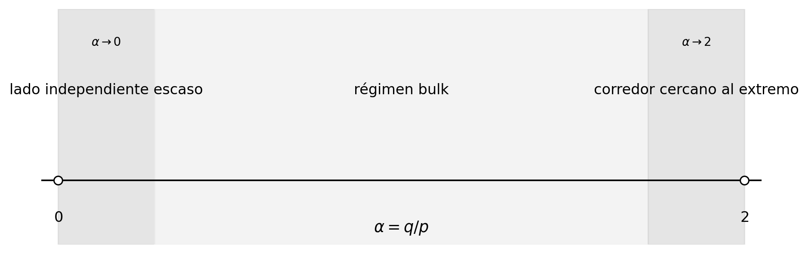

# Particiones de cliques con error lineal en grafos split mediante empaquetamiento estructurado de triángulos

**Juan Pablo Traverso Gianini**  
Investigador independiente, Santiago, Chile  
[jtraverso@gmail.com](mailto:jtraverso@gmail.com)  
[ORCID: 0009-0003-6068-4096](https://orcid.org/0009-0003-6068-4096)

**Paper III de la serie**  
**Manuscrito preprint:** v1.0 (primer preprint público). Enunciados matemáticos, hipótesis, constantes, identidades exhibidas y demostraciones congelados para este release.  
**Fecha:** 25 de julio de 2026  
**Estado:** release oficial de preprint (v1.0). El informe de build y axiomas de Lean 4 / Mathlib v4.28.0 suministrado por el autor registra una compilación con cero `sorry` para el núcleo probado, sin `admit`, `native_decide` ni `unsafe`. Su capa de proyecto confiable consta exactamente de los dos insumos asintóticos externos de la Sección 2.4, conservados como los axiomas nombrados `AX1` (Haxell--Rödl/Yuster) y `AX2` (Dross + Barber--Kühn--Lo--Osthus). La huella axiomática reportada de Teorema 1.1 es `propext`, `Classical.choice`, `Quot.sound`, `AX1` y `AX2`, y el informe no registra ninguna otra declaración de axioma del proyecto. El commit público de release, una reproducción independiente del build, la revisión humana por pares y la evaluación de arte previo siguen pendientes; la redacción final sobre verificación queda ligada al release congelado. Véase la Sección 11.6 para el perímetro completo.

**MSC 2020:** Primario 05C70; secundarios 05C35, 05C72, 05C15.

---

## Resumen

Sea \(G=(K\cup I,E)\) un grafo split de \(n\) vértices, donde \(K\) es una clique e \(I\) es un conjunto independiente. Probamos que existe una constante absoluta \(C\) tal que

\[
|E(G)|-2\nu_3(G)
\le
\frac{n^2}{6}+Cn,
\]

donde \(\nu_3(G)\) es el número máximo de triángulos de \(G\) dos a dos arista-disjuntos. En consecuencia,

\[
\operatorname{cp}(G)
\le
\frac{n^2}{6}+Cn
\]

para todo grafo split \(G\), donde \(\operatorname{cp}(G)\) es el número mínimo de cliques cuyos conjuntos de aristas particionan \(E(G)\). Esto refuerza la cota asintótica \((1/6+o(1))n^2\) hasta la escala correcta de error lineal. La constante principal es óptima.

La demostración separa tres regímenes de acuerdo con \(\alpha=|I|/|K|\). En el régimen bulk, un programa lineal exacto de cuatro órbitas para un perfil de vecindario común produce un margen fraccional cuadrático uniforme; el teorema de Haxell--Rödl absorbe entonces la pérdida subcuadrática de integralidad. Cuando \(\alpha\to0\), grandes matchings arista-disjuntos anclados en los vértices independientes dejan un residual de clique casi completo y divisible en triángulos, que se descompone exactamente mediante resultados de descomposición de grafos densos. Cuando \(\alpha\to2\), la factorización promediada cierra el corredor corto, mientras una desigualdad de polarización con factor doble y un argumento de completación de ganancia con centro desplazado cierran el corredor mesoscópico restante.

La demostración no establece la estimación universal más fuerte \(\nu_3^*(G)-\nu_3(G)=O(n)\). Fuera del corredor extremo, una brecha de integralidad potencialmente superlineal es absorbida por holgura fraccional cuadrática.

Todos los mecanismos específicos del corredor se prueban en el artículo; en particular, el ingrediente de coloreo de aristas por listas se establece desde primeros principios en el Apéndice D. Más allá de resultados clásicos estándar usados en teoría de grafos, los únicos insumos asintóticos externos son los dos teoremas confinados a los regímenes bulk y escaso. El teorema del corredor cercano al extremo (Proposición 10.5) es elemental y efectivo.

**Palabras clave:** partición en cliques; grafo split; empaquetamiento de triángulos; empaquetamiento fraccional; factorización; polarización; coloreo de aristas por listas; descomposición de grafos.

---

# 1. Introducción

## 1.1 Particiones en cliques de grafos split

Una **partición en cliques** de un grafo \(G\) es una familia de subgrafos completos cuyos conjuntos de aristas particionan \(E(G)\). Se permiten cliques de orden dos. El tamaño mínimo de una familia de este tipo se denota por \(\operatorname{cp}(G)\).

El problema de partición en cliques cordales de Erdős, Ordman y Zalcstein pregunta por el orden extremo correcto de \(\operatorname{cp}(G)\) sobre grafos cordales [8]. Su construcción complete-split (de hecho, threshold) muestra que el coeficiente \(1/6\) es inevitable. Los grafos split forman una subclase natural e importante de los grafos cordales: un grafo es split si su conjunto de vértices puede particionarse en una clique y un conjunto independiente. Chen, Erdős y Ordman establecieron para esta subclase una cota superior asintótica más fuerte [5].

Este es el tercer artículo de la serie sobre el problema de partición en cliques de Erdős–Ordman–Zalcstein (Problema #81 de Erdős [3]). Paper I prueba una cota fraccional finita para grafos split, \(|E(G)|-2\nu_3^*(G)\le n^2/6+n\). Paper II identifica la familia terminal complete-split y determina el máximo finito exacto del funcional fraccional de cobertura sobre grafos cordales [16]. Papers I y II son fraccionales y tienen releases congelados en Lean 4. Paper IV de la serie desarrolla una interfaz general de transferencia y redondeo para aplicaciones integrales; es lógicamente independiente de la presente demostración. El presente artículo es la primera entrega integral: refuerza la estimación para grafos split hasta la escala de error lineal \(n^2/6+O(n)\).

Paper II de la serie determina exactamente el problema extremo fraccional. Para todo \(n\),

\[
\max_{\substack{|V(G)|=n\\G\text{ cordal}}}
\bigl(|E(G)|-2\nu_3^*(G)\bigr)
=
\max_{\substack{|V(G)|=n\\G\text{ split}}}
\bigl(|E(G)|-2\nu_3^*(G)\bigr)
=
\left\lfloor\frac{(2n+1)^2}{24}\right\rfloor.
\]

Se sigue, mediante redondeo fraccional-a-integral estándar, que todo grafo cordal satisface

\[
\operatorname{cp}(G)
\le
\left(\frac16+o(1)\right)n^2.
\]

El presente artículo aborda una cuestión diferente y genuinamente de segundo orden: refuerza la cota integral hasta \(n^2/6+O(n)\) para grafos split arbitrarios.

## 1.2 Empaquetamientos de triángulos y el objetivo de error lineal

Sea \(\nu_3(G)\) el número máximo de triángulos de \(G\) dos a dos arista-disjuntos. Todo empaquetamiento de este tipo produce una partición en cliques: se conserva cada triángulo empaquetado y se usa un \(K_2\) para cada arista no cubierta. Por tanto,

\[
\operatorname{cp}(G)
\le
|E(G)|-2\nu_3(G).
\tag{1.1}
\]

El teorema central de este artículo es una estimación integral en la escala correcta de segundo orden.

### Teorema 1.1 — Teorema de error lineal para grafos split

Existe una constante absoluta \(C\) tal que todo grafo split \(G\) de \(n\) vértices satisface

\[
\boxed{
|E(G)|-2\nu_3(G)
\le
\frac{n^2}{6}+Cn.
}
\tag{1.2}
\]

Al combinar (1.1) con Teorema 1.1 se obtiene el enunciado de partición en cliques.

### Corolario 1.2 — Cota de error lineal para particiones en cliques

Existe una constante absoluta \(C\) tal que todo grafo split \(G\) de \(n\) vértices satisface

\[
\boxed{
\operatorname{cp}(G)
\le
\frac{n^2}{6}+Cn.
}
\tag{1.3}
\]

La familia complete-split (de hecho, threshold) de Erdős--Ordman--Zalcstein \(K_p\vee\overline K_{2p}\), con \(n=3p\), muestra que la constante principal \(1/6\) es óptima y que aparece naturalmente un término lineal.


**Figura 1.** El grafo complete-split \(K_p\vee\overline K_{2p}\). Están presentes todas las aristas entre las dos partes, y el lado independiente no contiene aristas internas. Como todo triángulo contiene una arista de la clique, un empaquetamiento de triángulos arista-disjuntos usa a lo sumo \(\binom p2\) triángulos; véase la Sección 10.2. La figura es ilustrativa y no se usa como premisa de la demostración.

## 1.3 Localización de obstrucciones hipotéticas

### Proposición 1.3 — Localización de obstrucciones hipotéticas

Supongamos, por contradicción, que no existe una cota absoluta de error lineal y, para cada entero positivo \(k\), elijamos un grafo split \(G_k\) de orden mínimo que satisfaga

\[
|E(G_k)|-2\nu_3(G_k)>\frac{|V(G_k)|^2}{6}+k|V(G_k)|.
\]

Tras pasar a una subsucesión y escribir \(|K_k|=p_k\), \(|I_k|=q_k\), toda sucesión hipotética de este tipo debe satisfacer

\[
\frac{q_k}{p_k}\longrightarrow 2.
\]

Además, si \(q_k=2p_k-s_k\), entonces las estimaciones del régimen bulk y del corredor corto fuerzan

\[
\sqrt{p_k}\ll s_k=o(p_k).
\]

Así, toda obstrucción a un término de error lineal tendría que concentrarse en el corredor mesoscópico cercano al extremo. La dicotomía de dispersión alta/baja de la Sección 9 excluye ese corredor.

## 1.4 Lo que el teorema no prueba

Sea \(\nu_3^*(G)\) el número fraccional de empaquetamiento de triángulos. La presente demostración **no** establece

\[
\nu_3^*(G)-\nu_3(G)=O(n)
\tag{1.4}
\]

uniformemente sobre grafos split.

En efecto, escribamos

\[
\Gamma(G)=\nu_3^*(G)-\nu_3(G)
\]

y

\[
S(G)=\frac{n^2}{6}-\bigl(|E(G)|-2\nu_3^*(G)\bigr).
\]

Entonces

\[
|E(G)|-2\nu_3(G)
=
\frac{n^2}{6}-S(G)+2\Gamma(G).
\tag{1.5}
\]

Teorema 1.1 solo requiere

\[
2\Gamma(G)\le S(G)+O(n).
\]

En el régimen bulk, \(S(G)\) es cuadrático y absorbe la pérdida general de integralidad \(o(n^2)\). Por tanto, el problema universal de brecha lineal de integralidad sigue abierto.

## 1.5 Arquitectura de la demostración

Escribamos

\[
|K|=p,
\qquad
|I|=q,
\qquad
\alpha=\frac qp.
\]

La razón \(\alpha=q/p\) determina qué fuente de holgura está disponible. Primero resolvemos \(q\ge2p-1\) mediante factorización promediada directa y podemos entonces suponer \(0\le\alpha<2\). Una sucesión hipotética de contraejemplos tiene una subsucesión en uno de tres regímenes.

1. **Bulk:** \(\alpha\) permanece alejado tanto de \(0\) como de \(2\). Un LP exacto de perfil común y un argumento de clonación fraccional producen holgura fraccional cuadrática. Haxell--Rödl convierte el empaquetamiento fraccional en uno integral con pérdida solo \(o(n^2)\).

2. **Lado independiente escaso:** \(\alpha\to0\). Cada vértice independiente ancla un matching grande dentro de su vecindario. La clique residual es casi completa. Después de eliminar \(O(p)\) aristas para corregir la divisibilidad, admite una descomposición exacta en triángulos.

3. **Corredor cercano al extremo:** \(\alpha\to2\). Escribamos \(q=2p-s\). La factorización promediada cierra \(s=O(\sqrt p)\). Para \(\sqrt p\ll s=o(p)\), la dispersión alta se paga mediante un término de polarización de factor doble, mientras que la dispersión baja implica cercanía a un centro común y se trata mediante completación de ganancia con centro desplazado.

**Tabla 1. Los tres regímenes de la demostración.** El corredor cercano al extremo es elemental y efectivo (Proposición 10.5); los otros dos regímenes invocan exactamente un insumo asintótico externo cada uno.

| Régimen | Condición sobre \(\alpha=q/p\) | Fuente de holgura | Insumo externo | Secciones |
|---|---|---|---|---|
| Lado independiente escaso | \(\alpha\to 0\) | el residual denso de clique admite una descomposición exacta en triángulos | Teorema 2.3 (Dross--BKLO) | §8 |
| Bulk | \(\alpha\) alejado de \(0\) y \(2\) | margen fraccional cuadrático (LP de perfil común + clonación fraccional) | Teorema 2.1 (Haxell--Rödl/Yuster) | §3--4, §9.1 |
| Corredor cercano al extremo | \(\alpha\to 2\), \(q=2p-s\) | factorización promediada, polarización de factor doble, completación de ganancia con centro desplazado | ninguno (elemental/efectivo) | §5--7, §9.2--9.3, §10.5 |

La división no es cosmética. En el bulk hay suficiente holgura fraccional cuadrática para absorber una pérdida general de redondeo \(o(n^2)\). En los dos extremos esa holgura se desvanece, por lo que la demostración reemplaza el redondeo genérico por construcciones adaptadas a la geometría de la presentación split.



**Figura 2.** Los tres regímenes de parámetros usados en la demostración. Se muestran los principales umbrales del corredor; las hipótesis completas aparecen en las Secciones 4, 8 y 9. Los regímenes extremos son asintóticos y no subintervalos rígidos de \([0,2]\).

## 1.6 Auditorías computacionales suplementarias

El paquete de cierre acompañante contiene pruebas de regresión con aritmética exacta e instancias finitas para identidades seleccionadas y desigualdades cuantitativas usadas en la demostración.

Todo enunciado auditado se prueba analíticamente en el manuscrito. Ningún cálculo, script, enumeración finita ni salida de solver es una premisa lógica de Teorema 1.1. El material suplementario se proporciona únicamente para comprobación independiente, pruebas de regresión y reproducibilidad.

## 1.7 Organización

La Sección 2 fija la notación y los insumos externos. La Sección 3 resuelve el LP de perfil común. La Sección 4 prueba la cota de clonación fraccional y el margen fraccional global. La Sección 5 desarrolla el redondeo mediante factorización promediada y factor doble. La Sección 6 prueba la polarización. La Sección 7 prueba la completación de ganancia con centro desplazado. La Sección 8 trata el régimen con lado independiente escaso. La Sección 9 ensambla los tres regímenes. La Sección 10 registra corolarios, la Sección 11 discute la demostración y sus limitaciones, y la Sección 12 describe usos futuros y direcciones abiertas. Los apéndices contienen detalles algebraicos, la corrección de divisibilidad, material de reproducibilidad y una demostración autocontenida del teorema de coloreo de aristas por listas (Apéndice D).

---

# 2. Preliminares

## 2.1 Notación split

En todo el artículo,

\[
G=(K\sqcup I,E)
\]

es un grafo split, donde \(K\) es una clique de tamaño \(p\) e \(I=\{v_1,\ldots,v_q\}\) es independiente.

Para \(v_i\in I\), escribimos

\[
N_i=N(v_i)\cap K,
\qquad
d_i=|N_i|,
\qquad
S_i=K\setminus N_i,
\qquad
m_i=|S_i|.
\]

Definimos

\[
M=\sum_i m_i,
\qquad
S_2=\sum_i m_i^2.
\]

Cuando \(q\) es cercano a \(2p\), escribimos

\[
q=2p-s.
\tag{2.1}
\]

## 2.2 Empaquetamientos de triángulos

Un empaquetamiento fraccional de triángulos es una asignación de pesos no negativos a los triángulos de \(G\) tal que el peso total que pasa por cada arista es a lo sumo uno. Su valor máximo es \(\nu_3^*(G)\).

El dual es una cobertura fraccional de triángulos: una asignación de pesos no negativos a las aristas tal que cada triángulo recibe peso total de aristas al menos uno. La dualidad de programación lineal da igualdad entre ambos valores óptimos.

En todo el artículo escribimos

\[
\Phi(G):=|E(G)|-2\nu_3(G)
\]

para el defecto integral de empaquetamiento de triángulos; por (1.1), \(\operatorname{cp}(G)\le\Phi(G)\).

## 2.3 Factorizaciones de grafos completos

Adoptamos las convenciones de frontera

\[
\chi'(K_0)=\chi'(K_1)=0.
\]

Para \(t\ge2\), el índice cromático de un grafo completo es

\[
\chi'(K_t)
=
\begin{cases}
t-1,&t\text{ par},\\
t,&t\text{ impar}.
\end{cases}
\tag{2.2}
\]

Por tanto, \(E(K_t)\) se descompone en \(\chi'(K_t)\) matchings. Las convenciones para \(t\le1\) hacen que el mismo lenguaje sea válido para conjuntos de aristas vacíos.

## 2.4 Teoremas externos

Usamos dos insumos asintóticos externos. Versiones anteriores citaban un tercero, el teorema de coloreo de aristas por listas; el caso requerido aquí se prueba de manera autocontenida en el Apéndice D. Por ello, las Secciones 5--7 y Proposición 10.5 no requieren ningún insumo asintótico adicional, aunque usan hechos clásicos estándar como el coloreo de aristas de grafos completos.

### Teorema 2.1 — Haxell--Rödl/Yuster [11,17]

Para todo grafo fijo \(H\),

\[
\nu_H^*(G)-\nu_H(G)=o(|V(G)|^2)
\]

uniformemente sobre grafos \(G\). Lo aplicamos con \(H=K_3\).

### Teorema 2.2 — Coloreo de aristas por listas (probado en el Apéndice D)

Sea \(B\) un grafo bipartito de grado máximo \(\Delta(B)\). Si a cada arista \(e\) se le asigna una lista \(L(e)\) con

\[
|L(e)|\ge\Delta(B),
\]

entonces \(B\) tiene un coloreo propio de aristas que elige el color de cada arista desde su lista.

Este es el caso de grado máximo del teorema de Galvin [10]. En el Apéndice D se da una demostración autocontenida (coloreo de König, emparejamientos estables y el lema del kernel), de modo que no constituye una dependencia externa del artículo. El refinamiento local \(|L(xy)|\ge\max\{d(x),d(y)\}\) de Borodin, Kostochka y Woodall [4] no es necesario: la hipótesis (7.2) ya acota cada lista por el grado máximo del grafo de ganancia.

### Teorema 2.3 — Descomposición densa en triángulos

Para todo \(\varepsilon>0\), todo grafo \(H\) suficientemente grande, divisible en triángulos y con

\[
\delta(H)\ge(0.9+\varepsilon)|V(H)|
\]

admite una descomposición en triángulos. Esto se sigue del teorema de descomposición fraccional en triángulos de Dross [7] (grado mínimo \(0.9v\) basta fraccionalmente), combinado con el teorema de absorción iterativa de Barber, Kühn, Lo y Osthus [2], que convierte el umbral fraccional en un umbral de descomposición exacta para grafos divisibles en triángulos, salvo \(\varepsilon\) y para orden suficientemente grande.

---

# 3. El programa lineal de perfil común

Para enteros \(p,q,d\), sea \(H(p,q,d)\) el grafo split con clique \(K\), \(|K|=p\), conjunto independiente \(I\), \(|I|=q\), y un conjunto fijo \(N\subseteq K\), \(|N|=d\), tal que todo vértice de \(I\) tiene vecindario \(N\). Definamos \(R=K\setminus N\) y \(r=p-d\).

## 3.1 Variables simétricas de cobertura

Al promediar sobre permutaciones de \(N\), \(R\) e \(I\), puede suponerse que una cobertura fraccional óptima de triángulos es constante sobre las cuatro clases de aristas

\[
E(N),
\qquad E(N,I),
\qquad E(N,R),
\qquad E(R).
\]

Sean \(a,b,c,e\) sus pesos respectivos. Las restricciones de triángulos son

\[
a+2b\ge1,
\qquad
3a\ge1,
\tag{3.1}
\]

\[
a+2c\ge1,
\qquad
2c+e\ge1,
\qquad
3e\ge1.
\tag{3.2}
\]

Las restricciones correspondientes a tipos de triángulos vacíos pueden omitirse; la fórmula siguiente sigue siendo válida para \(p\ge3\).

El objetivo es

\[
\binom d2a+qdb+dr\,c+\binom r2e.
\tag{3.3}
\]

## 3.2 Solución exacta

### Teorema 3.1 — Fórmula de perfil común

Para \(p\ge3\) y \(q\ge1\),

\[
\boxed{
\nu_3^*(H(p,q,d))
=
F(p,q,d),
}
\tag{3.4}
\]

donde

\[
\boxed{
F(p,q,d)
=
\min\left\{
\frac{\binom p2+qd}{3},
\binom d2+\binom r2,
\binom d2+\frac{dr+\binom r2}{3}
\right\}.
}
\tag{3.5}
\]

### Demostración

En un óptimo,

\[
b=\frac{1-a}{2},
\qquad
c=\frac{1-\min\{a,e\}}2,
\qquad
\frac13\le a,e\le1.
\]

Si \(a\le e\), disminuir \(e\) hasta \(a\) no puede aumentar el objetivo. Por tanto, basta minimizar sobre

\[
\frac13\le e\le a\le1.
\]

El objetivo es afín sobre este triángulo, por lo que un mínimo ocurre en

\[
(a,e)=\left(\frac13,\frac13\right),
\qquad
(1,1),
\qquad
\left(1,\frac13\right).
\]

Los valores correspondientes son precisamente las tres expresiones de (3.5). La dualidad completa la demostración. \(\square\)

Cuando \(q=0\), el grafo \(H(p,0,d)\) es simplemente \(K_p\), independientemente de \(d\), y la misma fórmula se sigue de \(\nu_3^*(K_p)=\binom p2/3\).

## 3.3 Interpretación de las tres coberturas

El mínimo de (3.5) se recuerda con mayor facilidad mediante los tres vértices del programa reducido de dos variables. Cada vértice representa una manera distinta de pagar las restricciones de triángulos.

| Patrón de cobertura | Vértice reducido \((a,e)\) | Valor | Descripción geométrica |
|---|---:|---:|---|
| **Uniforme** | \((1/3,1/3)\) | \(\bigl(\binom p2+qd\bigr)/3\) | Todas las órbitas relevantes de aristas se cubren a la tasa fraccional uniforme. |
| **Separada** | \((1,1)\) | \(\binom d2+\binom r2\) | Los dos bloques de clique \(N\) y \(R\) se pagan internamente, sin peso sobre la órbita cruzada. |
| **Vecindario caliente** | \((1,1/3)\) | \(\binom d2+\bigl(dr+\binom r2\bigr)/3\) | El vecindario común \(N\) se paga por completo, mientras la estructura de clique residual permanece fraccional. |

Las etiquetas son descriptivas y no constituyen definiciones adicionales. En los cálculos posteriores nos referimos a las correspondientes ramas primera, segunda y tercera de \(F\). Esta tricotomía finita es la fuente del margen fraccional global.

---

# 4. Clonación fraccional y margen fraccional exacto

## 4.1 Clonación fraccional

La operación de clonación fraccional (replicación) usada aquí es el análogo, desde el lado de coberturas, de la simetrización por clones usada en Paper II. Allí, vértices o clases de clones se copian por pares para simplificar un grafo cordal. Aquí, un perfil del conjunto independiente se copia \(q\) veces en un solo paso de promediado; el grafo \(H(p,q,d_i)\) registra el perfil común resultante.

### Lema 4.1 — Cota de clonación fraccional

Para todo grafo split con \(q\ge1\),

\[
\boxed{
\nu_3^*(G)
\ge
\frac1q\sum_{i=1}^qF(p,q,d_i).
}
\tag{4.1}
\]

### Demostración

Sea \(y\) una cobertura fraccional cualquiera de triángulos de \(G\). Definamos

\[
A=\sum_{e\in E(K)}y_e
\]

y

\[
B_i=\sum_{x\in N_i}y_{v_ix}.
\]

Reemplacemos \(v_i\) por \(q\) clones independientes, todos con vecindario \(N_i\), y demos a cada clone los pesos incidentes de \(v_i\). Junto con los pesos originales de las aristas de la clique, esto es una cobertura fraccional de \(H(p,q,d_i)\) de peso \(A+qB_i\). Por tanto,

\[
A+qB_i\ge F(p,q,d_i).
\]

Al sumar sobre \(i\) obtenemos

\[
q\left(A+\sum_iB_i\right)
\ge
\sum_iF(p,q,d_i).
\]

Minimizar sobre las coberturas prueba el lema. \(\square\)

## 4.2 El margen exacto

Supongamos \(0<q\le2p\), definamos

\[
\alpha=\frac qp,
\]

y el umbral de empaquetamiento

\[
T(G)=\frac12\left(|E(G)|-\frac{(p+q)^2}{6}\right).
\tag{4.2}
\]

Definamos

\[
\mu(\alpha)
=
\begin{cases}
\alpha^2/12,&0\le\alpha\le2/3,\\
(2-\alpha)^2/48,&2/3\le\alpha\le2.
\end{cases}
\tag{4.3}
\]

### Teorema 4.2 — Margen fraccional unificado

\[
\boxed{
\nu_3^*(G)
\ge
T(G)+\mu(\alpha)p^2-\frac p4.
}
\tag{4.4}
\]

### Demostración

Sea

\[
C_\alpha=\frac{2-2\alpha-\alpha^2}{12}.
\]

Para cada rama de \(F(p,q,d)\), completar cuadrados da

\[
F(p,q,d)
\ge
\frac{qd}{2}+C_\alpha p^2+\mu(\alpha)p^2-\frac p2.
\tag{4.5}
\]

Los tres mínimos residuales normalizados son

\[
\frac{\alpha^2}{12},
\qquad
\frac{(2-\alpha)^2}{48},
\]

y

\[
\begin{cases}
\alpha(8-5\alpha)/48,&\alpha\le4/3,\\
(2-\alpha)^2/12,&\alpha\ge4/3.
\end{cases}
\]

El tercero nunca está por debajo del mínimo de los dos primeros. Promediar (4.5) mediante Lema 4.1 da

\[
\nu_3^*(G)
\ge
\frac12\sum_i d_i+C_\alpha p^2+\mu(\alpha)p^2-\frac p2.
\]

Como

\[
T(G)=\frac12\sum_i d_i+C_\alpha p^2-\frac p4,
\]

obtenemos (4.4). \(\square\)

## 4.3 Consecuencia para el bulk

Si

\[
\varepsilon\le\alpha\le2-\varepsilon,
\]

entonces \(\mu(\alpha)\ge c_\varepsilon>0\). Teorema 4.2 y Haxell--Rödl implican

\[
\nu_3(G)\ge T(G)
\]

para todos los grafos suficientemente grandes en este régimen. Por tanto,

\[
|E(G)|-2\nu_3(G)
\le
\frac{n^2}{6}.
\tag{4.6}
\]

---

# 5. Redondeo por factorización cerca de \(q=2p\)

Sea

\[
r_p=\chi'(K_p).
\]

## 5.1 Promediado con un factor

### Lema 5.1

Si \(q\ge r_p\), entonces

\[
\boxed{
\nu_3(G)
\ge
\frac1q\sum_i\binom{d_i}{2}.
}
\tag{5.1}
\]

### Demostración

Factorizamos \(K_p\) en \(r_p\) matchings. Asignamos los factores de manera inyectiva y uniforme a vértices de \(I\). En el factor asignado a \(v_i\), conservamos solo las aristas cuyos dos extremos pertenecen a \(N_i\). Las aristas conservadas forman triángulos \(KKI\) válidos y arista-disjuntos.

El número esperado de aristas conservadas es

\[
\frac1q\sum_i\sum_{j=1}^{r_p}|F_j\cap E(K[N_i])|
=
\frac1q\sum_i\binom{d_i}{2}.
\]

Alguna asignación alcanza al menos la esperanza. \(\square\)

Al escribir \(q=2p-s\), la sustitución da

\[
\Phi(G)
\le
\frac{n^2}{6}+\frac p2-\frac{s^2}{6}
+
\frac{(s-1)M-S_2}{q}.
\tag{5.2}
\]

Usando \(S_2\ge M^2/q\) y maximizando la parábola resultante se obtiene

\[
\boxed{
\Phi(G)
\le
\frac{n^2}{6}+\frac p2+\frac{s^2-6s+3}{12}.
}
\tag{5.3}
\]

Así, \(s=O(\sqrt p)\) queda cerrado con error lineal.

## 5.2 Redondeo con factor doble

Para una arista \(e=xy\) de la clique, sea

\[
b_e=|\{i:\{x,y\}\not\subseteq N_i\}|.
\]

Definamos

\[
h=\min\{r_p,q-r_p\},
\qquad
\delta=\frac h{r_p}.
\]

Elegimos uniformemente al azar el conjunto de \(h\) factores que reciben dos vértices independientes distintos, damos un vértice independiente a cada factor restante y asignamos los vértices independientes a las posiciones resultantes de manera uniforme e inyectiva. Todas las esperanzas siguientes se toman respecto de ambas elecciones aleatorias; alguna elección determinista alcanza al menos la ganancia esperada.

### Lema 5.2 — Desigualdad de factor doble

Si \(q\ge r_p\), entonces

\[
\boxed{
\begin{aligned}
\Phi(G)
\le{}&
\frac{n^2}{6}+\frac p2-\frac{s^2}{6}
+
\frac{(s-1)M-S_2}{q}\\
&-
\frac{2\delta V}{q(q-1)},
\end{aligned}
}
\tag{5.4}
\]

donde

\[
V=\sum_{e\in E(K)}b_e(q-b_e).
\tag{5.5}
\]

### Demostración

Si el factor que contiene a \(e\) recibe un vértice, \(e\) se pierde con probabilidad \(b_e/q\). Si recibe dos vértices, se pierde solo cuando ambos son malos, con probabilidad

\[
\frac{b_e(b_e-1)}{q(q-1)}.
\]

Por tanto, el número esperado \(U\) de aristas de clique perdidas es

\[
U
=
\frac1q\sum_e b_e
-
\frac{\delta}{q(q-1)}\sum_e b_e(q-b_e).
\]

Como cada factor es un matching, cada arista conservada puede asignarse a uno de sus vértices admisibles sin crear una colisión de aristas. La sustitución da (5.4). \(\square\)

---

# 6. Polarización cuantitativa

Para cada \(i\), definamos

\[
\mathcal B_i=\{e\in E(K):e\cap S_i\ne\varnothing\}.
\]

Entonces

\[
V=\sum_{i,j}|\mathcal B_i\setminus\mathcal B_j|.
\tag{6.1}
\]

Sea

\[
m=\max_i|S_i|.
\]

### Lema 6.1 — Desigualdad de polarización

Si \(2p-3m-1\ge0\), entonces

\[
\boxed{
V
\ge
\frac{2p-3m-1}{4}
\sum_{i,j}|S_i\triangle S_j|.
}
\tag{6.2}
\]

### Demostración

Definamos

\[
a_{ij}=|S_i\setminus S_j|.
\]

Las aristas de \(\mathcal B_i\setminus\mathcal B_j\) son precisamente las aristas de \(K_p-S_j\) que inciden en \(S_i\setminus S_j\). Por tanto,

\[
|\mathcal B_i\setminus\mathcal B_j|
=
\frac{a_{ij}\bigl(2(p-|S_j|)-a_{ij}-1\bigr)}2.
\]

Como \(|S_j|\le m\) y \(a_{ij}\le m\),

\[
|\mathcal B_i\setminus\mathcal B_j|
\ge
\frac{2p-3m-1}{2}|S_i\setminus S_j|.
\]

Sumamos sobre pares ordenados y usamos

\[
\sum_{i,j}|S_i\setminus S_j|
=
\frac12\sum_{i,j}|S_i\triangle S_j|.
\]

Esto prueba (6.2). \(\square\)

---

# 7. Completación de ganancia con centro desplazado

Fijemos \(R\subseteq K\). Definamos

\[
\rho=|R|,
\qquad
Q=K\setminus R,
\qquad
b=|Q|.
\]

Para cada \(i\), definamos

\[
T_i=S_i\setminus R,
\qquad
t_i=|T_i|,
\]

y

\[
G_i=R\setminus S_i,
\qquad
g_i=|G_i|.
\]

Sean

\[
A_R=\sum_i t_i,
\qquad
A_{2,R}=\sum_i t_i^2,
\qquad
B_R=\sum_i g_i.
\]

Definamos

\[
r_b=\chi'(K_b),
\qquad
u=q-r_b.
\]

Supongamos

\[
b\ge2,
\qquad
q\ge r_b,
\qquad
b\ge\chi'(K_\rho),
\tag{7.1}
\]

y

\[
b-t_i\ge\max\{\rho,u\}
\qquad
\text{para todo }i.
\tag{7.2}
\]

Definamos

\[
\theta_R=\frac{\max\{\rho-1,0\}}{b}
\]

y

\[
\kappa_R
=
1-2(1-\theta_R)\frac{u}{q}.
\tag{7.3}
\]

## 7.1 Empaquetamiento dentro de \(Q\)

Reservamos un conjunto \(U\subseteq I\) de \(u\) vértices; nótese que \(|I\setminus U|=q-u=r_b\) exactamente. Asignamos los \(r_b\) vértices restantes biyectivamente a una factorización de \(K[Q]\).

Para \(v_i\), el número de aristas no disponibles de \(K[Q]\) es

\[
\beta_i
=
\binom b2-\binom{b-t_i}{2}.
\tag{7.4}
\]

Para \(U\) fijo, el promediado sobre las asignaciones da al menos

\[
\binom b2-\frac1{r_b}\sum_{i\notin U}\beta_i
\tag{7.5}
\]

triángulos \(QQI\) arista-disjuntos.

## 7.2 El grafo de ganancia

Construimos un grafo bipartito con partes \(U\) y \(R\), uniendo \(v_i\) con \(r\) cuando \(r\in G_i\). Asignamos la lista

\[
L(v_ir)=N_i\cap Q.
\]

Por (7.2), toda lista satisface

\[
|L(v_ir)|=b-t_i
\ge
\max\{\rho,u\}
\ge
\Delta,
\]

donde \(\Delta\) es el grado máximo del grafo de ganancia, pues \(d(v_i)=g_i\le\rho\) y \(d(r)\le|U|=u\). Teorema 2.2, probado de manera autocontenida en el Apéndice D, da un coloreo propio de aristas por listas. Si \(v_ir\) recibe el color \(z\in Q\), tomamos el triángulo \(v_irz\). Esto produce

\[
B_U=\sum_{i\in U}g_i
\]

triángulos \(IRQ\) arista-disjuntos.

## 7.3 Completación dentro de \(R\)

Para cada \(z\in Q\), sea \(U_z\subseteq R\) el conjunto de vértices \(r\) para los cuales la arista \(rz\) fue usada por un triángulo \(IRQ\).

Si \(\rho\le1\), el grafo \(K[R]\) no tiene aristas, de modo que esta completación no aporta triángulos \(RRQ\). Supongamos entonces \(\rho\ge2\). Factorizamos \(K[R]\), inyectamos sus factores en los colores \(z\in Q\) y eliminamos del factor asignado a \(z\) toda arista incidente en \(U_z\). El promediado sobre las inyecciones pierde a lo sumo

\[
\frac{\rho-1}{b}\sum_z|U_z|
=
\theta_RB_U
\]

aristas. Por tanto, en todos los casos obtenemos al menos

\[
\binom\rho2-\theta_RB_U
\]

triángulos \(RRQ\) adicionales.

Las tres familias \(QQI\), \(IRQ\) y \(RRQ\) son arista-disjuntas. En particular, la eliminación de colores prohibidos impide que un triángulo \(IRQ\) y un triángulo \(RRQ\) compartan una arista \(rz\).

## 7.4 La desigualdad centrada

Elegimos \(U\), \(|U|=u\), que maximice

\[
\sum_{i\in U}
\left(
\frac{2\beta_i}{r_b}+2(1-\theta_R)g_i
\right).
\]

Los mejores \(u\) términos tienen suma al menos \(u/q\) veces la suma total. Usando

\[
2\sum_i\beta_i
=(2b-1)A_R-A_{2,R},
\]

obtenemos el lema local principal.

### Lema 7.1 — Desigualdad con centro desplazado y ganancia reservada

Bajo (7.1)--(7.2),

\[
\boxed{
\begin{aligned}
\Phi(G)
\le{}&
\frac{n^2}{6}+\frac p2-\frac{s^2}{6}
+s\rho-2\rho^2\\
&+
\kappa_RB_R
+
\frac{(s-2\rho-1)A_R-A_{2,R}}q.
\end{aligned}
}
\tag{7.6}
\]

---

# 8. El régimen con lado independiente escaso

Supongamos \(q=o(p)\). Probamos la cota requerida de forma directa e integral.

## 8.1 Cota de grado en un contraejemplo mínimo

En el argumento global por contradicción, un contraejemplo mínimo con penalización \(kn\) satisface, para todo \(v\in I\),

\[
d(v)>
\frac{2n-1}{6}+k.
\tag{8.1}
\]

Como \(q=o(p)\), esto implica eventualmente

\[
d(v)\ge2q+2.
\tag{8.2}
\]

## 8.2 Matchings sucesivos

Ordenamos \(I=\{v_1,\ldots,v_q\}\). Elegimos sucesivamente matchings arista-disjuntos

\[
M_i\subseteq K[N_i]
\]

de tamaño \(\lfloor d_i/2\rfloor\).

Antes de elegir \(M_i\), cada vértice ha perdido a lo sumo \(i-1\) aristas incidentes, por lo que el grafo disponible sobre \(N_i\) tiene grado mínimo al menos

\[
d_i-i\ge d_i/2.
\]

El teorema de Dirac [6] proporciona un ciclo hamiltoniano y, por tanto, un matching del tamaño requerido.

Sea

\[
F=\bigcup_iM_i.
\]

Entonces

\[
|F|
\ge
\frac12\sum_i d_i-\frac q2,
\qquad
\Delta(F)\le q.
\tag{8.3}
\]

Las aristas de \(M_i\) producen \(|M_i|\) triángulos \(KKI\) arista-disjuntos con ápice \(v_i\).

## 8.3 Corrección de divisibilidad

El grafo residual de la clique

\[
R_0=K_p-F
\]

satisface

\[
\delta(R_0)
\ge
p-1-q
=(1-o(1))p.
\tag{8.4}
\]

En particular, para todos los miembros suficientemente grandes de la sucesión, \(\delta(R_0)>p/2\). El teorema de Dirac [6] da entonces un ciclo hamiltoniano y, por tanto, un camino hamiltoniano

\[
P=x_1x_2\cdots x_p
\]

contenido en \(R_0\). Sea \(O\) el conjunto de vértices de grado impar de \(R_0\). Por el lema del apretón de manos, \(|O|\) es par. Definimos el subgrafo de camino \(J\subseteq P\) mediante

\[
x_jx_{j+1}\in E(J)
\quad\Longleftrightarrow\quad
|O\cap\{x_1,\ldots,x_j\}|\text{ es impar}.
\tag{8.5}
\]

Para un vértice interno \(x_j\), la paridad de su grado en \(J\) es el cambio de paridad del prefijo entre las posiciones \(j-1\) y \(j\), y por tanto es \(1\) precisamente cuando \(x_j\in O\). La misma conclusión vale en los dos extremos porque \(|O|\) es par. En consecuencia,

\[
\operatorname{Odd}(J)=O,
\qquad
|E(J)|\le p-1,
\qquad
\Delta(J)\le2.
\tag{8.6}
\]

Así,

\[
R_1:=R_0-J
\]

tiene todos sus grados pares, y

\[
\delta(R_1)\ge p-1-q-2.
\tag{8.7}
\]

Como \(q=o(p)\), eventualmente \(\delta(R_1)>3p/4\). Por el teorema de Turán, \(R_1\) contiene una copia de \(K_5\). Elegimos un \(C_4\) y un \(C_5\) dentro de este \(K_5\) fijo. Según

\[
|E(R_1)|\equiv0,1,2\pmod3,
\]

eliminamos respectivamente nada, el \(C_4\) o el \(C_5\). Sea \(C\) el ciclo eliminado, permitiendo \(C=\varnothing\), y definamos

\[
H:=R_1-E(C).
\]

Cada vértice pierde cero o dos aristas incidentes al eliminar un ciclo, de modo que todos los grados de \(H\) siguen siendo pares. Además, \(|E(C)|\equiv |E(R_1)|\pmod3\), y por ello

\[
|E(H)|\equiv0\pmod3.
\]

Por tanto, \(H\) es divisible en triángulos. La pérdida total de grado al pasar de \(R_0\) a \(H\) es a lo sumo cuatro, por lo que

\[
\delta(H)\ge p-1-q-4.
\tag{8.8}
\]

Para aplicar Teorema 2.3 con un parámetro fijo, tomemos por ejemplo \(\varepsilon_0=1/100\). Como \(q=o(p)\), eventualmente \(q\le p/20\), y entonces, para \(p\) suficientemente grande,

\[
\delta(H)\ge p-1-q-4\ge0.91p=(0.9+\varepsilon_0)|V(H)|.
\tag{8.9}
\]

Teorema 2.3 da ahora una descomposición exacta en triángulos de \(H\). Nótese que el teorema de descomposición se aplica sobre el conjunto original de \(p\) vértices: no se elimina ningún vértice durante la corrección. La corrección completa elimina a lo sumo \(p+4\) aristas.

## 8.4 Tamaño del empaquetamiento

El empaquetamiento combinado tiene tamaño

\[
\begin{aligned}
\nu_3(G)
&\ge
|F|+\frac{\binom p2-|F|-O(p)}3\\
&=
\frac13\binom p2+\frac23|F|-O(p)\\
&\ge
\frac13\binom p2+\frac13\sum_i d_i-O(p+q).
\end{aligned}
\tag{8.10}
\]

En consecuencia,

\[
\begin{aligned}
\Phi(G)
&\le
\frac13\binom p2+\frac13\sum_i d_i+O(p+q)\\
&\le
\frac13\binom p2+\frac{pq}{3}+O(p+q)\\
&=
\frac{(p+q)^2}{6}-\frac{p+q^2}{6}+O(p+q).
\end{aligned}
\tag{8.11}
\]

Esto es a lo sumo \(n^2/6+O(n)\).

---

# 9. Demostración del teorema principal

Probamos ahora Teorema 1.1 por contradicción.

Supongamos que ninguna constante absoluta funciona. Para cada entero positivo \(k\), elegimos un grafo split \(G_k\), mínimo en su número \(n_k\) de vértices, tal que

\[
\Phi(G_k)
>
\frac{n_k^2}{6}+kn_k.
\tag{9.1}
\]

Necesariamente \(n_k\to\infty\). Para todo \(v\in I(G_k)\), la minimalidad da

\[
\Phi(G_k)
\le
\Phi(G_k-v)+d(v),
\]

y por tanto

\[
\boxed{
d(v)>
\frac{2n_k-1}{6}+k.
}
\tag{9.2}
\]

Primero, si \(q_k\ge2p_k-1\), Lema 5.1 da

\[
\Phi(G_k)
\le
\frac{n_k^2}{6}+\frac{p_k}{2},
\]

lo que contradice (9.1) para \(k\) grande. Podemos entonces suponer \(q_k<2p_k-1\) y pasar a una subsucesión de acuerdo con

\[
\alpha_k=\frac{q_k}{p_k}\in[0,2).
\]

## 9.1 Régimen bulk

Supongamos que para algún \(\varepsilon>0\),

\[
\varepsilon\le\alpha_k\le2-\varepsilon.
\]

Teorema 4.2 da

\[
\nu_3^*(G_k)
\ge
T(G_k)+c_\varepsilon p_k^2-O(p_k).
\]

Haxell--Rödl da

\[
\nu_3(G_k)
\ge
\nu_3^*(G_k)-o(n_k^2).
\]

Para \(k\) suficientemente grande, el margen cuadrático domina la pérdida de integralidad, por lo que \(\nu_3(G_k)\ge T(G_k)\), en contradicción con (9.1).

## 9.2 El extremo \(\alpha_k\to0\)

Este caso queda cerrado por la Sección 8, que da una constante absoluta \(C_0\) tal que

\[
\Phi(G_k)
\le
\frac{n_k^2}{6}+C_0n_k.
\]

Para \(k>C_0\), esto contradice (9.1).

## 9.3 El extremo \(\alpha_k\to2\)

Escribamos

\[
q=2p-s,
\qquad
s=o(p).
\]

Si \(s=O(\sqrt p)\), la desigualdad (5.3) da la cota de error lineal requerida. Supongamos en adelante

\[
\sqrt p\ll s=o(p).
\tag{9.3}
\]

Para todos los miembros suficientemente grandes de la sucesión,

\[
p\ge2304,
\qquad
6\sqrt p\le s\le\frac p8,
\qquad
k\ge1.
\tag{9.4}
\]

Por (9.2),

\[
m_i=|S_i|
<
\frac s3+\frac16-k
\le
\frac s3-\frac56.
\]

Como todo \(m_i\) es entero, con \(m=\max_i m_i\),

\[
\boxed{3m\le s-3.}
\tag{9.5}
\]

Para \(x\in K\), definamos

\[
a_x=|\{i:x\in S_i\}|
\]

y

\[
D=\sum_{x\in K}a_x(q-a_x).
\tag{9.6}
\]

Entonces

\[
\sum_{i,j}|S_i\triangle S_j|=2D.
\tag{9.7}
\]

### Dispersión alta

Supongamos

\[
D\ge\frac{qs^2}{12}.
\tag{9.8}
\]

Por (9.5),

\[
2p-3m-1\ge2p-s+2=q+2.
\]

Lema 6.1 y (9.7) dan entonces

\[
V
\ge
\frac{q+2}{2}D
\ge
\frac q2D.
\tag{9.9}
\]

El coeficiente de factor doble de Lema 5.2 satisface

\[
\boxed{\delta\ge\frac78.}
\tag{9.10}
\]

En efecto, si \(p\) es impar, \(r_p=p\) y

\[
\delta=\frac{p-s}{p}\ge\frac78,
\]

mientras que si \(p\) es par, \(r_p=p-1\) y

\[
\delta=\frac{p+1-s}{p-1}\ge\frac78.
\]

Además, \(S_2\ge M^2/q\), y (9.5) implica \(M/q\le m\le(s-3)/3\). Como la parábola resultante es creciente en este intervalo,

\[
\frac{(s-1)M-S_2}{q}
\le
\frac{2s(s-3)}9.
\tag{9.11}
\]

Al sustituir (9.8)--(9.11) en Lema 5.2 se obtiene

\[
\Phi(G)-\frac{n^2}{6}
\le
\frac p2-\frac{5s^2}{288}-\frac{2s}{3}.
\tag{9.12}
\]

Como \(s^2\ge36p\),

\[
\Phi(G)-\frac{n^2}{6}
\le
-\frac p8-\frac{2s}{3}<0,
\]

una contradicción.

### Dispersión baja

Supongamos

\[
D<\frac{qs^2}{12}.
\tag{9.13}
\]

Por (9.7), existe algún \(j\) tal que

\[
\sum_i|S_i\triangle S_j|
<
\frac{s^2}{6}.
\tag{9.14}
\]

Definamos

\[
R=S_j,
\qquad
\rho=|R|.
\]

Entonces

\[
A_R+B_R<\frac{s^2}{6},
\qquad
\rho\le m\le\frac{s-3}{3}.
\tag{9.15}
\]

Verificamos explícitamente las hipótesis de Lema 7.1. Como \(s\le p/8\),

\[
q=2p-s\ge\frac{15p}{8},
\qquad
b=p-\rho\ge p-\frac s3.
\]

Así, \(b\ge2\), \(q\ge r_b\) y \(b\ge\chi'(K_\rho)\). Además, \(r_b\ge b-1\), por lo que

\[
u=q-r_b\le p-s+\rho+1.
\]

Para todo \(i\),

\[
2\rho+t_i+1
\le
3m+1
\le
s-2.
\]

En consecuencia,

\[
b-t_i\ge\max\{\rho,u\},
\]

y Lema 7.1 es aplicable.

Si \(\rho=0\), entonces \(B_R=0\). Si \(\rho\ge1\), entonces

\[
\theta_R
\le
\frac{\rho}{p-\rho}
\le
\frac{8s}{23p}.
\]

Usando \(u=q-r_b\), \(r_b\le b\) y \(q\ge15p/8\), obtenemos

\[
\kappa_R
=1-2(1-\theta_R)\frac uq
\le
\frac sq+2\theta_R
\le
\frac{5s}{4p}.
\tag{9.16}
\]

Del mismo modo,

\[
\frac{(s-2\rho-1)_+}{q}
\le
\frac{5s}{4p}.
\tag{9.17}
\]

Por (9.15), la desviación positiva total en (7.6) es entonces a lo sumo

\[
\frac{5s}{4p}(A_R+B_R)
<
\frac{5s^3}{24p}
\le
\frac{5s^2}{192}.
\tag{9.18}
\]

Mientras tanto,

\[
\frac{s^2}{6}-s\rho+2\rho^2
=
2\left(\rho-\frac s4\right)^2+\frac{s^2}{24}
\ge
\frac{s^2}{24}.
\tag{9.19}
\]

Lema 7.1 da ahora

\[
\Phi(G)-\frac{n^2}{6}
\le
\frac p2-\frac{s^2}{64}.
\tag{9.20}
\]

Como \(s^2\ge36p\), el lado derecho es a lo sumo \(-p/16\), nuevamente una contradicción.

Todas las subsucesiones posibles son imposibles. Se sigue Teorema 1.1. \(\square\)

---

# 10. Corolarios

## 10.1 Particiones en cliques

Corolario 1.2 se sigue inmediatamente de

\[
\operatorname{cp}(G)
\le
|E(G)|-2\nu_3(G).
\]

## 10.2 Optimalidad del término principal

La familia

\[
K_p\vee\overline K_{2p}
\]

tiene \(n=3p\). Una factorización de \(K_p\) asignada a los vértices independientes empaqueta toda arista de la clique en un triángulo \(KKI\). La expresión resultante de empaquetamiento de triángulos es

\[
|E|-2\nu_3
=
\frac{n^2}{6}+\frac n6.
\tag{10.1}
\]

La construcción de partición en cliques de Erdős--Ordman--Zalcstein sobre esta familia muestra que el coeficiente \(1/6\) no puede mejorarse.

## 10.3 Localización de sucesiones difíciles

Proposición 1.3 registra el enunciado de localización proporcionado por la demostración. Debe entenderse como una descripción estructural de un fallo hipotético de toda estimación de error lineal, y no como un teorema extremo adicional posterior a Teorema 1.1. El margen bulk excluye razones alejadas de \(0\) y \(2\), la construcción escasa excluye \(|I|/|K|\to0\), y la factorización promediada excluye el corredor corto cerca de \(|I|=2|K|\). La única localización restante es el corredor mesoscópico

\[
|I|=2|K|-s,
\qquad
\sqrt{|K|}\ll s=o(|K|),
\]

que luego es eliminado por la dicotomía de dispersión.

## 10.4 Valor fraccional exacto de perfil común

Teorema 3.1 es útil de manera independiente: da el empaquetamiento fraccional exacto de triángulos para todo grafo split en el que todos los vértices independientes tienen un único vecindario común, incluido el régimen con demasiado pocos vértices independientes para colorear integralmente todas las aristas del vecindario. Lo enunciamos como un corolario autónomo.

### Corolario 10.4a — Empaquetamiento exacto de triángulos con vecindario común

Para todos los enteros \(p\ge3\), \(q\ge1\) y \(0\le d\le p\), el grafo \(H(p,q,d)\)
(clique de orden \(p\); \(q\) vértices independientes, cada uno con el mismo vecindario de tamaño
\(d\)) satisface
\[
\nu_3^*(H(p,q,d))=F(p,q,d)=\min\left\{\tfrac{\binom p2+qd}{3},\ \binom d2+\binom{p-d}2,\ \binom d2+\tfrac{d(p-d)+\binom{p-d}2}{3}\right\}.
\]
La misma identidad vale para \(q=0\), donde \(H(p,0,d)=K_p\) y \(\nu_3^*(K_p)=\binom p2/3\). Esta es una forma cerrada exacta para el número fraccional de empaquetamiento de triángulos de una familia completa de un parámetro, válida para todo \(d\), incluido el régimen de \(q\) pequeño en el que ninguna factorización integral cubre el vecindario; puede tener interés independiente fuera del problema de partición en cliques.

### Corolario 10.4b — Grafos threshold

Como \(K_p\vee\overline K_{2p}\) es un grafo threshold y todo grafo threshold es split,
Teorema 1.1 da, en particular, la cota de error lineal \(\operatorname{cp}(G)\le n^2/6+Cn\)
para todos los grafos threshold, con la misma constante principal óptima exhibida dentro de esa subclase.

## 10.5 Efectividad localizada cerca de \(q=2p\)

### Proposición 10.5 — Cotas explícitas del corredor

Sea \(q=2p-s\) y \(n=p+q\).

1. Si
   \[
   p\ge36,
   \qquad
   0\le s\le6\sqrt p,
   \]
   entonces
   \[
   \boxed{
   \Phi(G)\le\frac{n^2}{6}+2n.
   }
   \tag{10.2}
   \]

2. Si
   \[
   p\ge2304,
   \qquad
   6\sqrt p\le s\le\frac p8,
   \]
   y todo \(v\in I\) satisface
   \[
   d(v)>\frac{2n-1}{6}+1,
   \]
   entonces
   \[
   \boxed{
   \Phi(G)\le\frac{n^2}{6}.
   }
   \tag{10.3}
   \]

En consecuencia, para todo \(C\ge2\), un contraejemplo de orden mínimo a

\[
\Phi(G)\le\frac{n^2}{6}+Cn
\]

no puede satisfacer

\[
p\ge2304,
\qquad
0\le s\le\frac p8.
\]

### Demostración

Para el corredor corto, la desigualdad (5.3) y \(s^2\le36p\) dan

\[
\Phi(G)-\frac{n^2}{6}
\le
\frac{7p}{2}+\frac14
\le
2n,
\]

porque \(p\ge36\) implica \(s\le p\) y, por tanto, \(n=3p-s\ge2p\).

El enunciado mesoscópico es exactamente el cálculo cuantitativo de dispersión alta/baja de la Sección 9.3. La consecuencia final se sigue de la desigualdad de grado obtenida al eliminar un vértice independiente de un contraejemplo de orden mínimo. \(\square\)

---

# 11. Discusión

## 11.1 De la asintótica fraccional a un teorema integral con error lineal

La dificultad central es que el teorema general

\[
\nu_3^*(G)-\nu_3(G)=o(n^2)
\]

no tiene una tasa lineal. La presente demostración evita exigir un único mecanismo uniforme de redondeo.

- En el bulk, el LP de perfil común produce holgura cuadrática.
- Cerca de \(q=2p\), estructuras explícitas de factorización reemplazan el redondeo general.
- Cerca de \(q=0\), la clique residual se vuelve suficientemente densa para una descomposición exacta.

Esta estrategia dependiente del régimen es más débil que un teorema universal de brecha lineal de integralidad, pero basta para el problema extremo de partición en cliques. El tema empaquetamiento-versus-cobertura para triángulos es clásico; la conjetura de Tuza y sus formas fraccionales, para las cuales Krivelevich [14] probó dos variantes fraccionales y un caso especial integral, proporcionan el contexto general más cercano, aunque no se usan en la presente demostración.

## 11.2 Por qué el grado máximo residual no es el invariante adecuado

Trabajo exploratorio temprano intentó probar que un empaquetamiento óptimo deja un residual de clique de grado máximo acotado. El comportamiento numérico dependía fuertemente del algoritmo de empaquetamiento, y ninguna propiedad de este tipo es necesaria en la demostración final.

Los invariantes efectivos son, en cambio:

- el margen fraccional de perfil común;
- el término de varianza \(S_2\);
- la energía de polarización \(V\);
- las desviaciones centradas \(A_R,B_R\);
- la divisibilidad del residual denso.

## 11.3 Efectividad localizada y no efectividad restante

Proposición 10.5 muestra que todo el corredor cercano al extremo tratado mediante factorización, polarización y completación con centro desplazado es cuantitativamente efectivo. Puede tomarse

\[
C_{\mathrm{corr}}=2,
\qquad
p_0=2304,
\qquad
s_0(p)=6\sqrt p,
\qquad
\eta_0=\frac18.
\]

La constante global \(C\) sigue siendo no efectiva por dos razones independientes.

1. El teorema de Haxell--Rödl se usa mediante un enunciado asintótico \(o(n^2)\) en el bulk.
2. Los teoremas de descomposición densa en triángulos se invocan con umbrales no especificados de tamaño suficientemente grande en el régimen con lado independiente escaso.

Así, no queda no efectividad oculta en las Secciones 5--7; proviene solo de los dos insumos asintóticos externos usados en otras partes de la demostración. Después del Apéndice D, las Secciones 5--7, el argumento de dispersión alta/baja de la Sección 9.3 y Proposición 10.5 son autocontenidos y efectivos. Proposición 10.5 no usa ninguna instancia de Teorema 2.1 ni de Teorema 2.3; su único trasfondo externo es el coloreo estándar de aristas de grafos completos, junto con el teorema de coloreo de aristas por listas probado en el Apéndice D. Los teoremas de Dirac y Turán pertenecen al argumento separado del régimen con lado independiente escaso de la Sección 8.

## 11.4 Relación con el teorema extremo fraccional

El teorema extremo complete-split determina el máximo fraccional global de

\[
|E(G)|-2\nu_3^*(G)
\]

sobre grafos split y cordales. El LP de perfil común del presente artículo cumple un propósito diferente: es una cota inferior local sensible al perfil para el grafo clonado fraccionalmente, y su holgura cuantitativa absorbe la pérdida de integralidad fuera del corredor extremo.

Así, el cálculo extremo fraccional global y el cálculo local de perfil común son compatibles, pero lógicamente distintos. La presente demostración es autocontenida salvo por los teoremas externos enunciados en la Sección 2.

El cálculo local es el mismo programa de tres órbitas para perfiles puros aislado en Paper I [15], expresado después de añadir la contribución de Fase I del perfil puro. Bajo la identificación \(d=s\) y \(p-d=o\), las tres ramas de \(F(p,q,d)\) son \(qd/2+U\), \(qd/2+D\) y \(qd/2+H\), mientras \(C_\alpha p^2=R(p,q)\) para \(\alpha=q/p\). Aquí el cálculo se usa para producir holgura cuadrática sensible al perfil en el argumento integral.

**Observación (terminología de clonación).** Lema 4.1 y el paso de simetrización por clones de Paper II usan la misma operación subyacente de replicación en papeles diferentes. Paper II usa clonación por pares para mover un grafo cordal hacia un grafo terminal complete-split. Lema 4.1 usa replicación \(q\)-veces de un perfil desde el lado de coberturas para comparar un perfil arbitrario con un grafo de perfil común. El término establecido *clonación fraccional* se conserva para la presente desigualdad. Paper IV usa el término *clone step* para una operación diferente, la sustitución por copia de vértice que reemplaza un vecindario en lugar de replicar un perfil.

## 11.5 Relación con el problema cordal de error lineal

La reducción complete-split resuelve la cota cordal asintóticamente óptima

\[
\operatorname{cp}(G)
\le
\left(\frac16+o(1)\right)n^2.
\]

La estimación más fuerte

\[
\operatorname{cp}(G)
\le
\frac{n^2}{6}+O(n)
\]

sigue abierta para grafos cordales generales. Los mecanismos desarrollados aquí sugieren un programa concreto de tres partes para ese problema.

1. **Estabilidad del teorema extremo fraccional.** Reforzar el teorema fraccional cordal exacto de Paper II hasta un enunciado de estabilidad: todo grafo cordal cuyo valor esté a distancia \(\delta n^2\) del máximo fraccional está a distancia de edición de aristas \(\varepsilon n^2\) de un grafo complete-split maximizador. Fuera de la cercanía al extremo, la holgura fraccional cuadrática absorbe la pérdida general de integralidad exactamente como en la Sección 4.

2. **Mecanismos robustos de corredor.** Extender los argumentos de factorización, polarización y centro desplazado de las Secciones 5--7 desde grafos split a perturbaciones de \(\varepsilon n^2\) de grafos complete-split, para que se apliquen a los grafos cercanos al extremo producidos por estabilidad.

3. **Ensamblaje en el árbol de cliques.** Ensamblar las estimaciones locales a través del árbol de cliques mediante un ledger de propiedad de aristas que preserve las capacidades de los separadores, en el espíritu de la completación con centro desplazado, de modo que ninguna arista se cargue dos veces.

Una demostración cordal con error lineal tendría todavía que preservar la propiedad y las capacidades de separadores a través del árbol de cliques; el ledger del paso 3 está diseñado precisamente para ese propósito.

Paper V de la serie, en preparación, investiga este programa. La recursión prevista por separadores de cliques usa el teorema split probado aquí como caso base y está diseñada para que los regímenes cordales reflejen los ingredientes correspondientes de las Secciones 3--9: evaluación de perfil común, clonación fraccional, factorización y análisis del corredor. Mientras ese argumento acompañante no esté completo, este párrafo registra la interfaz propuesta y no un teorema del presente artículo.

## 11.6 Perímetro de verificación formal y estado actual

Papers I y II de la serie tienen releases congelados en Lean 4 / Mathlib. El presente artículo se está preparando bajo el mismo protocolo de release. El informe suministrado por el autor registra un build con Mathlib v4.28.0 que comprende 8.057 jobs, cero errores y cero `sorry`; el commit público y una reproducción independiente siguen pendientes.

El desarrollo formal separa dos capas.

- **Capa X** contiene exactamente los dos insumos asintóticos externos, Teoremas 2.1 y 2.3, conservados como los axiomas nombrados `AX1` y `AX2` con sus hipótesis enunciadas explícitamente. En la formalización, `AX1` se enuncia desde el lado de coberturas (\(\tau_3^*-\nu_3=o(n^2)\)); la desigualdad probada de dualidad débil \(\nu_3^*\le\tau_3^*\) basta para la deducción bulk usada aquí. No se requiere ninguna hipótesis adicional de dualidad fuerte para ese paso.
- **Capa E** contiene el núcleo matemático finito registrado por el informe suministrado como probado desde primeros principios y comprobado por máquina: Teoremas 3.1 y 4.2; Lemas 4.1--7.1; la corrección de divisibilidad del Apéndice B; el desarrollo de coloreo de aristas por listas del Apéndice D; las cadenas cuantitativas de las Secciones 9.3 y 10.5; Proposición 10.5; y el ensamblaje final de Teorema 1.1. Dos resultados clásicos reutilizables ausentes de Mathlib —el teorema de hamiltonicidad de Dirac y un matching casi perfecto a partir de grado mínimo— también se prueban desde cero y están libres de axiomas de proyecto.

El informe suministrado registra las siguientes huellas axiomáticas: Teorema 1.1 y Corolario 1.2 llevan `propext`, `Classical.choice`, `Quot.sound`, `AX1` y `AX2`; el nodo bulk lleva `AX1` además de la terna estándar; y Proposición 10.5, junto con los lemas elementales y la corrección de divisibilidad, lleva solo la terna estándar. El mismo informe lista `AX1` y `AX2` para el nodo del régimen escaso, aunque la demostración del manuscrito en la Sección 8 invoca visiblemente solo Teorema 2.3 (`AX2`) entre los dos insumos asintóticos nombrados. Sigue siendo un gate de release reconciliar, contra el informe de axiomas congelado, si `AX1` es una dependencia transitiva genuina o una importación evitable. El informe suministrado no registra `sorryAx`, `admit` ni `native_decide`, e identifica `AX1` y `AX2` como las únicas declaraciones de axiomas del proyecto.

**Tabla 2. Perímetro de formalización reportado.** Capa X contiene los dos insumos externos conservados como axiomas nombrados; Capa E es el núcleo finito registrado como comprobado por máquina relativamente a esos axiomas. “Informe Lean: probado” se refiere al informe de build y axiomas suministrado por el autor; la reproducción independiente y la revisión humana por pares siguen pendientes.

| Capa | Nodo | Contenido | Estado |
|---|---|---|---|
| X | `AX1` | Haxell--Rödl/Yuster: \(\tau_3^*-\nu_3=o(n^2)\) | Axioma nombrado (externo) |
| X | `AX2` | Dross--BKLO: divisible en triángulos, \(\delta\ge(0.9+\varepsilon)n\) \(\Rightarrow\) descomposición en triángulos | Axioma nombrado (externo) |
| E | Thm 3.1 | valor fraccional exacto de perfil común \(F(p,q,d)\) | Informe Lean: probado |
| E | Thm 4.2 | margen fraccional unificado | Informe Lean: probado |
| E | Lemas 4.1--7.1 | clonación, factorización, polarización, centro desplazado | Informe Lean: probado |
| E | Apénd. B | corrección de divisibilidad (orden de Dirac + paridad) | Informe Lean: probado |
| E | Apénd. D | coloreo de aristas por listas (Galvin/König, autocontenido) | Informe Lean: probado |
| E | Prop 10.5 | cotas explícitas del corredor (efectivas, incondicionales) | Informe Lean: probado |
| E | Nodo bulk (§9.1) | fraccional-a-integral en el bulk | Informe Lean: probado, módulo `AX1` |
| E | Nodo escaso (§8) | descomposición del residual denso | Informe Lean: probado, reportado módulo `AX1`, `AX2`; la demostración del manuscrito usa visiblemente `AX2`; reconciliación de dependencia pendiente |
| E | **Thm 1.1** | teorema principal (ensamblaje) | **Informe Lean: probado, módulo `AX1`, `AX2`** |

Ningún cálculo ni script de regresión es una premisa de la demostración. Las comprobaciones de aritmética exacta y programación entera son auditorías suplementarias. El resumen de auditoría suministrado reporta, bajo una convención de conteo, 46.390 comprobaciones de aritmética exacta y LP y 91 comprobaciones ILP exactas, para un total de 46.481 comprobaciones, sin discrepancias reportadas.

La línea de estado del preprint público quedará ligada al commit de release congelado, al informe de axiomas y al toolchain y manifest de Lean. La reproducción independiente del build desde ese commit público, la revisión humana por pares y la evaluación de arte previo siguen pendientes; por esos motivos, la expresión “formalmente verificado” queda reservada para el release congelado.

---

# 12. Usos potenciales y direcciones futuras

## 12.1 Brecha lineal universal de integralidad

### Problema 12.1

¿Existe una constante absoluta \(C\) tal que

\[
\nu_3^*(G)-\nu_3(G)
\le C|V(G)|
\]

para todo grafo split \(G\)?

El presente artículo aporta estructuras de apoyo cerca del corredor extremo, pero no resuelve el régimen bulk sin holgura cuadrática.

## 12.2 Constantes globales efectivas

### Problema 12.2

Encontrar una constante global explícita \(C\) en Teorema 1.1.

El corredor cercano al extremo ya es efectivo por Proposición 10.5. Por tanto, un teorema global plenamente cuantitativo requiere solo tasas explícitas en el empaquetamiento fraccional-a-integral, o un reemplazo estructurado de Haxell--Rödl en el bulk, junto con umbrales efectivos de descomposición densa en el régimen con lado independiente escaso.

## 12.3 Empaquetamiento algorítmico

La demostración contiene piezas implementables en tiempo polinómico:

- factorizaciones de grafos completos;
- selección ponderada de vértices reservados;
- coloreo de aristas por listas en grafos bipartitos;
- extracción de matchings;
- algoritmos de descomposición densa implícitos en la absorción iterativa.

Es natural buscar un algoritmo de tiempo polinómico que produzca una partición en cliques de tamaño

\[
\frac{n^2}{6}+O(n)
\]

con una constante explícita. Los pasos de factorización, coloreo por listas y matching de las Secciones 5--7 son individualmente polinómicos; ensamblarlos en un único algoritmo de aproximación con garantía probada queda para trabajo futuro.

### Corolario 12.3 — Algoritmo efectivo del corredor

En el corredor cercano al extremo cubierto por Proposición 10.5 (\(p_0,s_0\) explícitos), la demostración es constructiva: las factorizaciones simple y doble de \(K_p\), la selección de vértices reservados, el coloreo de aristas por listas (Apéndice D, cuya demostración por kernel/emparejamiento estable es en sí misma un algoritmo) y la extracción de matchings se ejecutan en tiempo polinómico. Por tanto, existe un algoritmo determinista de tiempo polinómico que, para grafos split en el corredor efectivo, produce una partición en cliques de tamaño \(n^2/6+2n\) con la constante explícita de Proposición 10.5. Fuera del corredor, la garantía depende actualmente del insumo no constructivo del bulk (Teorema 2.1); un algoritmo global plenamente efectivo queda para trabajo futuro.

## 12.4 Estabilidad y clasificación extrema

### Problema 12.4

Caracterizar los grafos split que satisfacen

\[
\operatorname{cp}(G)
\ge
\frac{n^2}{6}-o(n^2).
\]

La demostración sugiere que los grafos cercanos al extremo deberían tener \(|I|=(2+o(1))|K|\) y perfiles de ausencia de baja dispersión cercanos a un centro común.

Dos piezas de evidencia apoyan un enunciado de estabilidad de tipo Simonovits. Primero, una enumeración exhaustiva para \(n=9\) (todos los grafos split con \(|K|=3\)) muestra que los grafos dentro de una constante aditiva del máximo están a distancia de edición acotada de la familia complete-split, mientras los perfiles genuinamente dispersos quedan una cantidad lineal bajo el máximo. Segundo, el margen fraccional de Teorema 4.2 ya da una cota de conjunto de nivel: lejos de la cercanía al extremo, la holgura cuadrática \(\mu(\alpha)p^2\) es estrictamente positiva, de modo que todo casi-maximizador debe tener \(\alpha\) cerca de la razón extrema y dispersión de perfil pequeña. Un teorema completo de estabilidad todavía requeriría cuantificar la ganancia de un solo paso de simetrización y controlar las direcciones a lo largo de las cuales \(\Phi^*\) es plana; lo dejamos como problema abierto, formulado de manera más natural en la métrica de corte (graphon) para absorber la elección del grafo complete-split más cercano.

## 12.5 Empaquetamiento con cliques mayores y error lineal

La reducción complete-split determina el problema extremo fraccional y la asintótica integral de primer orden para particiones en \(K_r\) y aristas, con \(r\) fijo. El análogo natural con cliques mayores del presente artículo es la siguiente cuestión de error lineal.

Para \(r\ge3\) fijo, ¿satisface todo grafo split

\[
\pi_r(G)
\le
\frac{r-1}{4r}n^2+O_r(n),
\]

donde \(\pi_r(G)\) es el número mínimo de partes en una partición de aristas en copias de \(K_r\) y aristas individuales?

Las ideas de perfil común y clonación sugieren un enfoque posible, pero los programas locales de órbitas y los mecanismos de redondeo integral relevantes se vuelven sustancialmente más complicados. Métodos de diseños y descomposición como los desarrollados por Keevash [12] y el marco de slices regulares de Allen, Böttcher, Cooley y Mycroft [1] pueden ser herramientas útiles; no son ingredientes de la presente demostración.

## 12.6 Aplicaciones cordales y a árboles de cliques

La completación con centro desplazado fue diseñada para separar aristas de clique poseídas de aristas de interfaz protegidas. Una versión paramétrica puede ser útil en un futuro teorema cordal con error lineal, donde los separadores son compartidos entre cliques maximales vecinas.

## 12.7 Principio de demostración reutilizable

El artículo ilustra una estrategia más amplia:

> Usar LP simétricos exactos para crear holgura fuera del extremo y reservar el redondeo combinatorio explícito solo para el corredor donde la holgura se desvanece.

Esto puede aplicarse a otros problemas estructurados de empaquetamiento-cobertura en los que un teorema general de regularidad es demasiado débil en segundo orden.

---

# 13. Reproducibilidad

El paquete de trabajo previsto para el release de este borrador se organiza como sigue.

```text
01_MANUSCRIPT/
    PAPER_III_split_lineal_v0.9.16_editorial_review_es.md
02_PROOF_CONTROL/
    LEDGER.md
    LEDGER_INCREMENTAL_formalization_draft.md
    AUDIT_PAPER_C.md
03_FORMALIZATION/
    lean/                         (fuentes Lean 4 / Mathlib v4.28.0)
    lakefile.toml
    lean-toolchain
    lake-manifest.json
    BUILD_STATUS.md               (temporal hasta que el build de release quede congelado)
04_SUPPLEMENTARY_REGRESSION/
    audit_c_fast.py
    audit_c_ilp.py
    audit_c_ilp_results.txt
```

El manuscrito es la fuente matemática de verdad. `LEDGER.md` es la especificación autoritativa de dependencias para el desarrollo Lean; el ledger incremental registra solo la transición desde v0.9.1 hasta este borrador. El paquete de release final añadirá el commit congelado, el log de build, el informe de axiomas y el manifest SHA-256. Antes del release, el índice de scripts de esta sección debe reconciliarse con el inventario de auditoría más detallado del Apéndice C; ningún nombre de script ni conteo de comprobaciones debe tratarse como congelado antes de completar esa reconciliación.

La demostración misma está contenida en el manuscrito. La optimización de perfil común se prueba en Teorema 3.1; el margen fraccional se prueba en Teorema 4.2 y el Apéndice A; las desigualdades de factorización, polarización y centro desplazado se prueban en Lemas 5.1--7.1; la corrección de divisibilidad se prueba en la Sección 8.3 y el Apéndice B; y las constantes explícitas cercanas al extremo se prueban algebraicamente en las Secciones 9.3 y 10.5.

Los scripts listados en el paquete de trabajo para el release son pruebas de regresión suplementarias para las constantes explícitas del corredor. Sus salidas no se usan como hipótesis, reducciones ni pasos de demostración en ningún lugar del manuscrito. El inventario de scripts sigue sujeto a reconciliación con el Apéndice C antes de congelar el paquete de release. Los cálculos exploratorios históricos no forman parte del paquete lógico de la demostración.

El release público se realizará mediante el repositorio de la serie en un tag y commit congelados. Se pretende distribuir manuscritos, Markdown, LaTeX, PDFs y materiales escritos relacionados bajo CC BY-NC 4.0. Se pretende distribuir el código de verificación y regresión propiedad del autor bajo PolyForm Noncommercial License 1.0.0; el licenciamiento comercial de software está disponible por parte del autor. Las dependencias de terceros conservan sus propias licencias.

**Gates abiertos de release.** Antes del release público, deben reconciliarse el índice del paquete y el Apéndice C; el toolchain, manifest, log de build e informe de axiomas de Lean deben congelarse en el commit público; los totales computacionales reportados deben regenerarse desde los scripts empaquetados; y siguen pendientes una reproducción independiente del build, la revisión humana por pares y la revisión de arte previo.

---

# Apéndice A. Álgebra del margen fraccional

Sea \(x=d/p\) y \(\alpha=q/p\). Ignorando temporalmente los términos lineales exactos, las tres ramas normalizadas de \(F\) son

\[
f_1(x)=\frac16+\frac{\alpha x}{3},
\]

\[
f_2(x)=x^2-x+\frac12,
\]

y

\[
f_3(x)=\frac16+\frac{x^2}{3}.
\]

Al restar la contribución afín objetivo se obtienen los mínimos

\[
\min_x\left(f_1(x)-\frac{\alpha x}{2}-C_\alpha\right)
=
\frac{\alpha^2}{12},
\]

\[
\min_x\left(f_2(x)-\frac{\alpha x}{2}-C_\alpha\right)
=
\frac{(2-\alpha)^2}{48},
\]

y

\[
\min_x\left(f_3(x)-\frac{\alpha x}{2}-C_\alpha\right)
=
\begin{cases}
\alpha(8-5\alpha)/48,&\alpha\le4/3,\\
(2-\alpha)^2/12,&\alpha\ge4/3.
\end{cases}
\]

La tercera está dominada por la envolvente inferior de las dos primeras. Restaurar la contribución exacta \(-p/2\) en cada estimación puntual y promediar produce el término \(-p/4\) de Teorema 4.2.

---

# Apéndice B. Corrección de divisibilidad

Sea \(P=x_1\cdots x_p\) un camino y sea \(O\subseteq V(P)\) de cardinalidad par. Definamos

\[
J=\{x_jx_{j+1}:|O\cap\{x_1,\ldots,x_j\}|\text{ es impar}\}.
\]

Todo vértice interno \(x_j\) cambia la paridad del prefijo precisamente cuando \(x_j\in O\). Por tanto,

\[
\operatorname{Odd}(J)=O.
\]

Además, \(|E(J)|\le p-1\) y \(\Delta(J)\le2\).

Después de la corrección de paridad, el grado mínimo ha disminuido a lo sumo dos. En el régimen con lado independiente escaso sigue siendo mayor que \(3p/4\) para todo \(p\) suficientemente grande, por lo que el teorema de Turán proporciona un \(K_5\). Eliminar un \(C_4\) dentro de ese \(K_5\) cambia el número de aristas en \(1\pmod3\), mientras eliminar un \(C_5\) lo cambia en \(2\pmod3\). Todo grado afectado cambia en dos, por lo que se preserva la paridad. La pérdida total de grado debida al subgrafo de camino y al ciclo corrector es a lo sumo cuatro. Así, cuando \(q=o(p)\), el grafo final tiene grado mínimo al menos \(p-1-q-4\), que eventualmente supera \((0.9+\varepsilon_0)p\) para cualquier \(0<\varepsilon_0<0.1\).

---

# Apéndice C. Auditorías computacionales

## C.1 LP exacto de perfil común

`verify_common_profile_lp.py` enumera los vértices del poliedro simetrizado de coberturas mediante eliminación gaussiana racional exacta y compara el óptimo con (3.5).

## C.2 Margen fraccional exacto

`verify_fractional_margin.py` comprueba Teorema 4.2 para

\[
3\le p\le80,
\qquad
1\le q\le2p,
\qquad
0\le d\le p
\]

usando aritmética racional exacta.

## C.3 Auditorías ILP pequeñas

`verify_factor_rounding.py` y `verify_shifted_center.py` calculan empaquetamientos integrales exactos de triángulos en instancias pequeñas mediante un ILP binario con capacidades de aristas. Verifican las cotas superiores enunciadas para \(\Phi(G)\).

## C.4 Polarización

`verify_polarization.py` ejecuta comprobaciones exhaustivas de perfiles pequeños y comprobaciones aleatorias con enteros exactos de Lema 6.1.

## C.5 Divisibilidad

`verify_divisibility_correction.py` verifica exhaustivamente la construcción de paridad sobre caminos hasta orden dieciocho, comprueba exactamente el umbral fijo de grado mínimo y sigue la corrección completa de paridad y módulo tres sobre residuales densos aleatorios.

---

# Apéndice D. Coloreo autocontenido de aristas por listas

Este apéndice prueba el teorema de coloreo de aristas por listas usado en la Sección 7.2 (enunciado como Teorema 2.2), de modo que el argumento del corredor no depende de ningún teorema externo de coloreo. El resultado es el caso de grado máximo del teorema de Galvin [10]; el grafo de ganancia de la Sección 7.2 es simple y bipartito, que es el caso probado aquí.

## D.1 Kernels

Un **kernel** de un digrafo \(D\) es un conjunto independiente \(K\) de vértices tal que todo vértice fuera de \(K\) tiene un vecino de salida en \(K\). \(D\) es **kernel-perfect** si todo subdigrafo inducido tiene un kernel. Un kernel de un digrafo no vacío es no vacío.

### Lema D.1 — Lema de coloreo por kernels

Sea \(D\) un digrafo kernel-perfect en el que todo vértice \(v\) tiene una lista \(L(v)\) con \(|L(v)|\ge d^+_D(v)+1\). Entonces el grafo subyacente de \(D\) tiene un coloreo propio que elige cada color desde la lista correspondiente.

### Demostración

Elegimos un color cualquiera \(c\) que aparezca en alguna lista, definimos \(S=\{v:c\in L(v)\}\) y sea \(K\) un kernel de \(D[S]\). Coloreamos todo vértice de \(K\) con \(c\); esto es propio sobre \(K\) porque \(K\) es independiente. Eliminamos \(K\) de \(D\) y eliminamos \(c\) de la lista de todo vértice de \(S\setminus K\). Todo \(v\in S\setminus K\) perdió un color pero también al menos un vecino de salida, a saber, su vecino de salida en \(K\), por lo que la hipótesis \(|L(v)|\ge d^+(v)+1\) se conserva; los vértices fuera de \(S\) mantienen sus listas mientras sus grados de salida no aumentan. Repetimos. Todo vértice no coloreado siempre tiene una lista no vacía, y cada ronda con \(S\ne\varnothing\) colorea el conjunto no vacío \(K\), de modo que finalmente todos los vértices quedan coloreados. \(\square\)

## D.2 Emparejamientos estables

Sea \(B\) un grafo bipartito con partes \(U\) y \(R\) en el que todo vértice \(z\) tiene un orden lineal de preferencias \(>_z\) sobre sus aristas incidentes. Un matching \(M\subseteq E(B)\) es **estable** si toda arista \(f\notin M\) tiene un extremo \(z\) cubierto por una arista \(e\in M\) con \(e>_zf\).

### Lema D.2 — Gale--Shapley [9]

Para todo sistema de preferencias existe un matching estable.

### Demostración

Ejecutamos aceptación diferida. Mientras algún \(u\in U\) esté no emparejado y todavía no haya propuesto por todas sus aristas, hacemos que \(u\) proponga por su arista no intentada más preferida, digamos \(f\) con extremo \(r\in R\). Si \(r\) está no emparejado, o prefiere \(f\) a la arista que mantiene actualmente, entonces \(r\) acepta \(f\), liberando a su pareja anterior si la hubiera; en caso contrario, \(r\) rechaza \(f\). Cada arista recibe a lo sumo una propuesta, por lo que el proceso termina, y termina en un matching \(M\).

Sea \(f=ur\notin M\). Supongamos primero que \(u\) propuso por \(f\) en algún momento. Entonces \(r\) rechazó \(f\) inmediatamente o la aceptó y luego la liberó; en ambos casos, en ese momento \(r\) mantenía o recibió una arista que prefiere estrictamente a \(f\). Como la arista mantenida por \(r\) solo mejora durante el proceso, la arista final \(e\in M\) en \(r\) satisface \(e>_rf\). Supongamos, en cambio, que \(u\) nunca propuso por \(f\). Un vértice no emparejado de \(U\) sigue proponiendo mientras queden aristas no intentadas, de modo que al terminar \(u\) está emparejado, digamos con \(e\in M\); y como \(u\) propone en orden decreciente de preferencia y nunca alcanzó \(f\), tenemos \(e>_uf\). En ambos casos, \(f\) tiene un extremo cuya arista emparejada es preferida a \(f\). \(\square\)

## D.3 El teorema de coloreo

### Teorema D.3 — Galvin, caso de grado máximo

Sea \(B\) un grafo bipartito simple de grado máximo \(\Delta\), y sea cada arista \(e\) portadora de una lista \(L(e)\) con \(|L(e)|\ge\Delta\). Entonces \(B\) tiene un coloreo propio de aristas que elige cada color desde la lista correspondiente.

### Demostración

**Paso 1: un coloreo propio de aristas con \(\Delta\) colores.** Por el teorema de coloreo de aristas de König [13], \(B\) tiene un coloreo propio de aristas \(\varphi:E(B)\to\{1,\ldots,\Delta\}\). Para completar: procedemos por inducción sobre el número de aristas. Eliminamos una arista \(e=ur\) y coloreamos el resto. A lo sumo \(\Delta-1\) colores aparecen en \(u\) y a lo sumo \(\Delta-1\) en \(r\), de modo que \(u\) omite un color \(\alpha\) y \(r\) omite un color \(\beta\). Si omiten un color común, se lo damos a \(e\). En caso contrario, consideramos el camino maximal \(P\) que parte de \(u\) y cuyas aristas están coloreadas alternadamente \(\beta,\alpha\). El camino \(P\) no puede terminar en \(r\): como \(r\) omite \(\beta\), un camino de este tipo terminaría con una arista \(\alpha\) y, por tanto, tendría longitud par, mientras todo camino entre los vértices adyacentes \(u\) y \(r\) de un grafo bipartito tiene longitud impar. Intercambiamos los colores \(\alpha\) y \(\beta\) a lo largo de \(P\); por maximalidad de \(P\), el coloreo sigue siendo propio, el vértice \(r\) no es afectado y \(u\) ahora omite \(\beta\). Damos \(\beta\) a \(e\).

**Paso 2: la orientación.** Definimos preferencias a partir de \(\varphi\): todo \(u\in U\) prefiere sus aristas incidentes con color \(\varphi\) **mayor**, y todo \(r\in R\) prefiere color \(\varphi\) **menor**. Definimos un digrafo \(D\) sobre el conjunto de vértices \(E(B)\): para aristas distintas \(e,f\) que comparten un extremo \(z\), ponemos un arco \(e\to f\) exactamente cuando \(f>_ze\).

Grados de salida: sea \(e=ur\) con \(\varphi(e)=c\). Los vecinos de salida de \(e\) son las aristas en \(u\) con color mayor que \(c\) —a lo sumo \(\Delta-c\), pues los colores en \(u\) son dos a dos distintos— y las aristas en \(r\) con color menor que \(c\) —a lo sumo \(c-1\). Por tanto,

\[
d^+_D(e)\le(\Delta-c)+(c-1)=\Delta-1.
\]

**Paso 3: perfección de kernels.** Un subdigrafo inducido de \(D\) es \(D[S]\) para un conjunto \(S\) de aristas de \(B\). Un kernel de \(D[S]\) es exactamente un matching estable del subgrafo \((V(B),S)\) con las preferencias heredadas: la independencia en \(D\) significa que dos aristas del kernel no comparten un extremo, porque dos aristas en un vértice común siempre están unidas por un arco; y la condición de dominación pide que todo \(f\in S\setminus K\) tenga un arco hacia \(K\), es decir, un extremo \(z\) y una arista \(e\in K\) en \(z\) con \(e>_zf\), lo que es estabilidad. Lema D.2 proporciona un matching estable, por lo que \(D\) es kernel-perfect.

**Paso 4: conclusión.** Toda arista tiene \(|L(e)|\ge\Delta\ge d^+_D(e)+1\), por lo que Lema D.1 produce un coloreo propio del grafo subyacente de \(D\) desde las listas; es decir, un coloreo propio de aristas por listas de \(B\). \(\square\)

### Observación D.4 — Aplicación

El grafo de ganancia de la Sección 7.2 es simple y bipartito, y la hipótesis (7.2) acota toda lista mediante \(b-t_i\ge\max\{\rho,u\}\ge\Delta\) del grafo de ganancia. Teorema D.3 se aplica, por tanto, literalmente. La versión para multigrafos del teorema de Galvin también es válida [10] y no se necesita aquí.

---

## Agradecimientos

El autor está profundamente agradecido a su esposa María Paz y a sus hijos Lucas, Juan Cristóbal, Francisca, Raimundo y Benjamín por su amor, paciencia y apoyo.

---

## Uso de herramientas asistidas por IA

Se usaron herramientas asistidas por IA durante las etapas exploratorias, computacionales, adversariales, organizativas y editoriales, incluidos sistemas de Anthropic, Google y OpenAI. Apoyaron la prueba de argumentos candidatos, las comprobaciones exactas de regresión, la organización de la demostración, la preparación de auditorías y la redacción. El autor revisó el contenido matemático, seleccionó los argumentos finales y conserva la responsabilidad exclusiva por las afirmaciones, las citas, el código y la presentación. Ningún sistema de IA figura como autor.

---

## Referencias

[1] P. Allen, J. Böttcher, O. Cooley, and R. Mycroft, “Tight cycles and regular slices in dense hypergraphs,” *Journal of Combinatorial Theory, Series A* **149** (2017), 30–100.

[2] B. Barber, D. Kühn, A. Lo, and D. Osthus, “Edge-decompositions of graphs with high minimum degree,” *Advances in Mathematics* **288** (2016), 337–385.

[3] T. F. Bloom, “Erdős Problem #81,” *Erdős Problems*, https://www.erdosproblems.com/81, accessed July 6, 2026.

[4] O. V. Borodin, A. V. Kostochka, and D. R. Woodall, “List edge and list total colourings of multigraphs,” *Journal of Combinatorial Theory, Series B* **71** (1997), no. 2, 184–204.

[5] G.-T. Chen, P. Erdős, and E. T. Ordman, “Clique partitions of split graphs,” in *Combinatorics, Graph Theory, Algorithms and Applications* (Beijing, 1993), World Scientific, 1994, pp. 21–30.

[6] G. A. Dirac, “Some theorems on abstract graphs,” *Proceedings of the London Mathematical Society* (3) **2** (1952), 69–81.

[7] F. Dross, “Fractional triangle decompositions in graphs with large minimum degree,” *SIAM Journal on Discrete Mathematics* **30** (2016), no. 1, 36–42.

[8] P. Erdős, E. T. Ordman, and Y. Zalcstein, “Clique partitions of chordal graphs,” *Combinatorics, Probability and Computing* **2** (1993), no. 4, 409–415.

[9] D. Gale and L. S. Shapley, “College admissions and the stability of marriage,” *The American Mathematical Monthly* **69** (1962), no. 1, 9–15.

[10] F. Galvin, “The list chromatic index of a bipartite multigraph,” *Journal of Combinatorial Theory, Series B* **63** (1995), no. 1, 153–158.

[11] P. E. Haxell and V. Rödl, “Integer and fractional packings in dense graphs,” *Combinatorica* **21** (2001), 13–38.

[12] P. Keevash, “The existence of designs,” arXiv:1401.3665, revised 2018.

[13] D. König, “Über Graphen und ihre Anwendung auf Determinantentheorie und Mengenlehre,” *Mathematische Annalen* **77** (1916), 453–465.

[14] M. Krivelevich, “On a conjecture of Tuza about packing and covering of triangles,” *Discrete Mathematics* **142** (1995), 281–286.

[15] J. P. Traverso Gianini, “Affine profile reduction for fractional triangle packings in split graphs” (Paper I in the series), preprint v1.0, July 2026.

[16] J. P. Traverso Gianini, “Complete-split extremizers for a fractional triangle-cover functional on chordal graphs” (Paper II in the series), preprint v1.0, July 2026.

[17] R. Yuster, “Integer and fractional packing of families of graphs,” *Random Structures & Algorithms* **26** (2005), 110–118.
